# Linear models

If you’ve had an introductory statistics course, then you are probably familiar with the **linear regression** model. Ordinary linear regression, or simple linear regression, is probably the simplest of the inferential statistical techniques that relates two continuous variables. In addition, linear models can be used with categorical predictors called **factors**. Several models that you've probably heard of are actually all special cases of the linear model:

- **Linear regression:** Continuous response and continuous one predictor.
- **Multiple linear regression:** Continuous response and more than 1 continuous predictor.
- **Two-sample *t*****-test:** Continuous response and 1 factor with 2 levels.
- **Analysis of variance (ANOVA):** Continuous response and $\ge$ 1 factor, where each factor can have $\ge$ 2 levels.
- **Analysis of covariance:** Continuous response variable with $\ge$ 1 continuous and $\ge$ 1 factor predictor.
- ...and many more.

What makes all of these methods linear models is that there exists a way to rewrite them so that the response variable is a linear function of the predictors [@bolker2008ecological].

Many situations are, at least at first glance, amenable to linear regression. But, as we’ll see later, many situations are better treated by more elaborate methods such as GLM or mixed models [@bolker2008ecological; @bolker2009; @zuur2007analysing]. When learning those more advanced methods it is easiest to think of them as extensions of the linear model, but it’s actually the other way around: linear regression is a special case of the more advanced methods.

In linear regression with one predictor variable, a response variable *Y* is modeled as a linear function of some explanatory variable *X*. The model can be written in several ways. The most common way is:

$$Y=\beta_{0}+\beta_{1}X+\varepsilon$$
$$\varepsilon \sim Normal(0,\sigma^{2})$$

In this equation:

- *Y* is the response variable (AKA: dependent variable)
- *X* is the explanatory variable (AKA: independent variable or predictor variable)
- $\beta_{0}$ is the *Y*-intercept (i.e., the value of *Y* when *X* = 0). Called “beta zero” or “beta naught”.
- $\beta_{1}$ is the slope or regression coefficient (i.e., the change in *Y* per unit change in *X*). Called “beta one”.
- $\varepsilon$ is a random error term that describes residual variation not explained by the model. Residuals are identically and independently distributed (*i*.*i*.*d*.) according to a normal distribution with mean 0 and variance $\sigma^{2}$. Called “epsilon” or “the error term”. 
- The residual variance $\sigma^{2}$ is estimated from the data. As you might expect, larger residual variance indicates a poorer fit to the data. Called “sigma squared” or the “residual variance”. Some authors might use the standard deviation (SD) $\sigma$ instead of $\sigma^{2}$ to describe the residual variation^[This is mirrored in how different statistical software packages express the variability of a normal distribution. R uses the SD; others use variance or precision (reciprocal of SD or variance). Read the manual!].

You might recognize most of this model as the equation for the slope of a line that you learned in high school algebra: $Y=mx+b$, but *b* is now called $\beta_{0}$ and *m* is now called $\beta_{1}$. The model intercept $\beta_{0}$ is the ***Y*****-intercept**, or the value that *Y* takes when *X* = 0. The model **slope** $\beta_{1}$ is the amount that *Y* changes per unit increase in *X*. That is, if *X* increases by 1, then *Y* increases by $\beta_{1}$.

The linear regression model is sometimes written in other ways. Here are some other notations you might see:

**Observation-wise notation**

$$Y_{i}=\beta_{0}+\beta_{1}X_{i}+\varepsilon_{i}$$
$$\varepsilon_{i} \sim Normal(0,\sigma^{2})$$

This is very similar to the notation above, but it emphasizes that the residual is different for each observation *i*. More complicated models with additional predictors might use this form to emphasize that each observed *Y* value (*Y~i~*) depends on a combination of predictor values (*X~1,i~*, *X~2,i~*, and so on) specific to observation *i*.

**State-space notation**

$$Y \sim Normal(E(Y), \sigma^{2}) $$
$$E(Y) = \beta_{0}+\beta_{1}X$$

The state-space notation explicitly separates the deterministic part of the model, which describes the “state” of *Y*, from the stochastic part, which has more to do with the “space” of potential observations. Thinking about statistical models in a state-space way is key to understanding many advanced statistical methods, including GLM and mixed models. The state-space form can also be written to include subscripts for each observation.

**Matrix notation**

$$ \textbf{Y} = \textbf{X}\beta + \varepsilon $$

The bold letters in this notation signify that **Y**, $\beta$, **X**, and $\varepsilon$ are either vectors or matrices^[The $\beta$ and $\varepsilon$ are supposed to be bold, but I can't figure out the right combination of markdown and Latex to get bold Greek letters.]. The matrix **X** is sometimes called the **design matrix**. This term comes up a lot in the R documentation and in discussion of different statistical methods (this is how most statisticians think of many statistical models).

The matrix notation is a compact way of writing the linear model and shows how linear models can be expressed (and calculated) using linear algebra. Note that $\beta$ is written after **X** here, to signify the order in which terms must occur for matrix multiplication to be defined. The matrix notation above can be expanded as:

$$ \begin{bmatrix} Y_{1} \\ Y_{2} \\ \vdots \\ Y_{n} \end{bmatrix} = \begin{bmatrix} 1 & X_{1,1} & \cdots & X_{1,p} \\ 1 & X_{2,1} & \cdots & X_{2,p} \\ \vdots & \vdots & \ddots & \vdots \\ 1 & X_{n,1} & \cdots & X_{n,p}  \end{bmatrix} \begin{bmatrix} \beta_{0} \\ \beta_{1} \\ \beta_{2} \\ \vdots \\ \beta_{p} \end{bmatrix} + \begin{bmatrix} \varepsilon_{1} \\ \varepsilon_{2} \\ \vdots \\ Y_{n} \end{bmatrix}$$

where *n* is the number of observations; *Y*~1~, *Y*~2~, …, *Y~n~* is a vector of observed values of the dependent variable (aka: response variable); *p* is the number of linear predictors; *X~i,j~* is the *i*-th value of predictor *j*; $\beta_{0}$, $\beta_{1}$, …, $\beta_{p}$ is the vector of regression coefficients; and $\varepsilon_{1}$, $\varepsilon_{2}$, .., $\varepsilon_{n}$ is a vector of *i*.*i*.*d*. normal residuals. This matrix notation illustrates how linear regression can be easily extended to models with multiple predictor variables: multiple linear regression (see below).

Linear regression models are fit by finding a slope and coefficient (or coefficients) that minimize the sums of squared errors, or sum of squared deviations from the expected value, or simply, residuals. Sum of squared residuals is calculated as:

$${SS}_{res}=\sum_{i=1}^n (Y_{i}-\beta_{0}+\beta_{1}X_{i})^{2}$$

This expression shows why some authors prefer the observation-wise notation for linear regression. For ordinary linear regression, the optimal values of $\beta_{0}$ and $\beta_{1}$ can be calculated as:

$$ \hat{\beta}_{1}=\frac{\sum_{i=1}^{n}(X_{i}-\bar{X})(Y_{i}-\bar{Y})}{\sum_{i=1}^{n}(X_{i}-\bar{X})^{2}} $$

$$ \hat{\beta}_{0}=\bar{Y}-\hat{\beta}_{1}\bar{X} $$

The results ${\hat{\beta}}_0$ and ${\hat{\beta}}_1$ are referred to as “estimates” because we do not assume that our analysis gives us the “true” values of ${\hat{\beta}}_0$ and ${\hat{\beta}}_1$. The “hat” symbols signify that these parameters are estimates. These symbols are usually pronounced “beta zero hat” and “beta one hat”. 

The residual variance ${\hat{\sigma}}^2$ is then estimated as:

$${\hat{\sigma}}^2=\frac{{SS}_{res}}{n-2}$$

Expressions for ${SS}_{res}$ and the estimators in cases with >1 linear predictor are just more elaborate versions of the expressions for simple linear regression.

# Assumptions of linear models

Like all statistical models, linear regression carries with it many assumptions about the nature of the data and the relationships contained within the data. These assumptions are rarely met perfectly in real datasets, but minor violations are usually fine if they are identified and understood. 

**Assumption 1: Linearity**

Linear regression assumes that there is a linear relationship between the predictor variable (or variables) and the response variable. This does not mean that the relationship is always a straight line: variables can be transformed to achieve linearity. For example, polynomial models can be considered linear because the dependent value *Y* varies as a linear function of *X* values raised to a power, not as powers of the *X* values:

$$ Y=\beta_0+\beta_1X+\beta_2X^2$$

In this quadratic model, *Y* is a linear function of *X* and *X*^2^, according to the slopes $\beta_1$ and $\beta_2$. This is because a plot of *Y* vs. *X* would be a straight line with slope $\beta_1$. Likewise, a plot of *Y* vs. *X*^2^ would be a straight line with slope $\beta_2$ (even though a plot of *Y* vs. *X* would be a parabola).

**Assumption 2: Constant variance (aka: homoscedasticity)**

Another key assumption of linear models is that the variance of the errors is the same for all values of the predictor variables. This condition is called **homoscedasticity**. Violations of this assumption, where error variance is not the same for all *X*, lead to a situation called **heteroscedasticity**. To relate this to the model equations above, the residual variance $\sigma^2$ is the same for all *X*. Consider the two scatterplots below, both showing some data with a fitted linear model. The left plot shows a homoscedastic relationship. The right plot does not. Heteroscedasticity is a serious problem for linear models because it leads to biased parameter estimates and standard errors (SE) of those estimates. The latter issue means that significance tests on parameters will be incorrect.


**Fixed predictor values**

A third assumption is that the *X* values are precisely known. If there is uncertainty in the *X* variables, this adds uncertainty to the *Y* values and the relationship between *Y* and *X* that linear regression cannot account for. Simply put, linear regression has a term for uncertainty in *Y* ($\sigma^2$), but no term for uncertainty in *X*.

**Assumption 4: Independent and identically distributed errors (*i*.*i*.*d*.)**

The assumption of independently and identically distributed (*i*.*i*.*d*.) errors is very important. It means that the residual, or predictive error, for each observation depends only on that observation and not on predictor variables in other observations. When the assumption of independence is violated, the degrees of freedom in the analysis is artificially inflated, increasing the chance of a type I error (false positive). There are methods to deal with errors that are not independent, but linear regression is not one of them.

**Assumption 5: Independent predictors**

The final assumption of the linear model is that predictor variables are (mostly) independent of each other. When predictor variables are correlated, or collinear, the precision of parameter estimates suffers. When predictor variables are perfectly collinear, the linear model cannot be fit at all because the parameters (effects of different predictors) are not uniquely identifiable.

# Linear regression in R

The function `lm()` for performs linear regression. It is a good idea to save your model to an **object**. We’ll use names like `mod1`, short for “model 1”. Note that this name uses the numeral `1`, not the lower-case letter L `l`. These two symbols look very similar in the Courier font used by R.


```r
mod1 <- lm(iris$Petal.Width~iris$Petal.Length)
```

Using the `data` argument can make code neater: 


```r
mod1 <- lm(Petal.Width~Petal.Length, data=iris) 
```

The object `mod1` is really a type of object called a **list** with a lot of information about your model. When you write up your analysis you can extract information from mod1. The function `str()` prints a lot of information about `mod1` and what it contains:


```r
str(mod1)
```

```
## List of 12
##  $ coefficients : Named num [1:2] -0.363 0.416
##   ..- attr(*, "names")= chr [1:2] "(Intercept)" "Petal.Length"
##  $ residuals    : Named num [1:150] -0.019 -0.019 0.0226 -0.0606 -0.019 ...
##   ..- attr(*, "names")= chr [1:150] "1" "2" "3" "4" ...
##  $ effects      : Named num [1:150] -14.6888 8.9588 0.0257 -0.0576 -0.0159 ...
##   ..- attr(*, "names")= chr [1:150] "(Intercept)" "Petal.Length" "" "" ...
##  $ rank         : int 2
##  $ fitted.values: Named num [1:150] 0.219 0.219 0.177 0.261 0.219 ...
##   ..- attr(*, "names")= chr [1:150] "1" "2" "3" "4" ...
##  $ assign       : int [1:2] 0 1
##  $ qr           :List of 5
##   ..$ qr   : num [1:150, 1:2] -12.2474 0.0816 0.0816 0.0816 0.0816 ...
##   .. ..- attr(*, "dimnames")=List of 2
##   .. .. ..$ : chr [1:150] "1" "2" "3" "4" ...
##   .. .. ..$ : chr [1:2] "(Intercept)" "Petal.Length"
##   .. ..- attr(*, "assign")= int [1:2] 0 1
##   ..$ qraux: num [1:2] 1.08 1.1
##   ..$ pivot: int [1:2] 1 2
##   ..$ tol  : num 1e-07
##   ..$ rank : int 2
##   ..- attr(*, "class")= chr "qr"
##  $ df.residual  : int 148
##  $ xlevels      : Named list()
##  $ call         : language lm(formula = Petal.Width ~ Petal.Length, data = iris)
##  $ terms        :Classes 'terms', 'formula'  language Petal.Width ~ Petal.Length
##   .. ..- attr(*, "variables")= language list(Petal.Width, Petal.Length)
##   .. ..- attr(*, "factors")= int [1:2, 1] 0 1
##   .. .. ..- attr(*, "dimnames")=List of 2
##   .. .. .. ..$ : chr [1:2] "Petal.Width" "Petal.Length"
##   .. .. .. ..$ : chr "Petal.Length"
##   .. ..- attr(*, "term.labels")= chr "Petal.Length"
##   .. ..- attr(*, "order")= int 1
##   .. ..- attr(*, "intercept")= int 1
##   .. ..- attr(*, "response")= int 1
##   .. ..- attr(*, ".Environment")=<environment: R_GlobalEnv> 
##   .. ..- attr(*, "predvars")= language list(Petal.Width, Petal.Length)
##   .. ..- attr(*, "dataClasses")= Named chr [1:2] "numeric" "numeric"
##   .. .. ..- attr(*, "names")= chr [1:2] "Petal.Width" "Petal.Length"
##  $ model        :'data.frame':	150 obs. of  2 variables:
##   ..$ Petal.Width : num [1:150] 0.2 0.2 0.2 0.2 0.2 0.4 0.3 0.2 0.2 0.1 ...
##   ..$ Petal.Length: num [1:150] 1.4 1.4 1.3 1.5 1.4 1.7 1.4 1.5 1.4 1.5 ...
##   ..- attr(*, "terms")=Classes 'terms', 'formula'  language Petal.Width ~ Petal.Length
##   .. .. ..- attr(*, "variables")= language list(Petal.Width, Petal.Length)
##   .. .. ..- attr(*, "factors")= int [1:2, 1] 0 1
##   .. .. .. ..- attr(*, "dimnames")=List of 2
##   .. .. .. .. ..$ : chr [1:2] "Petal.Width" "Petal.Length"
##   .. .. .. .. ..$ : chr "Petal.Length"
##   .. .. ..- attr(*, "term.labels")= chr "Petal.Length"
##   .. .. ..- attr(*, "order")= int 1
##   .. .. ..- attr(*, "intercept")= int 1
##   .. .. ..- attr(*, "response")= int 1
##   .. .. ..- attr(*, ".Environment")=<environment: R_GlobalEnv> 
##   .. .. ..- attr(*, "predvars")= language list(Petal.Width, Petal.Length)
##   .. .. ..- attr(*, "dataClasses")= Named chr [1:2] "numeric" "numeric"
##   .. .. .. ..- attr(*, "names")= chr [1:2] "Petal.Width" "Petal.Length"
##  - attr(*, "class")= chr "lm"
```

Use `summary()` to see the terms and coefficients in the model. Note that the result of `summary(lm())` is an object in its own right, which you can assign to a name and extract information from.


```r
summary(mod1)
```

```
## 
## Call:
## lm(formula = Petal.Width ~ Petal.Length, data = iris)
## 
## Residuals:
##      Min       1Q   Median       3Q      Max 
## -0.56515 -0.12358 -0.01898  0.13288  0.64272 
## 
## Coefficients:
##               Estimate Std. Error t value Pr(>|t|)    
## (Intercept)  -0.363076   0.039762  -9.131  4.7e-16 ***
## Petal.Length  0.415755   0.009582  43.387  < 2e-16 ***
## ---
## Signif. codes:  0 '***' 0.001 '**' 0.01 '*' 0.05 '.' 0.1 ' ' 1
## 
## Residual standard error: 0.2065 on 148 degrees of freedom
## Multiple R-squared:  0.9271,	Adjusted R-squared:  0.9266 
## F-statistic:  1882 on 1 and 148 DF,  p-value: < 2.2e-16
```

```r
str(summary(mod1))
```

```
## List of 11
##  $ call         : language lm(formula = Petal.Width ~ Petal.Length, data = iris)
##  $ terms        :Classes 'terms', 'formula'  language Petal.Width ~ Petal.Length
##   .. ..- attr(*, "variables")= language list(Petal.Width, Petal.Length)
##   .. ..- attr(*, "factors")= int [1:2, 1] 0 1
##   .. .. ..- attr(*, "dimnames")=List of 2
##   .. .. .. ..$ : chr [1:2] "Petal.Width" "Petal.Length"
##   .. .. .. ..$ : chr "Petal.Length"
##   .. ..- attr(*, "term.labels")= chr "Petal.Length"
##   .. ..- attr(*, "order")= int 1
##   .. ..- attr(*, "intercept")= int 1
##   .. ..- attr(*, "response")= int 1
##   .. ..- attr(*, ".Environment")=<environment: R_GlobalEnv> 
##   .. ..- attr(*, "predvars")= language list(Petal.Width, Petal.Length)
##   .. ..- attr(*, "dataClasses")= Named chr [1:2] "numeric" "numeric"
##   .. .. ..- attr(*, "names")= chr [1:2] "Petal.Width" "Petal.Length"
##  $ residuals    : Named num [1:150] -0.019 -0.019 0.0226 -0.0606 -0.019 ...
##   ..- attr(*, "names")= chr [1:150] "1" "2" "3" "4" ...
##  $ coefficients : num [1:2, 1:4] -0.36308 0.41576 0.03976 0.00958 -9.13122 ...
##   ..- attr(*, "dimnames")=List of 2
##   .. ..$ : chr [1:2] "(Intercept)" "Petal.Length"
##   .. ..$ : chr [1:4] "Estimate" "Std. Error" "t value" "Pr(>|t|)"
##  $ aliased      : Named logi [1:2] FALSE FALSE
##   ..- attr(*, "names")= chr [1:2] "(Intercept)" "Petal.Length"
##  $ sigma        : num 0.206
##  $ df           : int [1:3] 2 148 2
##  $ r.squared    : num 0.927
##  $ adj.r.squared: num 0.927
##  $ fstatistic   : Named num [1:3] 1882 1 148
##   ..- attr(*, "names")= chr [1:3] "value" "numdf" "dendf"
##  $ cov.unscaled : num [1:2, 1:2] 0.03708 -0.00809 -0.00809 0.00215
##   ..- attr(*, "dimnames")=List of 2
##   .. ..$ : chr [1:2] "(Intercept)" "Petal.Length"
##   .. ..$ : chr [1:2] "(Intercept)" "Petal.Length"
##  - attr(*, "class")= chr "summary.lm"
```

```r
summary(mod1)$coefficients
```

```
##                Estimate  Std. Error   t value     Pr(>|t|)
## (Intercept)  -0.3630755 0.039761990 -9.131221 4.699798e-16
## Petal.Length  0.4157554 0.009582436 43.387237 4.675004e-86
```

```r
# alternatively:
mod1.sum <- summary(mod1)
mod1.sum$coefficients
```

```
##                Estimate  Std. Error   t value     Pr(>|t|)
## (Intercept)  -0.3630755 0.039761990 -9.131221 4.699798e-16
## Petal.Length  0.4157554 0.009582436 43.387237 4.675004e-86
```

Finally, you can get diagnostic plots for the model using `plot()`. These plots are useful for checking whether your data contains heteroscedasticity.


```r
plot(mod1)
```

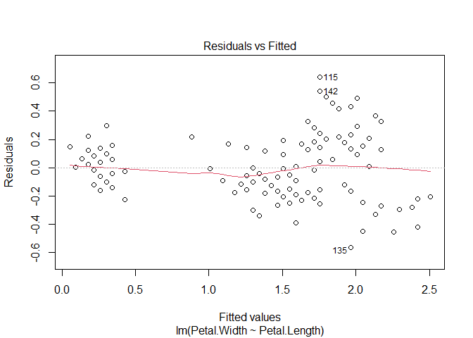<!-- -->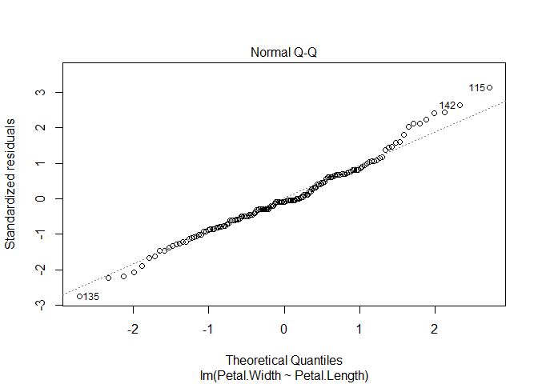<!-- -->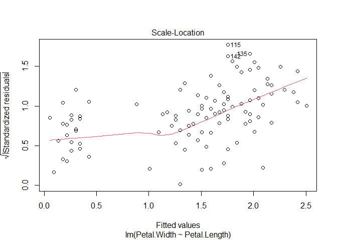<!-- -->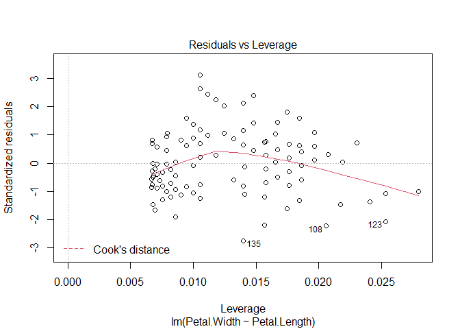<!-- -->

Next, let's get the predicted values and 95% confidence interval (CI) from the model. First, we use `predict()` to calculate the expected value (i.e., mean value of the response variable) for a range of *X* values. Then, we use the predicted standard error of the prediction to calculate the CI. Finally, we assemble everything in a plot. 


```r
# number of points for prediction
new.n <- 100

# x values for prediction
newx <- seq(min(iris$Petal.Length), 
            max(iris$Petal.Length),
            length=new.n)

# put new X values in data frame
newdat <- data.frame(Petal.Length=newx)

# calculate prediction and 95% CI
pred <- predict(mod1, newdata=data.frame(newdat),
    se.fit=TRUE)
mm <- qnorm(0.5, pred$fit, pred$se.fit)
lo <- qnorm(0.025, pred$fit, pred$se.fit)
up <- qnorm(0.975, pred$fit, pred$se.fit)

# make plot with lines for prediction and CI
plot(iris$Petal.Length, iris$Petal.Width, 
     ylim=c(0, 3),
     xlab="Petal length (cm)",
     ylab="Petal width (cm)")
points(newx, lo, type="l", col="red", lty=2, lwd=2)
points(newx, up, type="l", col="red", lty=2, lwd=2)
points(newx, mm, type="l", lwd=2, col="red")
```

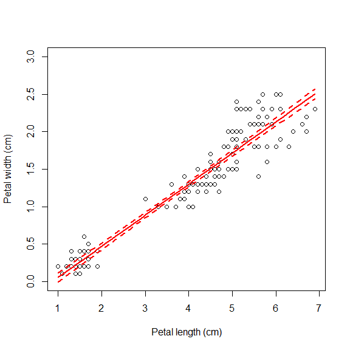<!-- -->

Below is an alternative version of the plot that uses a shaded area to show the 95% CI. The shaded area is drawn with the `polygon()` function.


```r
# alternative version: use shaded area for 95% CI
# note that polygon() goes first
plot(iris$Petal.Length, iris$Petal.Width,
     ylim=c(0, 3),
     xlab="Petal length (cm)",
     ylab="Petal width (cm)")
polygon(x=c(newx, rev(newx)),
        y=c(lo, rev(up)), 
        border=NA, col="grey70")
points(newx, mm, type="l", lwd=2)
points(iris$Petal.Length, iris$Petal.Width, pch=16, cex=1.1)
```

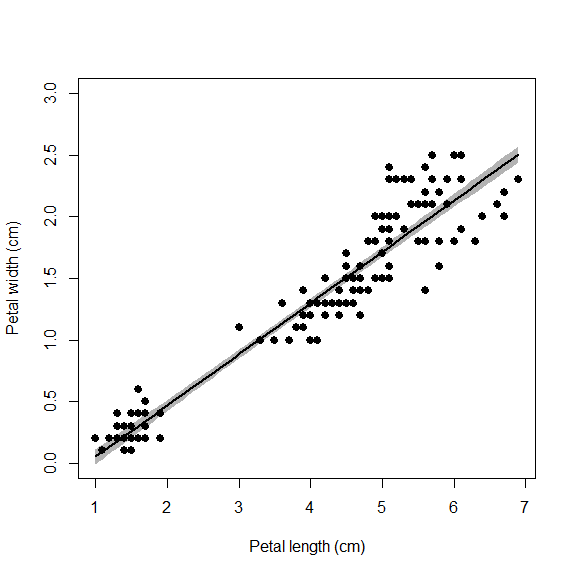<!-- -->

# Multiple linear regression

The linear model can easily be extended to include multiple predictors. This can be seen in the matrix notation for linear regression. With a single predictor variable *X*, the matrix form of the model is:


In this equation, the subscripts on *Y*, *X*, and $\epsilon$^[This is another version of $\varepsilon$.] refer to observations; the subscripts on $\beta$ identify the intercept ($\beta_0$) or slope ($\beta_1$). This matrix notation is shorthand for a system of equations:

$$\begin{matrix}Y_1=1\times\beta_0+\beta_1{\times X}_1+\varepsilon_1\\Y_1=1\times\beta_0+\beta_1{\times X}_2+\varepsilon_2\\\vdots\\Y_n=1\times\beta_0+\beta_1{\times X}_n+\varepsilon_n\\\end{matrix}$$

The matrix shorthand just takes advantage of the rules of matrix multiplication and addition. Multiplying the matrices **X** and $\beta$ will result in a matrix with the same number of columns as $\beta$ and the same number of rows as **X**. In other words, an *n* $\times$ 1 matrix like **Y**, also called a column vector.

With additional predictors, the design matrix is expanded with additional columns to contain the additional predictors. At the same time, the coefficient matrix $\beta$ is expanded with the same number of additional rows. The example below shows the matrix form for a regression model with 2 predictors *X*~1~ and *X*~2~.

$$\left[\begin{matrix}Y_1\\Y_2\\\vdots\\Y_n\\\end{matrix}\right]=\left[\begin{matrix}1&X_{1,1}&X_{2,1}\\1&X_{1,2}&X_{2,2}\\\vdots&\vdots&\vdots\\1&X_{1,n}&X_{2,n}\\\end{matrix}\right]\left[\begin{matrix}\beta_0\\\beta_1\\\beta_2\\\end{matrix}\right]+\left[\begin{matrix}\varepsilon_1\\\varepsilon_2\\\vdots\\\varepsilon_n\\\end{matrix}\right] $$

Fortunately, R takes care of all this matrix algebra for you. The linear model function `lm()` will automatically define the design and coefficient matrices and estimate the latter. All you need to do is define the model equation using the formula interface as before. Predictor variables go on the right side of the `~`, separated by `+`.


```r
mod2 <- lm(Petal.Length~Sepal.Length+Sepal.Width, data=iris)
summary(mod2)
```

```
## 
## Call:
## lm(formula = Petal.Length ~ Sepal.Length + Sepal.Width, data = iris)
## 
## Residuals:
##      Min       1Q   Median       3Q      Max 
## -1.25582 -0.46922 -0.05741  0.45530  1.75599 
## 
## Coefficients:
##              Estimate Std. Error t value Pr(>|t|)    
## (Intercept)  -2.52476    0.56344  -4.481 1.48e-05 ***
## Sepal.Length  1.77559    0.06441  27.569  < 2e-16 ***
## Sepal.Width  -1.33862    0.12236 -10.940  < 2e-16 ***
## ---
## Signif. codes:  0 '***' 0.001 '**' 0.01 '*' 0.05 '.' 0.1 ' ' 1
## 
## Residual standard error: 0.6465 on 147 degrees of freedom
## Multiple R-squared:  0.8677,	Adjusted R-squared:  0.8659 
## F-statistic:   482 on 2 and 147 DF,  p-value: < 2.2e-16
```

The results show that petal length increases by 1.77 cm for every additional cm of sepal length, and decreases by 1.33 cm for each additional cm of sepal width. The effects of the two predictors are assumed to be **orthogonal**, or independent of each other. 

# ANOVA and ANCOVA with `lm()`

The formula interface is very flexible and can be used to define many kinds of models. If all predictor variables are factors (AKA: grouping or categorical variables), then the result is an analysis of variance model (ANOVA). The ANOVA table can be obtained with function `anova()`, and post-hoc tests performed on the result of `aov()`. R uses function `lm()` to fit ANOVA models because ANOVA is a special case of the linear model.


```r
mod3 <- lm(Petal.Length~Species, data=iris)
summary(mod3)
```

```
## 
## Call:
## lm(formula = Petal.Length ~ Species, data = iris)
## 
## Residuals:
##    Min     1Q Median     3Q    Max 
## -1.260 -0.258  0.038  0.240  1.348 
## 
## Coefficients:
##                   Estimate Std. Error t value Pr(>|t|)    
## (Intercept)        1.46200    0.06086   24.02   <2e-16 ***
## Speciesversicolor  2.79800    0.08607   32.51   <2e-16 ***
## Speciesvirginica   4.09000    0.08607   47.52   <2e-16 ***
## ---
## Signif. codes:  0 '***' 0.001 '**' 0.01 '*' 0.05 '.' 0.1 ' ' 1
## 
## Residual standard error: 0.4303 on 147 degrees of freedom
## Multiple R-squared:  0.9414,	Adjusted R-squared:  0.9406 
## F-statistic:  1180 on 2 and 147 DF,  p-value: < 2.2e-16
```

The model summary shows us that at least some of the species have different means. Notice that effects are shown only for two of the three species (*versicolor* and *virginica*). The level that is first alphabetically is used as a baseline. So, the effects shown for the other two species are the differences in means between those species and the baseline species. For example, species *versicolor* has a mean that is 2.798 cm greater than the mean in species *setosa*.

We can get the omnibus test with `anova()`.


```r
# anova table:
anova(mod3)
```

```
## Analysis of Variance Table
## 
## Response: Petal.Length
##            Df Sum Sq Mean Sq F value    Pr(>F)    
## Species     2 437.10 218.551  1180.2 < 2.2e-16 ***
## Residuals 147  27.22   0.185                      
## ---
## Signif. codes:  0 '***' 0.001 '**' 0.01 '*' 0.05 '.' 0.1 ' ' 1
```

The ANOVA table shows how the variance is partitioned between that explained by species (expressed as sum of squared errors, `Sum Sq`) and the residual variation. The *F* value for each explanatory variable is the ratio of the mean squared error (`Mean Sq`) for that factor divided by the mean squared error of the residuals. The *F* value is then used to calculate *P*-value (`Pr(>F)`).


```r
# post-hoc test (Tukey):
TukeyHSD(aov(mod3))
```

```
##   Tukey multiple comparisons of means
##     95% family-wise confidence level
## 
## Fit: aov(formula = mod3)
## 
## $Species
##                       diff     lwr     upr p adj
## versicolor-setosa    2.798 2.59422 3.00178     0
## virginica-setosa     4.090 3.88622 4.29378     0
## virginica-versicolor 1.292 1.08822 1.49578     0
```

The Tukey honest significant difference (HSD) test shows which levels of the factors in the ANOVA have means that differ from each other. The `diff` is literally the difference between the means of the levels in each row. So, the mean of *I*. *versicolor* minus the mean of *I*. *setosa* is 2.798 cm. Negative numbers would indicate that the level listed first had a smaller mean. The 95% CI of the difference is given, followed by a *P*-value that is adjusted for multiple comparisons. The *P*-values shown are not literally 0 (which is not possible). Instead, these should be interpreted as very small. Reporting them as something like “<0.0001” would be appropriate.

Including a continuous predictor with a factor predictor 
will produce main-effects analysis of covariance (ANCOVA).


```r
mod4 <- lm(Petal.Length~Sepal.Length+Species, data=iris)
summary(mod4)
```

```
## 
## Call:
## lm(formula = Petal.Length ~ Sepal.Length + Species, data = iris)
## 
## Residuals:
##      Min       1Q   Median       3Q      Max 
## -0.76390 -0.17875  0.00716  0.17461  0.79954 
## 
## Coefficients:
##                   Estimate Std. Error t value Pr(>|t|)    
## (Intercept)       -1.70234    0.23013  -7.397 1.01e-11 ***
## Sepal.Length       0.63211    0.04527  13.962  < 2e-16 ***
## Speciesversicolor  2.21014    0.07047  31.362  < 2e-16 ***
## Speciesvirginica   3.09000    0.09123  33.870  < 2e-16 ***
## ---
## Signif. codes:  0 '***' 0.001 '**' 0.01 '*' 0.05 '.' 0.1 ' ' 1
## 
## Residual standard error: 0.2826 on 146 degrees of freedom
## Multiple R-squared:  0.9749,	Adjusted R-squared:  0.9744 
## F-statistic:  1890 on 3 and 146 DF,  p-value: < 2.2e-16
```

The summary table now shows the effects of both the continuous predictor and the factor predictor. As before, the estimated coefficient for a continuous predictor is the change in the response variable for every unit increase in the predictor. The estimates shown for the levels of the factor are the differences between the means of those levels and the baseline level. To fully make sense of this output, we also need to look at the omnibus test and the Tukey test outputs.


```r
anova(mod4)
```

```
## Analysis of Variance Table
## 
## Response: Petal.Length
##               Df Sum Sq Mean Sq F value    Pr(>F)    
## Sepal.Length   1 352.87  352.87 4419.48 < 2.2e-16 ***
## Species        2  99.80   49.90  624.99 < 2.2e-16 ***
## Residuals    146  11.66    0.08                      
## ---
## Signif. codes:  0 '***' 0.001 '**' 0.01 '*' 0.05 '.' 0.1 ' ' 1
```

```r
TukeyHSD(aov(mod4))
```

```
## Warning in replications(paste("~", xx), data = mf): non-factors ignored:
## Sepal.Length
```

```
## Warning in TukeyHSD.aov(aov(mod4)): 'which' specified some non-factors which
## will be dropped
```

```
##   Tukey multiple comparisons of means
##     95% family-wise confidence level
## 
## Fit: aov(formula = mod4)
## 
## $Species
##                           diff         lwr       upr     p adj
## versicolor-setosa    1.0696573  0.93584210 1.2034726 0.0000000
## virginica-setosa     1.1499590  1.01614380 1.2837743 0.0000000
## virginica-versicolor 0.0803017 -0.05351353 0.2141169 0.3327997
```

The omnibus test and Tukey test above demonstrate the effects of the continuous predictor and the factor are orthogonal: no sums of squared errors are shared between the variables. Another way of putting that is that the response to one predictor does not depend on any other predictor.

When the effect of one predictor alters the effect of another predictor, the two predictors are said to “interact”. Interactions between predictors can be specified in R in two ways: `*` or `:`. Most of the time you should use `*`, which automatically fits both predictors by themselves (“main effects”) and the interaction between them (“interaction term”). The model produced this way is also called an “interaction effects ANCOVA” or “ANCOVA with interaction”.


```r
f1 <- formula("Petal.Length~Sepal.Length*Species")
mod5 <- lm(f1, data=iris)
summary(mod5)
```

```
## 
## Call:
## lm(formula = f1, data = iris)
## 
## Residuals:
##      Min       1Q   Median       3Q      Max 
## -0.68611 -0.13442 -0.00856  0.15966  0.79607 
## 
## Coefficients:
##                                Estimate Std. Error t value Pr(>|t|)    
## (Intercept)                      0.8031     0.5310   1.512    0.133    
## Sepal.Length                     0.1316     0.1058   1.244    0.216    
## Speciesversicolor               -0.6179     0.6837  -0.904    0.368    
## Speciesvirginica                -0.1926     0.6578  -0.293    0.770    
## Sepal.Length:Speciesversicolor   0.5548     0.1281   4.330 2.78e-05 ***
## Sepal.Length:Speciesvirginica    0.6184     0.1210   5.111 1.00e-06 ***
## ---
## Signif. codes:  0 '***' 0.001 '**' 0.01 '*' 0.05 '.' 0.1 ' ' 1
## 
## Residual standard error: 0.2611 on 144 degrees of freedom
## Multiple R-squared:  0.9789,	Adjusted R-squared:  0.9781 
## F-statistic:  1333 on 5 and 144 DF,  p-value: < 2.2e-16
```

The coefficients for the interaction term are `Sepal.Length:Speciesversicolor` and `Sepal.Length:Speciesvirginica`. These should be interpreted as “the change in the effect of sepal length when species is versicolor instead of setosa” and “the change in the effect of sepal length when species is virginica instead of setosa”.
 
The ANOVA table shows us that the effects of sepal length and species are NOT orthogonal, because some of the sums of squares (1.84) are associated with both variables.


```r
anova(mod5)
```

```
## Analysis of Variance Table
## 
## Response: Petal.Length
##                       Df Sum Sq Mean Sq  F value    Pr(>F)    
## Sepal.Length           1 352.87  352.87 5175.537 < 2.2e-16 ***
## Species                2  99.80   49.90  731.905 < 2.2e-16 ***
## Sepal.Length:Species   2   1.84    0.92   13.489 4.272e-06 ***
## Residuals            144   9.82    0.07                       
## ---
## Signif. codes:  0 '***' 0.001 '**' 0.01 '*' 0.05 '.' 0.1 ' ' 1
```

# Variations on linear models

Models without *Y*-intercepts can be fit by including `0+` in the formula. Sometimes fitting a model without an intercept can be appropriate if there is a natural reason why the response variable must be 0 when the predictor variable is 0. In such a case, any $\beta_0$ fit by the model would likely be non-significant or meaningless anyway.


```r
# simulate some random data
set.seed(123)
n <- 20
x <- runif(n, 0, 20)
y <- 2.3 * x + rnorm(n, 0, 3)

# full model with intercept and slope:
mod7a <- lm(y~x)
summary(mod7a)
```

```
## 
## Call:
## lm(formula = y ~ x)
## 
## Residuals:
##     Min      1Q  Median      3Q     Max 
## -4.2284 -1.8960 -0.2605  2.0599  5.6778 
## 
## Coefficients:
##             Estimate Std. Error t value Pr(>|t|)    
## (Intercept)   1.8488     1.3149   1.406    0.177    
## x             2.1028     0.1044  20.146  8.5e-14 ***
## ---
## Signif. codes:  0 '***' 0.001 '**' 0.01 '*' 0.05 '.' 0.1 ' ' 1
## 
## Residual standard error: 2.852 on 18 degrees of freedom
## Multiple R-squared:  0.9575,	Adjusted R-squared:  0.9552 
## F-statistic: 405.8 on 1 and 18 DF,  p-value: 8.498e-14
```

```r
# model with slope only (i.e., no intercept)
mod7b <- lm(y~0+x)
summary(mod7b)
```

```
## 
## Call:
## lm(formula = y ~ 0 + x)
## 
## Residuals:
##     Min      1Q  Median      3Q     Max 
## -4.6702 -1.7713  0.2444  2.3790  5.4235 
## 
## Coefficients:
##   Estimate Std. Error t value Pr(>|t|)    
## x  2.23111    0.05192   42.98   <2e-16 ***
## ---
## Signif. codes:  0 '***' 0.001 '**' 0.01 '*' 0.05 '.' 0.1 ' ' 1
## 
## Residual standard error: 2.925 on 19 degrees of freedom
## Multiple R-squared:  0.9898,	Adjusted R-squared:  0.9893 
## F-statistic:  1847 on 1 and 19 DF,  p-value: < 2.2e-16
```

You can also fit a model with only a constant as the predictor using `1` as the right-hand side of the model formula (numeral 1, not lower-case letter L). This is also called an **intercept-only model**, a **model of the mean**, or sometimes a **null model**. A null model with no predictors can be a useful baseline against which to measure other models. 


```r
mod8 <- lm(Petal.Width~1,data=iris)	
summary(mod8)
```

```
## 
## Call:
## lm(formula = Petal.Width ~ 1, data = iris)
## 
## Residuals:
##     Min      1Q  Median      3Q     Max 
## -1.0993 -0.8993  0.1007  0.6007  1.3007 
## 
## Coefficients:
##             Estimate Std. Error t value Pr(>|t|)    
## (Intercept)  1.19933    0.06224   19.27   <2e-16 ***
## ---
## Signif. codes:  0 '***' 0.001 '**' 0.01 '*' 0.05 '.' 0.1 ' ' 1
## 
## Residual standard error: 0.7622 on 149 degrees of freedom
```

The last regression flavor that we’ll cover is regression on **ranks**. This uses ranks of the variables rather than their actual values. A variable can be converted to ranks with function `rank()`. As with any other transformation, it might be better to transform the data in place and call the transformed data inside `lm()`.


```r
mod10 <- lm(rank(Petal.Width)~rank(Petal.Length), data=iris)
summary(mod10)
```

```
## 
## Call:
## lm(formula = rank(Petal.Width) ~ rank(Petal.Length), data = iris)
## 
## Residuals:
##     Min      1Q  Median      3Q     Max 
## -42.506 -10.385   0.338  10.184  35.939 
## 
## Coefficients:
##                    Estimate Std. Error t value Pr(>|t|)    
## (Intercept)         4.97766    2.47618    2.01   0.0462 *  
## rank(Petal.Length)  0.93407    0.02846   32.82   <2e-16 ***
## ---
## Signif. codes:  0 '***' 0.001 '**' 0.01 '*' 0.05 '.' 0.1 ' ' 1
## 
## Residual standard error: 15.08 on 148 degrees of freedom
## Multiple R-squared:  0.8792,	Adjusted R-squared:  0.8784 
## F-statistic:  1077 on 1 and 148 DF,  p-value: < 2.2e-16
```

```r
# better: transform in place:
iris2 <- iris
iris2$pw.rank <- rank(iris2$Petal.Width)
iris2$pl.rank <- rank(iris2$Petal.Length)
mod10 <- lm(pw.rank~pl.rank, data=iris2)
summary(mod10)
```

```
## 
## Call:
## lm(formula = pw.rank ~ pl.rank, data = iris2)
## 
## Residuals:
##     Min      1Q  Median      3Q     Max 
## -42.506 -10.385   0.338  10.184  35.939 
## 
## Coefficients:
##             Estimate Std. Error t value Pr(>|t|)    
## (Intercept)  4.97766    2.47618    2.01   0.0462 *  
## pl.rank      0.93407    0.02846   32.82   <2e-16 ***
## ---
## Signif. codes:  0 '***' 0.001 '**' 0.01 '*' 0.05 '.' 0.1 ' ' 1
## 
## Residual standard error: 15.08 on 148 degrees of freedom
## Multiple R-squared:  0.8792,	Adjusted R-squared:  0.8784 
## F-statistic:  1077 on 1 and 148 DF,  p-value: < 2.2e-16
```

# Example linear regression workflow

The following example shows a typical linear regression workflow. This example uses simulated data. So, the first few commands that simulate the dataset are not part of a usual regression analysis. After the data are generated, we will fit a linear model, examine the outputs, and then plot the results. 

```r
# simulate the data
set.seed(42)
n <- 30
x <- sample(1:50, n, replace=TRUE)
beta0 <- 30
beta1 <- 1.3
sigma <- 10
y <- rnorm(n, beta0 + beta1 * x, sigma)
dat <- data.frame(x=x, y=y)

# fit the model (analysis workflow starts here!)
mod <- lm(y~x, data=dat)

# examine the results
summary(mod)
```

```
## 
## Call:
## lm(formula = y ~ x, data = dat)
## 
## Residuals:
##     Min      1Q  Median      3Q     Max 
## -25.033  -7.130   2.620   6.855  18.035 
## 
## Coefficients:
##             Estimate Std. Error t value Pr(>|t|)    
## (Intercept)  18.2851     4.6818   3.906 0.000541 ***
## x             1.5752     0.1416  11.128 8.64e-12 ***
## ---
## Signif. codes:  0 '***' 0.001 '**' 0.01 '*' 0.05 '.' 0.1 ' ' 1
## 
## Residual standard error: 11.12 on 28 degrees of freedom
## Multiple R-squared:  0.8156,	Adjusted R-squared:  0.809 
## F-statistic: 123.8 on 1 and 28 DF,  p-value: 8.638e-12
```

The output of `summary()` tells us a lot:

- **Call**: the model that was fit
Residuals: range (min, max) and 1st, 2nd, and 3rd quartiles of the distribution of residuals
- **Coefficients**: the estimated intercept and slope. Note that the slope associated with each predictor is named for that predictor, exactly as it was named in the function call.
- **R-squared**: the coefficient of determination, or proportion of variance in *Y* explained by *X*. Use the adjusted *R*^2^, which penalizes models for the number of predictors and gives a more conservative estimate of the model goodness-of-fit.
- **Omnibus ANOVA test**: the last line of the output tells us a bit about the ANOVA test for overall model significance. You can get the full test with `anova(mod)`.

The “coefficients” section of the output is very important. You can access it directly as a matrix:


```r
summary(mod)$coefficients
```

```
##             Estimate Std. Error   t value     Pr(>|t|)
## (Intercept) 18.28512  4.6817629  3.905606 5.409231e-04
## x            1.57522  0.1415513 11.128259 8.637921e-12
```

This table is really a matrix that contains the estimated values of each regression parameter, the standard error (SE) of each estimate, the test statistic t, and the P-value for each parameter. In standard linear regression, the test statistic t is calculated as:

$$t=\frac{\hat{\beta}}{se\left(\hat{\beta}\right)}$$

and the *P*-value is calculated by assuming that *t* follows a *t* distribution with $n-2$ degrees of freedom. Note that a *P*-value is calculated for both the model slope and intercept. Often a model intercept will have *P* $\ge$ 0.05. This does not mean that the regression model is invalid or non-significant. This simply means that the data do not support a model intercept significantly different from 0. This is not necessarily a problem: can you think of a biological scenario where an intercept = 0 makes sense?

Before moving on, we should examine some of the diagnostic plots that describe our model. These are produced by plotting our model object. This will produce several plots that you can cycle through by clicking on the plot window. The first two are probably the most important.


```r
plot(mod)
```

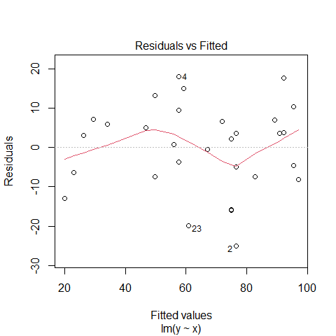<!-- -->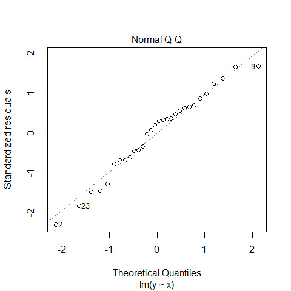<!-- -->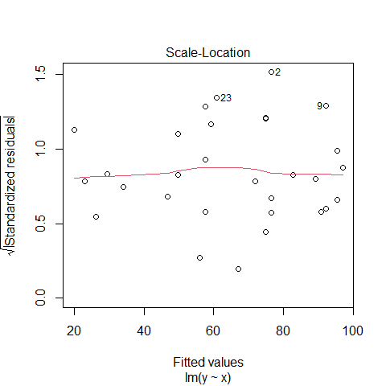<!-- -->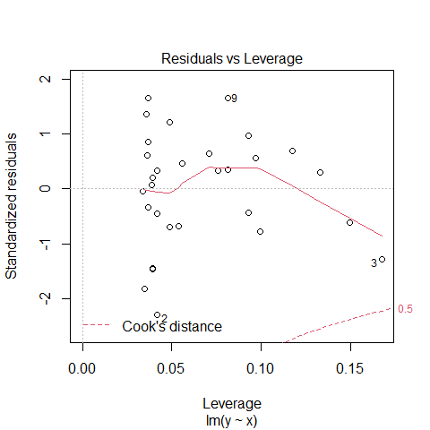<!-- -->

The first plot shows model residuals vs the fitted values (i.e., the values predicted by the deterministic part of the model). This plot should show no obvious pattern. A pattern, such as residuals increasing or decreasing with predicted value, suggests that the residuals are not normal or i.i.d. Such a pattern is called heteroscedasticity. The plot below shows homoscedasticity, a much better situation. If a plot of residuals vs. fitted has a pattern, you need to investigate where that pattern might be coming from and how it can be eliminated. Potential solutions include adding additional predictors, transforming one or more predictor variables, transforming the response variable, or using a different statistical method (e.g., GLM) that can account for the various sources of heteroscedasticity.

The second plot is called a “quantile-quantile” plot, or “QQ plot” for short. This figure shows standardized residuals (see Module 4) on the y-axis vs. the standard scores of those quantiles in a reference distribution (in this case, a normal distribution with mean 0 and variance equal to the variance of the residuals). The points should fall on or near the diagonal line. Significant departures, particularly near the center of the distribution, suggest that the residuals are not normally distributed. If that is the case, then either the data need to be transformed to achieve normality in the residuals, or another statistical method needs to be explored.

Now that we have a fitted regression model, we might want to present it in a publication. The usual way is to have (1) a table showing the model coefficients; (2) text describing the model in the Results section, including the *R*^2^; and (3) a figure showing the data and fitted model.

The table should resemble the output of `summary(mod)$coefficients`. Note that estimates are rounded to a reasonable number of decimal places. Test statistics and *P* values can have a couple more digits. If you can, align the numbers on the decimal point, so it is easier to compare numbers up and down a column.

| |Estimate $\pm$ SE|*t*|*P*|
|----|----|----|----|
|Intercept ($\beta_0$)|18.3 $\pm$ 4.7|3.906|0.0005|
|Slope ($\beta_1$)|1.6 $\pm$ 0.1|11.128|<0.0001|

In order to plot the data and the relationship, we need to put together a few pieces. Namely, the predicted values (so we can add a “trendline”, as it’s called in Excel) and the 95% CI of the predicted values (so we can show how uncertain the predictions are). R makes both of these tasks straightforward, although not as easy as simply clicking “Add Trendline…” in Excel!

In this example, `px` is a sequence of new values within the domain of the observed *X* values—do not generate predictions outside your dataset! We are going to use a sequence of new values so that we can smoothly cover the interval between the minimum and maximum of *X*. This will make for a nicer looking plot. 

These values are then supplied to the `predict()` function (which internally calls another function,  `predict.lm()`) in a data frame. Note that the names in the new data frame must match the names in original data exactly, and any variable in the model must be in the data frame used for prediction, whether or not a variable was significant. The final argument, `se.fit=TRUE`, specifies that we want the SE of the expected value in addition to the expected value.


```r
# new data for prediction
px <- seq(min(x), max(x), length=50)

# prediction with expected mean and SE of Y
pred <- predict(mod, newdata=data.frame(x=px), se.fit=TRUE)
```

Next, we use the `fit` and `se.fit` from the result to define normal distributions at each *X* value. This way we can calculate what the expected mean and upper and lower confidence limits of the prediction are. You could subtract and add 1.96 SE from/to the mean, but the `qnorm()` method is much cleaner (and, much more adaptable to situations where other distributions apply). 


```r
# predicted mean and 95% CI
y.mn <- pred$fit
y.lo <- qnorm(0.025, pred$fit, pred$se.fit)
y.up <- qnorm(0.975, pred$fit, pred$se.fit)
```

Now we are ready to make the plot. The code below sets some graphical options with `par()`, then makes the plot one piece at a time. The `par()` statement is not necessary if you are making graphs for yourself. However, if you are making graphs for your thesis or for a publication, it is essential to producing a clean, professional-quality figure. 

In my workflow I prefer to first make a blank plot, then add the CI and prediction, then the original data. This ensures that the data are not plotted over by one of the other pieces. Note that the *y*-axis limits are set so that 0 is included.


```r
par(mfrow=c(1,1), mar=c(5.1, 5.1, 1.1, 1.1),
    bty="n", lend=1,
    las=1, cex.axis=1.2, cex.lab=1.2)
plot(dat$x, dat$y, type="n", ylim=c(0, 120),
     xlab="X", ylab="Y")
points(px, y.lo, type="l", lwd=2, lty=2) 
points(px, y.up, type="l", lwd=2, lty=2) 
points(px, y.mn, type="l", lwd=2)
points(dat$x, dat$y, pch=16, cex=1.2)
```

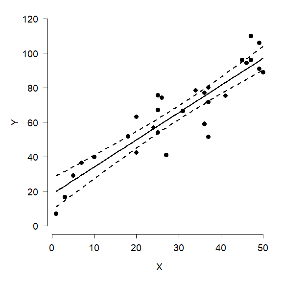<!-- -->

Here is an alternative version of the figure, using `polygon()` to plot the confidence interval. Notice how the vertices for the polygon are specified. Half of the values are reversed with `rev()`, because the `polygon()` function basically draws the polygon vertex by vertex in a “circle”.


```r
par(mfrow=c(1,1), mar=c(5.1, 5.1, 1.1, 1.1), 
    bty="n", lend=1, las=1, cex.axis=1.2, cex.lab=1.2)
plot(dat$x, dat$y, type="n",
     ylim=c(0, 120),
     xlab="X", ylab="Y")
polygon(x=c(px, rev(px)), 
        y=c(y.lo, rev(y.up)),
        border=NA, col="grey80")
points(px, y.mn, type="l", lwd=2)
points(dat$x, dat$y, pch=16, cex=1.2)
```

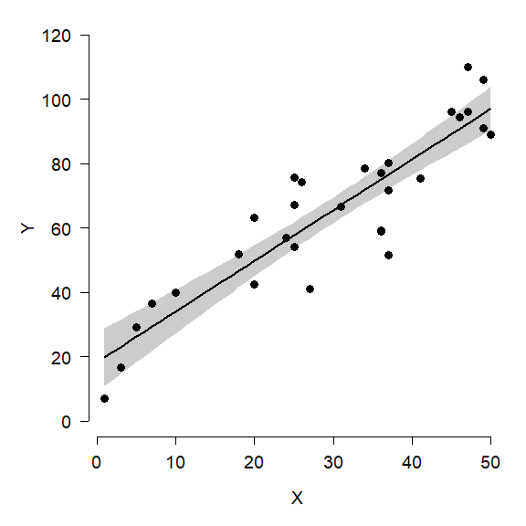<!-- -->

There is one other consideration here: do we want to show the model’s predictions and 95% CI of the expected values, or 95% CI of all values? The default is to show the 95% confidence interval, which is a statement about where we expect the **mean or expected value to fall**. The figures above show 95% CI. The alternative is the 95% **prediction interval (PI)**, sometimes called the tolerance interval. The PI describes the region where 95% of **all values might fall**, not just the mean. The PI is always wider than the CI. Most of the time showing the CI is appropriate…just be clear in your write-up what you are showing!

The figure below shows the difference between the CI and PI. Note that the output of `predict()` is different when using the argument `interval="prediction"`, so the code is a little different (we don’t have to use `qnorm()` to get the limits).


```r
pred2 <- predict(mod, newdata=data.frame(x=px),
    se.fit=TRUE,
    interval="prediction")
y.lo2 <- pred2$fit[,"lwr"]
y.up2 <- pred2$fit[,"upr"]

par(mfrow=c(1,2), mar=c(5.1, 5.1, 1.1, 1.1), bty="n",
    lend=1, las=1, cex.axis=1.2, cex.lab=1.2)

# plot 1: CI
plot(dat$x, dat$y, type="n", ylim=c(0, 120),
     xlab="X", ylab="Y",
	 main="Confidence interval")
polygon(x=c(px, rev(px)), 
        y=c(y.lo, rev(y.up)),
        border=NA, col="grey80")
points(px, y.mn, type="l", lwd=2)
points(dat$x, dat$y, pch=16, cex=1.2)

# plot 2: PI
plot(dat$x, dat$y, type="n", ylim=c(0, 120),
     xlab="X", ylab="Y",
	 main="Prediction interval")
polygon(x=c(px, rev(px)),
        y=c(y.lo2, rev(y.up2)),
        border=NA, col="grey80")
points(px, y.mn, type="l", lwd=2)
points(dat$x, dat$y, pch=16, cex=1.2)
```

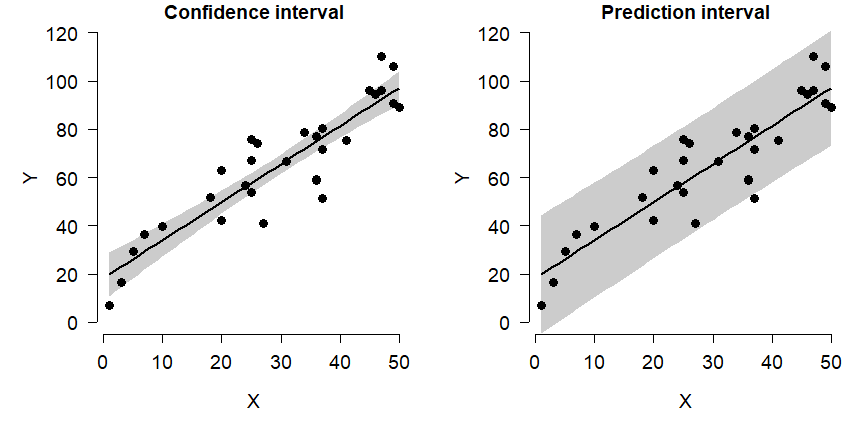<!-- -->

---


[**Go back to main page**](https://greenquanteco.github.io/index.html)

# References

<div id="refs"></div>

# Legal notice

This site is for educational purposes only. This work and its content is released under the [Creative Commons Attribution-ShareAlike 4.0](https://creativecommons.org/licenses/by-sa/4.0/) license. Inclusion of third-party data falls under guidelines of fair use as defined in [section 107 of the US Copyright Act of 1976](https://www.law.cornell.edu/uscode/text/17/107). 
