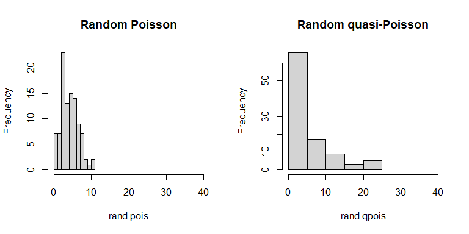
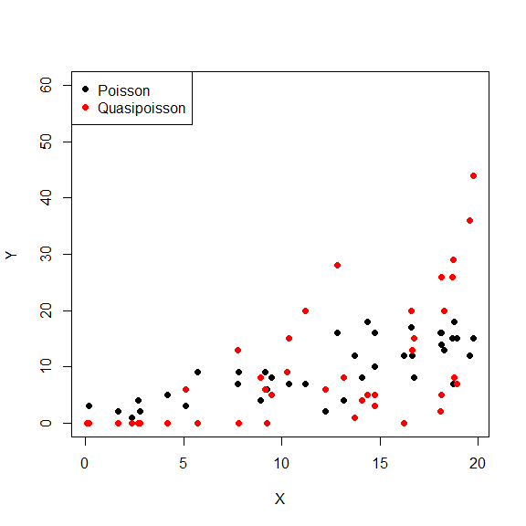
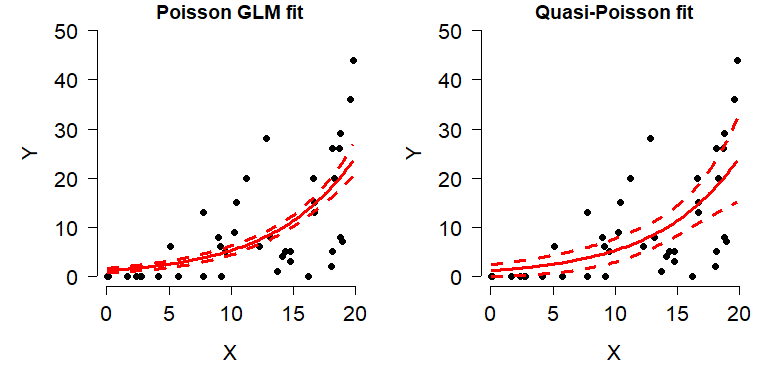
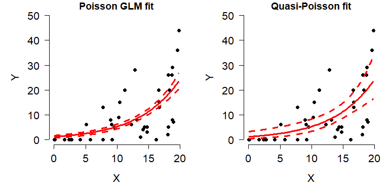
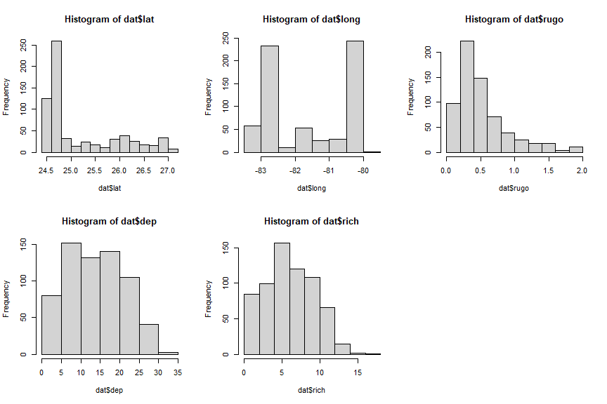
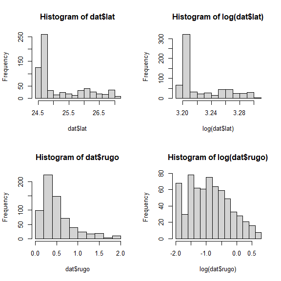
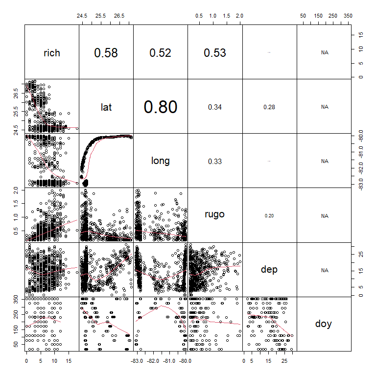
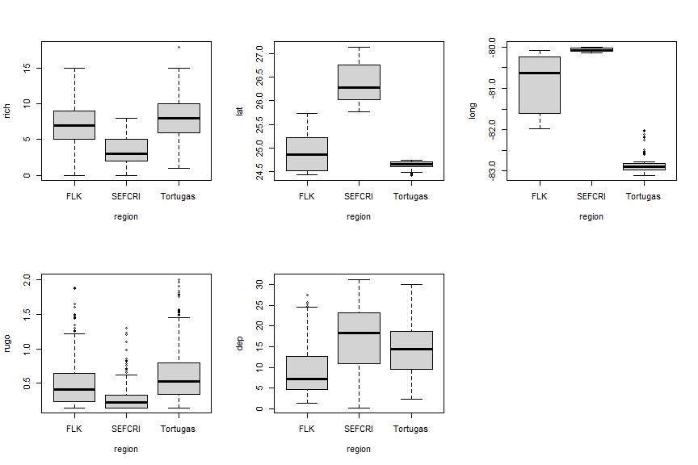
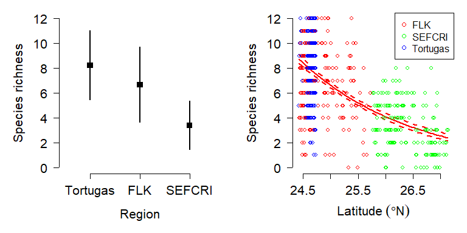

# Overview

This is one of several sections exploring some common GLM applications. For most of these applications we will work through two examples. First, an analysis of simulated data, and second, an analysis of a real dataset. Simulating a dataset suitable for an analysis is an excellent way to learn about the analysis method, because it helps you see the relationship between the data-generating process and the analysis.

This module explores GLMs for **overdispersed count data**. Count data are exactly what they sound like: values resulting from counting things. Count data are usually well-modeled by the Poisson distribution. In the Poisson distribution, the mean and variance are the same value (i.e., $\mu=\sigma^2$). Sometimes count data are **overdispersed**, which means that the variance is greater than would be expected for a Poisson distribution (i.e., $\sigma^{2}>\mu$)^[As you might suspect, the opposite situation, when $\mu > \sigma^2$, is called “underdispersion”. Underdispersion does not come up as often as overdispersion and poses less of a problem for analysis.]. These data can still be modeled with GLM, but a different family is necessary to account for the overdispersion. The most common options for modeling overdispersed counts are the **quasi-Poisson distribution** and the **negative binomial distribution**. These are different distributions, and GLMs using them are technically different models, but we will see below that any situation where one is appropriate, the other is as well.  

# Modeling overdispersed counts: quasi-Poisson and negative binomial GLMs

As useful as the Poisson distribution is for modeling counts, it has a serious limitation: the assumption that its single parameter $\lambda$ is both the mean and variance (i.e., $\lambda=\mu=\sigma^2$). However, this is not always the case in real datasets. Many biological processes that produce counts have a variance much greater than their mean. This phenomenon is called “overdispersion” . The “over” in “overdispersion” is defined relative to the Poisson distribution. Using a different distribution in our GLM will account for the “over”. The two most common options for modeling overdispersed counts are the quasi-Poisson family and the negative binomial family.

The quasi-Poisson family is part of a class of **quasi-likelihood** models that inflate the variance to account for overdispersion [@bolker2008ecological]. Quasi-likelihoods add a parameter that increases the variance in a distribution. This parameter is usually called $\phi$ (Greek letter “phi”) or $\hat{c}$ (“c-hat”). This parameter is typically added as a scalar to the expression for variance, so it tends to be >1. For example, the variance of a Poisson distribution is the same as its mean, $\lambda$. The variance of a quasi-Poisson distribution is $\phi\lambda$. The overdispersion parameter $\phi$ will be estimated by R as it fits the GLM. The disadvantage of using quasi-likelihood models is that the likelihood functions are never explicitly defined, which means that many goodness of fit measures like deviance and AIC cannot be easily calculated. @burnham2004multimodel defined a **quasi-AIC (qAIC)** that can be used in place of ordinary AIC for model selection procedures.

The **negative binomial distribution** can also be used as a response distribution for overdispersed count data. The negative binomial distribution has two definitions. The original definition describes the number of failures that occur in a series of Bernoulli trials until some predetermined number of successes is observed. The version of the negative binomial that biologists use is parameterized by its mean $\mu$ and its overdispersion *k*. This definition reframes the negative binomial as a Poisson distribution with parameter $\lambda$, where $\lambda$ is a random variable that follows a Gamma distribution. In practice this is sort of like a quasi-Poisson distribution, but turns out to be easier to work with in R. Compare the variance for a quasi-Poisson distribution, $\phi\lambda$, to the variance of a negative binomial distribution:

$$Var\left(X\right)=\mu+\frac{\mu^2}{k}$$

If the mean of a quasi-Poisson distribution is $\lambda$, then we can do some rearranging to find that the *k* parameter of a negative binomial is equivalent to

$$k=\frac{\lambda}{\phi-1}$$

In practical terms, this means that the quasi-Poisson $\phi$ and the negative binomial *k* have opposite effects on the variance. This also means that any situation where one of these models is appropriate, the other is also appropriate. Personally, I tend to use the negative binomial because it has a well-defined likelihood (unlike quasi-Poisson) and is thus easier to work with in R.

## Example with simulated data

R does not have a function for drawing random numbers from a quasi-Poisson distribution, but it does have a function for drawing random numbers from a negative binomial distribution. We can take advantage of the relationship between the quasi-Poisson $\phi$ and the negative binomial *k* to define our own quasi-Poisson function:


```r
rqpois <- function(n, lambda, phi){
    rnbinom(n=n, mu=lambda, size=lambda/(phi-1))
}

# compare the variances of these distributions:
rand.pois <- rpois(100, 5)
rand.qpois <- rqpois(100, 5, 6)
mean(rand.pois)
```

```
## [1] 4.68
```

```r
var(rand.pois)
```

```
## [1] 5.351111
```

```r
mean(rand.qpois)
```

```
## [1] 5.66
```

```r
var(rand.qpois)
```

```
## [1] 35.11556
```

```r
par(mfrow=c(1,2))
hist(rand.pois, xlim=c(0,40), main="Random Poisson")
hist(rand.qpois, xlim=c(0,40), main="Random quasi-Poisson")
```

<!-- -->

Now let’s simulate some overdispersed count data.


```r
set.seed(42)
n <- 40
x <- runif(n, 0, 20)
beta0 <- 1.1
beta1 <- 0.72
phi <- 16
eta <- beta0 + beta1 * x

# Poisson data
yp <- rpois(n, eta)

# quasi-Poisson data
yq <- rqpois(n, eta, phi)

# plot the data
plot(x, yp, pch=16, ylim=c(0, 60),
     ylab="Y", xlab="X")
points(x, yq, pch=16, col="red")
legend("topleft", 
       legend=c("Poisson", "Quasipoisson"),
       pch=16, col=c("black", "red"))
```

<!-- -->

See what the overdispersion term did? The data simulated using a quasi-Poisson distribution are much more spread out than the data simulated using the Poisson distribution. Analyzing the quasi-Poisson data as if they were Poisson distributed might lead to underestimating the variance, especially at greater *X* values.


```r
dat <- data.frame(x=x, y=yq)
mod1 <- glm(y~x, data=dat, family=poisson)
mod2 <- glm(y~x, data=dat, family=quasipoisson)

summary(mod1)
```

```
## 
## Call:
## glm(formula = y ~ x, family = poisson, data = dat)
## 
## Deviance Residuals: 
##    Min      1Q  Median      3Q     Max  
## -5.223  -2.174  -1.024   1.405   5.439  
## 
## Coefficients:
##             Estimate Std. Error z value Pr(>|z|)    
## (Intercept)  0.12441    0.20218   0.615    0.538    
## x            0.15343    0.01236  12.416   <2e-16 ***
## ---
## Signif. codes:  0 '***' 0.001 '**' 0.01 '*' 0.05 '.' 0.1 ' ' 1
## 
## (Dispersion parameter for poisson family taken to be 1)
## 
##     Null deviance: 487.11  on 39  degrees of freedom
## Residual deviance: 274.66  on 38  degrees of freedom
## AIC: 398.22
## 
## Number of Fisher Scoring iterations: 6
```

```r
summary(mod2)
```

```
## 
## Call:
## glm(formula = y ~ x, family = quasipoisson, data = dat)
## 
## Deviance Residuals: 
##    Min      1Q  Median      3Q     Max  
## -5.223  -2.174  -1.024   1.405   5.439  
## 
## Coefficients:
##             Estimate Std. Error t value Pr(>|t|)    
## (Intercept)  0.12441    0.53258   0.234    0.817    
## x            0.15343    0.03255   4.713 3.24e-05 ***
## ---
## Signif. codes:  0 '***' 0.001 '**' 0.01 '*' 0.05 '.' 0.1 ' ' 1
## 
## (Dispersion parameter for quasipoisson family taken to be 6.939018)
## 
##     Null deviance: 487.11  on 39  degrees of freedom
## Residual deviance: 274.66  on 38  degrees of freedom
## AIC: NA
## 
## Number of Fisher Scoring iterations: 6
```

The model fits, parameter estimates, and diagnostics like deviance are essentially identical. But, as the figures below show, the Poisson GLM predicted much less variation about the mean than did the quasi-Poisson model.


```r
# values for prediction
n.pr <- 100
px <- seq(min(x), max(x), length=n.pr)
pred1 <- predict(mod1, newdata=data.frame(x=px),
                 type="response", se.fit=TRUE)
pred2 <- predict(mod2, newdata=data.frame(x=px),
                 type="response", se.fit=TRUE)

# pull out predictions and calculate CI
mn1 <- pred1$fit
mn2 <- pred2$fit
lo1 <- qnorm(0.025, mn1, pred1$se.fit)
lo2 <- qnorm(0.025, mn2, pred2$se.fit)
up1 <- qnorm(0.975, mn1, pred1$se.fit)
up2 <- qnorm(0.975, mn2, pred2$se.fit)

# make the plots
par(mfrow=c(1,2), bty="n", 
    mar=c(5.1, 5.1, 1.1, 1.1),
    lend=1, las=1, cex.lab=1.3, cex.axis=1.3)
plot(x, yq, pch=16, ylim=c(0, 50),
     ylab="Y", xlab="X",
     main="Poisson GLM fit")
points(px, lo1, type="l", col="red", lwd=3, lty=2)
points(px, up1, type="l", col="red", lwd=3, lty=2)
points(px, mn1, type="l", col="red", lwd=3)

plot(x, yq, pch=16, ylim=c(0, 50),
     ylab="Y", xlab="X",
     main="Quasi-Poisson fit")
points(px, lo2, type="l", col="red", lwd=3, lty=2)
points(px, up2, type="l", col="red", lwd=3, lty=2)
points(px, mn2, type="l", col="red", lwd=3)
```

<!-- -->

The right plot looks reasonable, but there is one small problem: the 95% CI calculated on the response scale extends below 0, which is not defined for a Poisson distribution. So, we should have calculated the CI on the link scale and back-transformed to get values on the response scale.


```r
# predict on link scale instead:
pred2 <- predict(mod2, newdata=data.frame(x=px),
                 type="link", se.fit=TRUE)
mn2 <- pred2$fit
lo2 <- qnorm(0.025, mn2, pred2$se.fit)
up2 <- qnorm(0.975, mn2, pred2$se.fit)

# back-transform:
mn2 <- mod2$family$linkinv(mn2)
lo2 <- mod2$family$linkinv(lo2)
up2 <- mod2$family$linkinv(up2)

# make the plots
par(mfrow=c(1,2), bty="n", 
    mar=c(5.1, 5.1, 1.1, 1.1),
    lend=1, las=1, cex.lab=1.3, cex.axis=1.3)
plot(x, yq, pch=16, ylim=c(0, 50),
     ylab="Y", xlab="X",
     main="Poisson GLM fit")
points(px, lo1, type="l", col="red", lwd=3, lty=2)
points(px, up1, type="l", col="red", lwd=3, lty=2)
points(px, mn1, type="l", col="red", lwd=3)

plot(x, yq, pch=16, ylim=c(0, 50),
     ylab="Y", xlab="X",
     main="Quasi-Poisson fit")
points(px, lo2, type="l", col="red", lwd=3, lty=2)
points(px, up2, type="l", col="red", lwd=3, lty=2)
points(px, mn2, type="l", col="red", lwd=3)
```

<!-- -->

Notice that the lower confidence limit does not dip below 0 in the revised quasi-Poisson plot. The CI is somewhat asymmetrical, but that’s okay and not at all uncommon with log-transformed data or in models with log-link functions.

## Example with real data

The US National Oceanic and Atmospheric Administration (NOAA) conducts periodic coral reef surveys in the Atlantic and Caribbean to monitor coral status (NOAA 2018). For this example, we will use [data from 2016-2018](https://www.coris.noaa.gov/monitoring/biological.html) to explore the relationship between coral species richness and environmental factors. The survey sites are shown on the map below in relation to mainland Florida, the Keys, and the Tortugas^[As you may have guessed as you clicked the footnote, this map was made in R.].


Download the dataset [coral_glm_example.csv](https://greenquanteco.github.io/coral_glm_example.csv) and put it in your R home directory.


```r
in.name <- "coral_glm_example.csv"
dat <- read.csv(in.name, header=TRUE)
```

The dataset contains many variables, but we are interested in the following:

|Variable|Units|Meaning|
|----|----|----|
|`date`|Days|Date sample was taken|
|`lat`|°N|North latitude|
|`long`|°E|Degrees east longitude|
|`rugo`|Unitless|Index of bottom roughness (rugosity)|
|`dep`|m|Mean depth of coral transect|
|`region`|Unitless|Geographic region where sample was taken|
|`rich`|Species|Number of coral species recorded on transect|


Let's start by using histograms and scatterplot matrices to get a sense of what patterns might exist in the data.


```r
head(dat)
```

```
##        date      lat      long      rugo     dep   region rich
## 1 5/12/2016 24.72435 -82.81070 0.8433333 16.3068 Tortugas    8
## 2 5/12/2016 24.72367 -82.78785 0.4900000 16.3068 Tortugas    8
## 3 5/12/2016 24.72623 -82.80449 0.1766667 17.0688 Tortugas    1
## 4 5/12/2016 24.71759 -82.80542 0.2966667 13.4112 Tortugas    7
## 5 5/12/2016 24.71971 -82.81462 0.6300000 11.1252 Tortugas    5
## 6 5/12/2016 24.72118 -82.80761 0.8833333 12.4968 Tortugas    9
```

```r
par(mfrow=c(2,3))
hist(dat$lat)
hist(dat$long)
hist(dat$rugo)
hist(dat$dep)
hist(dat$rich)
```

<!-- -->

The histograms suggest that latitude and rugosity might cause problems because of how many observations are clustered around a few values. Perhaps a log-transform would help? The plots from the commands below suggest not.


```r
par(mfrow=c(2,2))
hist(dat$lat)
hist(log(dat$lat))
hist(dat$rugo)
hist(log(dat$rugo))
```

<!-- -->

Next, search for patterns in the dataset using some scatterplot matrices. We will make use of the custom function `panel.cor()`, which can be found in the examples in the help page for function `pairs()`.


```r
# make day of year a number
dat$doy <- as.numeric(format(as.Date(dat$date), "%j"))

# scatterplot matrices to explore
panel.cor <- function(x, y, digits = 2, prefix = "", cex.cor, ...)
{
    usr <- par("usr"); on.exit(par(usr))
    par(usr = c(0, 1, 0, 1))
    r <- abs(cor(x, y))
    txt <- format(c(r, 0.123456789), digits = digits)[1]
    txt <- paste0(prefix, txt)
    if(missing(cex.cor)) cex.cor <- 0.8/strwidth(txt)
    text(0.5, 0.5, txt, cex = cex.cor * r)
}
num.cols <- c("rich", "lat", "long", "rugo", "dep", "doy")
pairs(dat[,num.cols], lower.panel = panel.smooth,
      upper.panel = panel.cor, gap=0)
```

<!-- -->

It appears that richness is somewhat correlated with latitude, longitude, and rugosity. Interestingly, latitude and longitude appear correlated. Can you think of why? (Hint: plot the coordinates and compare to a map of the Florida Keys). Because latitude and longitude are correlated, we should probably not fit a model with both of these variables included.

Based on the scatterplot matrix, it appears that latitude, longitude, and rugosity are most likely to be the variables driving coral species richness. There is a factor in our dataset, region, that also appears to play a role. However, we won’t model region with latitude or longitude because it is confounded with both.


```r
# possible effect of region, confounded with lat/long
par(mfrow=c(2,3))
boxplot(rich~region, data=dat)
boxplot(lat~region, data=dat)
boxplot(long~region, data=dat)
boxplot(rugo~region, data=dat)
boxplot(dep~region, data=dat)
```

<!-- -->

Finally, we suspect that there might be overdispersion in our response variable richness. This can be checked comparing the mean and variance of its distribution. Recall that a Poisson distribution has a single parameter $\lambda$ that is both its mean and variance. If the variance of a count variable is larger than its mean, overdispersion should be suspected.


```r
# possible overdispersion because var() > mean()
var(dat$rich)
```

```
## [1] 11.15052
```

```r
mean(dat$rich)
```

```
## [1] 6.504601
```

How much larger than the mean can variance be before we start to worry about overdispersion? Opinions differ. Some authors use the ratio $\rho=\sigma^{2}/\mu$ to define a rule of thumb (note that $\rho$ is the Greek letter “rho”, not the Latin letter “p”). The threshold $\rho$ varies by author: values as small as 2 and as large as 50 can be found in the literature! Our value, 1.71, is not very concerning but we should be aware of possible overdispersion anyway.

The commands below define some models that we will compare using information theoretic methods (i.e., AIC). We will not fit and compare every possible combination of predictors. Instead, we will fit only a narrow subset suggested by the exploratory data analysis. Julian date (`doy`, for “day of year”) is not considered. The only model with two continuous predictors has longitude and depth. Any other pair has some risk of collinearity. Region will only be tested by itself because the other variables appear to vary by region. Finally, we will test two versions of each model: one with a Poisson family, and another with a quasi-Poisson family that accounts for overdispersion.


```r
mod01 <- glm(rich~lat, data=dat, family=poisson)
mod02 <- glm(rich~long, data=dat, family=poisson)
mod03 <- glm(rich~rugo, data=dat, family=poisson)
mod04 <- glm(rich~dep, data=dat, family=poisson)
mod05 <- glm(rich~long+dep, data=dat, family=poisson)
mod06 <- glm(rich~region, data=dat, family=poisson)
mod07 <- glm(rich~lat, data=dat, family=quasipoisson)
mod08 <- glm(rich~long, data=dat, family=quasipoisson)
mod09 <- glm(rich~rugo, data=dat, family=quasipoisson)
mod10 <- glm(rich~dep, data=dat, family=quasipoisson)
mod11 <- glm(rich~long+dep, data=dat, family=quasipoisson)
mod12 <- glm(rich~region, data=dat, family=quasipoisson)
```

Next, we will use Akaike's information criterion (AIC) to compare the goodness-of-fit of the models. Recall that AIC rewards predictive ability and penalizes model complexity (i.e., number of parameters), with smaller AIC indicating better fit.


```r
aicdf <- AIC(mod01, mod02, mod03,
             mod04, mod05, mod06,
             mod07, mod08, mod09,
             mod10, mod11, mod12)
aicdf
```

```
##       df      AIC
## mod01  2 3131.119
## mod02  2 3254.461
## mod03  2 3287.994
## mod04  2 3567.371
## mod05  3 3256.438
## mod06  3 3128.355
## mod07  2       NA
## mod08  2       NA
## mod09  2       NA
## mod10  2       NA
## mod11  3       NA
## mod12  3       NA
```

The table of AIC values illustrates a downside of using quasi-likelihoods: because the likelihood is not actually defined, it is hard to calculate an AIC value (which depends on the likelihood function). There is such a thing as a “quasi-AIC” that you can use. But, we can take advantage of the fact that the quasi-Poisson and negative binomial are more or less interchangeable and refit models 7-12 using the negative binomial family. The base `glm()` function does not fit negative binomial GLMs, but there are a few options for negative binomial GLMs in add-on packages. We will use the function `glm.nb()` from package `MASS`.


```r
library(MASS)
mod13 <- glm.nb(rich~lat, data=dat)
mod14 <- glm.nb (rich~long, data=dat)
mod15 <- glm.nb (rich~rugo, data=dat)
mod16 <- glm.nb (rich~dep, data=dat)
mod17 <- glm.nb (rich~long+dep, data=dat)
mod18 <- glm.nb (rich~region, data=dat)

# calculate AIC
aicdf <- AIC(mod01, mod02, mod03,
             mod04, mod05, mod06,
             mod13, mod14, mod15,
             mod16, mod17, mod18)
aicdf
```

```
##       df      AIC
## mod01  2 3131.119
## mod02  2 3254.461
## mod03  2 3287.994
## mod04  2 3567.371
## mod05  3 3256.438
## mod06  3 3128.355
## mod13  3 3126.964
## mod14  3 3235.538
## mod15  3 3260.363
## mod16  3 3439.161
## mod17  4 3237.537
## mod18  4 3126.858
```

Next we calculate and use the **AIC weight** to determine which of these models is most likely to be best-fitting. ***This is not the same as calculating the probability that any particular model is correct***. Rather, the AIC weight represents the probability that each model is the best-fitting of the models included in the AIC weight calculation. 


```r
aicdf <- aicdf[order(aicdf$AIC),]
aicdf$delta <- aicdf$AIC - min(aicdf$AIC)
aicdf$wt <- exp(-0.5*aicdf$delta)
aicdf$wt <- aicdf$wt/sum(aicdf$wt)
aicdf <- aicdf[order(-aicdf$wt),]
aicdf$cumsum <- cumsum(aicdf$wt)
aicdf
```

```
##       df      AIC       delta           wt    cumsum
## mod18  4 3126.858   0.0000000 3.937070e-01 0.3937070
## mod13  3 3126.964   0.1062192 3.733429e-01 0.7670499
## mod06  3 3128.355   1.4976903 1.861889e-01 0.9532388
## mod01  2 3131.119   4.2611044 4.676124e-02 1.0000000
## mod14  3 3235.538 108.6804455 9.897242e-25 1.0000000
## mod17  4 3237.537 110.6791284 3.643391e-25 1.0000000
## mod02  2 3254.461 127.6037518 7.697868e-29 1.0000000
## mod05  3 3256.438 129.5806317 2.864814e-29 1.0000000
## mod15  3 3260.363 133.5057437 4.025031e-30 1.0000000
## mod03  2 3287.994 161.1360641 4.026441e-36 1.0000000
## mod16  3 3439.161 312.3037967 6.015411e-69 1.0000000
## mod04  2 3567.371 440.5134831 8.687317e-97 1.0000000
```

The AIC weights suggest that models 18 and 13 are most likely to be the best models, because they have the greatest AIC weights and their AIC weights are nearly equal. Model 18 is the negative binomial GLM with only region as a predictor; model 13 is the negative binomial GLM with only latitude as a predictor. Recall from above that latitude and region are strongly related to each other: latitude increases from the Tortugas to the Keys (FLK) and to southeast Florida (SEFCRI). So, it shouldn’t be surprising that these two models were nearly equivalent as measured by AIC.  Because both models 18 and 13 have nearly equivalent support, we should present the predictions of both. In lieu of “predictions” of model 18, which has only factors as predictors, you can simply present the mean and SD or 95% CI within each group.


```r
# plotting values for groups (model 18)
agg1 <- aggregate(rich~region, data=dat, mean)
agg1$lat <- aggregate(lat~region, data=dat, median)$lat
agg1$sd <- aggregate(rich~region, data=dat, sd)$rich
# reorder by latitude
agg1<- agg1[order(agg1$lat),]

lo1 <- agg1$rich - agg1$sd
up1 <- agg1$rich + agg1$sd
mn1 <- agg1$rich

# predicted values for model 13 (continuous predictor)
n <- 50
px <- seq(min(dat$lat), max(dat$lat), length=n)
pred2 <- predict(mod13, newdata=data.frame(lat=px),
                type="link", se.fit=TRUE)
mn2 <- pred2$fit
lo2 <- qnorm(0.025, mn2, pred2$se.fit)
up2 <- qnorm(0.975, mn2, pred2$se.fit)

# back-transform to response scale
mn2 <- mod13$family$linkinv(mn2)
lo2 <- mod13$family$linkinv(lo2)
up2 <- mod13$family$linkinv(up2)

# define some colors for the model 13 plot
sites <- sort(unique(dat$region))
cols <- rainbow(length(sites))
dat$col <- cols[match(dat$region, sites)]

# make the plot
par(mfrow=c(1,2), bty="n", las=1, lend=1, 
    mar=c(5.1, 5.1, 1.1, 1.1), cex.axis=1.3,
    cex.lab=1.3)
plot(1:3, mn1, pch=15, cex=1.3, xaxt="n",
     xlab="Region", ylim=c(0, 12), xlim=c(0.5, 3.5),
     ylab="Species richness")
segments(1:3, lo1, 1:3, up1, lwd=2)
axis(side=1, at=1:3, labels=agg1$region)

plot(px, mn2, type="n", ylab="Species richness",
     xlab="", ylim=c(0, 12))
title(xlab=expression(Latitude~(degree*N)))
points(px, lo2, type="l", lwd=2, col="red", lty=2)
points(px, up2, type="l", lwd=2, col="red", lty=2)
points(px, mn2, type="l", lwd=2, col="red")
points(dat$lat, dat$rich, col=dat$col, cex=0.8)
legend("topright", legend=sites, pch=1, col=cols)
```

<!-- -->

The negative binomial model accounts for the fact that the data show more variability than would be expected under a Poisson distribution, and can be worked with in R much more easily than can the quasi-Poisson. The two fitted models should be presented together and compared. The authors should point out the relationship between latitude and region evident in the data. Another strategy for handling these data might be mixed models.

---


[**Go back to main page**](https://greenquanteco.github.io/index.html)

# References

<div id="refs"></div>

# Legal notice

This site is for educational purposes only. This work and its content is released under the [Creative Commons Attribution-ShareAlike 4.0](https://creativecommons.org/licenses/by-sa/4.0/) license. Inclusion of third-party data falls under guidelines of fair use as defined in [section 107 of the US Copyright Act of 1976](https://www.law.cornell.edu/uscode/text/17/107). 
