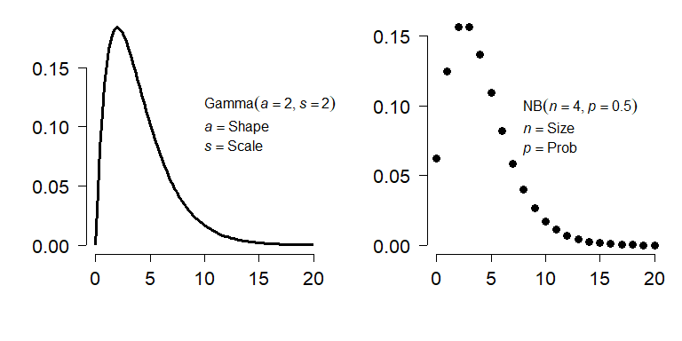
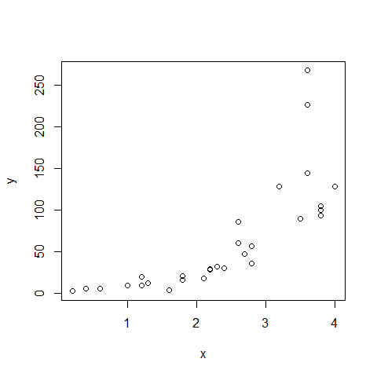
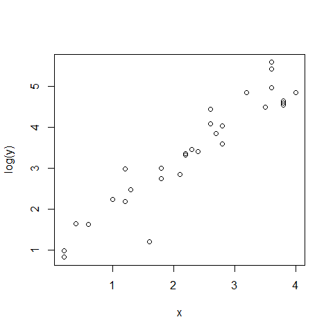
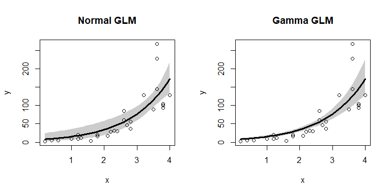

# Overview

This is one of several sections exploring some common GLM applications. For most of these applications we will work through two examples. First, an analysis of simulated data, and second, an analysis of a real dataset. Simulating a dataset suitable for an analysis is an excellent way to learn about the analysis method, because it helps you see the relationship between the data-generating process and the analysis.

This module explores GLMs for data following a **gamma distribution**. Gamma-distributed data can show up in two ways in biology: waiting times, or overdispersed continuous data (i.e., data where $\sigma > \mu$). The latter case can also be well-modeled by a [log-linear GLM](https://greenquanteco.github.io/05-glm-03-loglinear_models.html), but the gamma GLM offers an elegant (and under-utilized) alternative.
 
# Gamma GLMs

**Gamma regression** is a GLM where response values follow a gamma distribution. The gamma distribution usually describes one of two kinds of data: waiting times until a certain number of events occur, or right-skewed continuous data. The gamma distribution is the continuous analogue of the negative binomial distribution. The figure below shows this:

<!-- -->

A gamma distribution with shape *a* and scale *s* is basically a continuous version of a negative binomial distribution with size *n* and probability *p* according to the following relationships:

$$a=\frac{\mu^2}{\sigma^2}$$
$$s=\frac{\mu}{a}$$

Where $\mu$ and $\sigma^2$ can be calculated from the parameters of the negative binomial distribution as:

$$\mu=\frac{n\left(1-p\right)}{p},\ \sigma^2=\frac{n\left(1-p\right)}{p^2}$$

The relationships above can be used to convert between gamma distributions and negative binomial distributions with other parameterizations. For example, ecologists often use an alternate version of the negative binomial with mean $\mu$ and $\sigma^{2}=\mu + (\mu^{2}/k)$.

Like the negative binomial, biologists can take advantage of the numerical properties of the gamma to model phenomena for which the variance is much greater than the mean. The **log-normal distribution** is another option for right-skewed data. Neither the log-normal nor the gamma distribution can take the value 0, so users of the gamma distribution may need to adjust their data so that 0s do not occur. Of the GLMs described in this guide, gamma models are probably the most under-utilized by biologists.
 
# Example with simulated data

As always, we will start with analysis of simulated data. Notice that we are using **log link function**. The canonical link for the gamma distribution is the **reciprocal function** ($f(x)=1/x$). However, the reciprocal function is more applicable for the “waiting time” interpretation of the distribution. For the “right-skewed non-negative distribution” interpretation, the log or identity links can be appropriate. However, the log-link cannot be used if your data contain 0s.


```r
set.seed(123)
n <- 30
x <- round(runif(n, 0, 4), 1)

# coefficients
beta0 <- 0.9
beta1 <- 1.2

# linear predictor
eta <- beta0 + beta1 * x

# inverse link
y <- exp(eta)

# gamma parameter
shape <- 4

# draw y values (stochastic part)
y <- rgamma(n, rate=shape/y, shape=shape)

# assemble dataset
dat <- data.frame(x=x, y=y)

# take a look at the data:
head(dat)
```

```
##     x          y
## 1 1.2  19.831466
## 2 3.2 128.548423
## 3 1.6   3.303748
## 4 3.5  89.653108
## 5 3.8 105.050148
## 6 0.2   2.268062
```

```r
plot(x,y)
```

<!-- -->

The data look like they might be log-linear—i.e., linear on a logarithmic scale. We can check that with another scatterplot:


```r
plot(x, log(y))
```

<!-- -->

When *y* is log-transformed, things look linear. We will try a Gaussian GLM with log link function. Because the variance looks like it increases at larger *X* values, we will also try a gamma GLM. One characteristic of the gamma distribution is that the variance is proportional to the mean squared, which might be the case here.


```r
mod1 <- glm(y~x, data=dat, family=gaussian(link="log"))
mod2 <- glm(y~x, data=dat, family=Gamma(link="log"))
summary(mod1)
```

```
## 
## Call:
## glm(formula = y ~ x, family = gaussian(link = "log"), data = dat)
## 
## Deviance Residuals: 
##     Min       1Q   Median       3Q      Max  
## -52.584  -18.722   -8.663   -4.337  143.577  
## 
## Coefficients:
##             Estimate Std. Error t value Pr(>|t|)    
## (Intercept)   1.8969     0.6141   3.089   0.0045 ** 
## x             0.8122     0.1725   4.708 6.16e-05 ***
## ---
## Signif. codes:  0 '***' 0.001 '**' 0.01 '*' 0.05 '.' 0.1 ' ' 1
## 
## (Dispersion parameter for gaussian family taken to be 1650.88)
## 
##     Null deviance: 128445  on 29  degrees of freedom
## Residual deviance:  46225  on 28  degrees of freedom
## AIC: 311.34
## 
## Number of Fisher Scoring iterations: 6
```

```r
summary(mod2)
```

```
## 
## Call:
## glm(formula = y ~ x, family = Gamma(link = "log"), data = dat)
## 
## Deviance Residuals: 
##      Min        1Q    Median        3Q       Max  
## -1.23251  -0.35454  -0.05758   0.13402   0.76848  
## 
## Coefficients:
##             Estimate Std. Error t value Pr(>|t|)    
## (Intercept)  0.99844    0.17787   5.613 5.21e-06 ***
## x            1.08949    0.06932  15.717 2.02e-15 ***
## ---
## Signif. codes:  0 '***' 0.001 '**' 0.01 '*' 0.05 '.' 0.1 ' ' 1
## 
## (Dispersion parameter for Gamma family taken to be 0.1887889)
## 
##     Null deviance: 41.3449  on 29  degrees of freedom
## Residual deviance:  5.4667  on 28  degrees of freedom
## AIC: 245.54
## 
## Number of Fisher Scoring iterations: 4
```

Notice that the parameter estimates from the gamma GLM were much closer to "reality" than those of the Gaussian GLM. Which model performed better? The pseudo-*R*^2^ suggests the gamma:


```r
1-mod1$deviance/mod1$null.deviance
```

```
## [1] 0.6401217
```

```r
1-mod2$deviance/mod2$null.deviance
```

```
## [1] 0.8677773
```

The best test is to plot the predicted values against the actual values and compare the models.


```r
# values for prediction
use.n <- 50
px <- seq(min(x), max(x), length=use.n)

# calculate predictions and CI
pred1 <- predict(mod1, newdata=data.frame(x=px),
                 type="link", se.fit=TRUE)
mn1 <- pred1$fit
lo1 <- qnorm(0.025, mn1, pred1$se.fit)
up1 <- qnorm(0.975, mn1, pred1$se.fit)

# inverse link function
mn1 <- mod1$family$linkinv(mn1)
lo1 <- mod1$family$linkinv(lo1)
up1 <- mod1$family$linkinv(up1)

# calculate predictions and CI for gamma model
pred2 <- predict(mod2, newdata=data.frame(x=px),
                 type="link", se.fit=TRUE)
mn2 <- pred1$fit
lo2 <- qnorm(0.025, mn2, pred2$se.fit)
up2 <- qnorm(0.975, mn2, pred2$se.fit)

# inverse link function
mn2 <- mod1$family$linkinv(mn2)
lo2 <- mod1$family$linkinv(lo2)
up2 <- mod1$family$linkinv(up2)

# make plot
par(mfrow=c(1,2))
plot(x,y, main="Normal GLM")
polygon(x=c(px, rev(px)), y=c(lo1, rev(up1)),
        border=NA, col="grey80")
points(px, mn1, type="l", lwd=3)
points(x, y)
plot(x,y, main="Gamma GLM")
polygon(x=c(px, rev(px)), y=c(lo2, rev(up2)),
        border=NA, col="grey80")
points(px, mn2, type="l", lwd=3)
points(x, y)
```

<!-- -->

The gamma GLM captured the heteroscedasticity in the data (non-constant variance) better than the Gaussian (normal) GLM. We should conclude that the gamma GLM better represents the data. If you have a heteroscedastic relationship that isn't well-modeled by other GLMs, the gamma GLM might be worth a try.

---


[**Go back to main page**](https://greenquanteco.github.io/index.html)

# References

<div id="refs"></div>

# Legal notice

This site is for educational purposes only. This work and its content is released under the [Creative Commons Attribution-ShareAlike 4.0](https://creativecommons.org/licenses/by-sa/4.0/) license. Inclusion of third-party data falls under guidelines of fair use as defined in [section 107 of the US Copyright Act of 1976](https://www.law.cornell.edu/uscode/text/17/107). 
