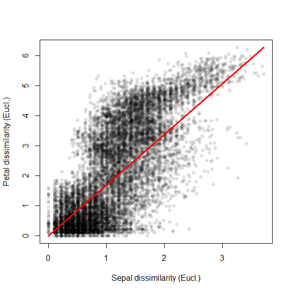
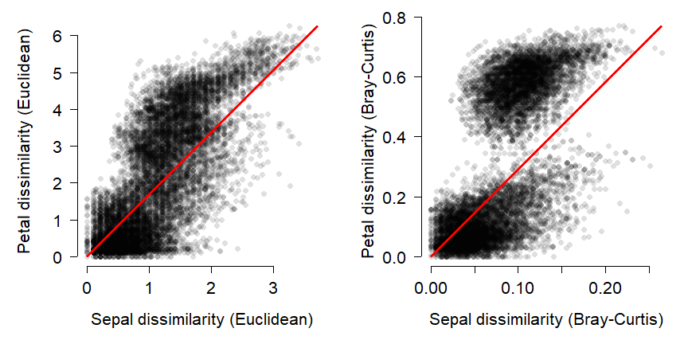
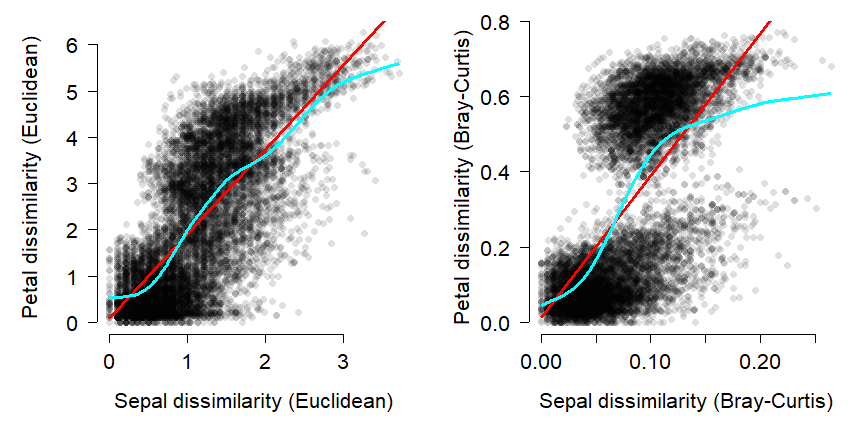
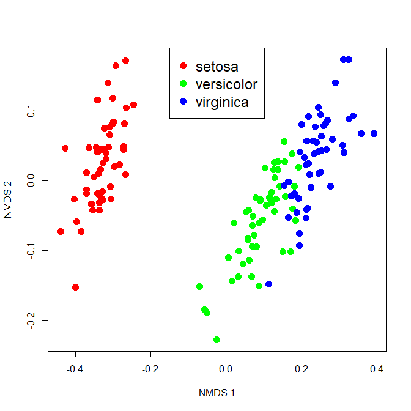

# Introduction

A metric like the Bray-Curtis or Euclidean metric can quantify how different samples are from each other in terms of many variables simultaneously. The natural next question to ask is, "So what?". Just as we can compare means between groups, or measure whether two variables are correlated, we can compare distances between groups or test whether two sets of distances are correlated. This document demonstrates some ways to use distance metrics to generalize common univariate and bivariate tests to patterns in higher dimensions.

# Mantel tests: distance vs. distance

One way to use distance metrics in a biological investigation is to calculate different distances between samples using different sets of variables, and then see if those distances are related. For example, an ecologist might calculate distances between sites using plant cover data, and a separate set of distances using soil chemistry data. She would then have one distance metric describing differences between the sites in terms of their plant cover, and a second distance metric describing differences between the sites in terms of their soil characteristics. A natural question to ask then is, “is distance in terms of plant cover related to distance in terms of soil chemistry?”. In other words, "do sites that are more similar in terms of their soil chemistry tend to be more similar in terms of their plant cover?"

Answering these questions is tantamount to calculating a **correlation coefficient between two vectors of distance metrics**. This procedure is called a **Mantel test** [@mantel1967detection]. The Mantel correlation coefficient *r* answers the question, “How is variation in one set of variables related to variation in another set of variables?”.


The example below uses the `iris` dataset to test whether variation in petal morphology is related to variation in sepal morphology. Note that while the Euclidean distance metric is used here because data are known to be multivariate normal, the Bray-Curtis or other metrics may be more appropriate in other situations.


```r
# get sepal and petal variables from iris
x1 <- iris[,grep("Sepal", names(iris))]
x2 <- iris[,grep("Petal", names(iris))]

# calculate distance metrics
library(vegan)
d1 <- vegdist(x1, method="euclidean")
d2 <- vegdist(x2, method="euclidean")
d3 <- vegdist(x1) # vegdist() default metric = Bray-Curtis
d4 <- vegdist(x2)

# Mantel test on Euclidean distances
mantel(d1, d2)
```

```
## 
## Mantel statistic based on Pearson's product-moment correlation 
## 
## Call:
## mantel(xdis = d1, ydis = d2) 
## 
## Mantel statistic r: 0.7326 
##       Significance: 0.001 
## 
## Upper quantiles of permutations (null model):
##    90%    95%  97.5%    99% 
## 0.0242 0.0330 0.0409 0.0490 
## Permutation: free
## Number of permutations: 999
```

The Mantel statistic *r* is exactly the same as the Pearson product moment correlation *r* between the two sets of distance metrics (verify this with the command `cor(d1, d2)`). The significance of the Mantel *r* is usually calculated by a permutation test instead of the more conventional methods . A **permutation test** for significance works by rearranging, or permuting, the observations many times and comparing a statistic (*r*) to the distribution of the statistic across the permutations. The *P*-value is calculated as the proportion of permutations that had a statistic with a magnitude at least as great as the original statistic. In the example above, *P* = 0.001 because at most 1 out of 999 permutations had an *r* $\ge$ 0.7326. 

The function below will replicate the permutation test done for the Mantel test above. This function is provided for didactic purposes only. You should use the methods built into R and `vegan` instead. But, studying the code below can help you understand how a permutation test works.


```r
simple.ptest <- function(dm1, dm2, n=999){
    r <- cor(dm1, dm2)
    dn <- length(dm1)
    rvec <- numeric(dn)
    for(i in 1:dn){
        i1 <- d1[sample(1:dn, replace=FALSE)]
        i2 <- d2[sample(1:dn, replace=FALSE)]
        rvec[i] <- cor(i1, i2)
    }
    res <- length(which(rvec >= r))/dn
    return(res)
}

simple.ptest(d1, d2, 999)
```

```
## [1] 0
```

Mantel tests are usually reported by their numerical outputs, but you can plot the results if the test is central to your presentation. The simplest way is to plot the distance metrics on a scatterplot. The example below uses partial transparency  to better show the overlapping points. A diagonal red line shows where the two dissimilarities are equal.


```r
plot(d1, d2, pch=16, col="#00000020",
    xlab="Sepal dissimilarity (Eucl.)",
    ylab="Petal dissimilarity (Eucl.)")
segments(0, 0, max(d1), max(d2), 
    lwd=3, col="red")
```

<!-- -->

The figure shows what the Mantel *r* statistic already indicated: that flowers with similar sepal morphology tend to have similar petal morphology. 

Just for fun, the figure below visualizes the Mantel correlation based on the Euclidean (left) and Bray-Curtis (right) distances.


```r
d3 <- vegdist(x1) # default Bray-Curtis
d4 <- vegdist(x2)
mantel(d3, d4)
```

```
## 
## Mantel statistic based on Pearson's product-moment correlation 
## 
## Call:
## mantel(xdis = d3, ydis = d4) 
## 
## Mantel statistic r: 0.6552 
##       Significance: 0.001 
## 
## Upper quantiles of permutations (null model):
##    90%    95%  97.5%    99% 
## 0.0260 0.0365 0.0459 0.0578 
## Permutation: free
## Number of permutations: 999
```

```r
par(mfrow=c(1,2), mar=c(5.1, 5.1, 1.1, 1.1),
    bty="n", lend=1, las=1,
    cex.axis=1.3, cex.lab=1.3)
plot(d1, d2, pch=16, col="#00000020",
    xlab="Sepal dissimilarity (Euclidean)",
    ylab="Petal dissimilarity (Euclidean)")
segments(0, 0, max(d1), max(d2), 
    lwd=3, col="red")

plot(d3, d4, pch=16, col="#00000020",
    xlab="Sepal dissimilarity (Bray-Curtis)",
    ylab="Petal dissimilarity (Bray-Curtis)")
segments(0, 0, max(d3), max(d4), 
    lwd=3, col="red")
```

<!-- -->

Interestingly, the Bray-Curtis distances seemed to fall into two clusters in terms of the petal dissimilarity. That probably has something to do with the difference between *I*. *setosa* and the other species, but I haven't investigated it.

The Mantel test can also be performed with correlation coefficients other than the linear correlation coefficient. This makes sense if the correlation appears nonlinear. For example, if one dissimilarity metric increases consistently with the other dissimilarity metric, but not in a straight line. The most common alternative is the Spearman’s rank correlation coefficient $\rho$ (“rho”).


```r
# euclidean distance metric
mantel(d1, d2, method="spearman")
```

```
## 
## Mantel statistic based on Spearman's rank correlation rho 
## 
## Call:
## mantel(xdis = d1, ydis = d2, method = "spearman") 
## 
## Mantel statistic r: 0.7258 
##       Significance: 0.001 
## 
## Upper quantiles of permutations (null model):
##    90%    95%  97.5%    99% 
## 0.0197 0.0253 0.0298 0.0362 
## Permutation: free
## Number of permutations: 999
```

```r
# bray-curtis metric
mantel(d3, d4, method="spearman")
```

```
## 
## Mantel statistic based on Spearman's rank correlation rho 
## 
## Call:
## mantel(xdis = d3, ydis = d4, method = "spearman") 
## 
## Mantel statistic r:  0.69 
##       Significance: 0.001 
## 
## Upper quantiles of permutations (null model):
##    90%    95%  97.5%    99% 
## 0.0247 0.0331 0.0392 0.0540 
## Permutation: free
## Number of permutations: 999
```

Changing from a linear to nonlinear correlation coefficient slightly decreased the Mantel correlation for the Euclidean distances (0.7326 to 0.7258), and slightly increased the correlation for the Bray-Curtis distances (0.6552 to 0.69). Examine the figure above and see if you can work out why this is.

The figure below shows the two sets of distances with two lines: a straight line to represent the linear correlation *r* and a spline curve to represent the nonlinear correlation $\rho$.

<!-- -->

# Comparing dissimilarity between groups

Just as the Mantel test generalizes the idea of correlation from "one variable vs. one variable" to "many variables vs. many variables", other techniques generalize the idea of group differences from "difference in means between groups" to "differences in centroids between groups". This section demonstrates three common tests for multivariate differences between groups. 

## Analysis of similarity (ANOSIM): distances between groups

The **analysis of similarities (ANOSIM)** is a nonparametric, ANOVA-like test that tests whether similarity between groups is greater than or equal to the similarity within groups [@clarke1993]. This is analogous to how ANOVA tests whether the difference in means (i.e., variance) between groups is greater than or equal to the variance within groups. What makes the test nonparametric is that it operates on the rank-transformed distance matrix rather than on the actual distance metrics. 

The `vegan` function `anosim()` is used for ANOSIM. The function takes the original data matrix, a grouping variable, and can use any distance metric available in `vegan::vegdist()`. The example below uses the Euclidean metric because the data are known to be multivariate normal; you may need to use the Bray-Curtis or another metric with your own data.


```r
a1 <- anosim(iris[,1:4],
    grouping=iris$Species,
    distance="euclidean")
a1
```

```
## 
## Call:
## anosim(x = iris[, 1:4], grouping = iris$Species, distance = "euclidean") 
## Dissimilarity: euclidean 
## 
## ANOSIM statistic R: 0.8794 
##       Significance: 0.001 
## 
## Permutation: free
## Number of permutations: 999
```

Like the Mantel test, ANOSIM estimates a *P*-value by permutation. In this case, the permutation is of group membership. The underlying idea is that if there are no differences between groups (i.e., if the null hypothesis were true), then group membership is irrelevant and changing group memberships should not affect any test statistics. The ANOSIM statistic *R* expresses the relationship between the difference in mean ranks between groups ($mr_{between}$) and the within groups ($mr_{within}$).

$$R=\frac{mr_{between}-mr_{within}}{\frac{1}{4}n(n-1)}$$

The denominator scales the difference in mean ranks from -1 to 1. *R* = 0 means that grouping is unrelated to differences in mean ranks; greater *R* values indicate that differences between groups are greater than differences within groups; smaller *R* values indicate the reverse. The *R* value in our test above suggests that about 87.9% of the variation in the rank order of the distance matrix can be attributed to differences between species of *Iris*. 

## MANOVA and PERMANOVA: distances between centroids

**Multivariate analysis of variance (MANOVA)** is an extension of ANOVA with multiple response variables. The underlying theory and matrix algebra is very similar to ANOVA, and so many of the same assumptions apply (just in many dimensions instead of one). For that reason, MANOVA is often not appropriate for real biological data without careful experimental design and exploratory data analysis to confirm that the test’s assumptions are met.


```r
Y <- as.matrix(iris[,1:4])
mod1 <- manova(Y~iris$Species)

# (M)ANOVA table
summary(mod1, test="Pillai")
```

```
##               Df Pillai approx F num Df den Df    Pr(>F)    
## iris$Species   2 1.1919   53.466      8    290 < 2.2e-16 ***
## Residuals    147                                            
## ---
## Signif. codes:  0 '***' 0.001 '**' 0.01 '*' 0.05 '.' 0.1 ' ' 1
```

```r
# coefficients for each response and level of predictor
coef(mod1)
```

```
##                        Sepal.Length Sepal.Width Petal.Length Petal.Width
## (Intercept)                   5.006       3.428        1.462       0.246
## iris$Speciesversicolor        0.930      -0.658        2.798       1.080
## iris$Speciesvirginica         1.582      -0.454        4.090       1.780
```

**Permutational analysis of variance (PERMANOVA)** is a nonparametric version of MANOVA [@anderson2001]. It is nonparametric because it uses permutation of group membership to determine statistical significance instead of calculating an *F* statistic based on probability theory. The most common R function for PERMANOVA is `adonis()` from the `vegan` package.


```r
mod2 <- adonis(iris[,1:4]~iris$Species, method="euclidean")

# (perm)anova table
mod2
```

```
## 
## Call:
## adonis(formula = iris[, 1:4] ~ iris$Species, method = "euclidean") 
## 
## Permutation: free
## Number of permutations: 999
## 
## Terms added sequentially (first to last)
## 
##               Df SumsOfSqs MeanSqs F.Model      R2 Pr(>F)    
## iris$Species   2    592.07 296.037  487.33 0.86894  0.001 ***
## Residuals    147     89.30   0.607         0.13106           
## Total        149    681.37                 1.00000           
## ---
## Signif. codes:  0 '***' 0.001 '**' 0.01 '*' 0.05 '.' 0.1 ' ' 1
```

```r
# coefficients for each response and level of predictor
mod2$coefficients
```

```
##               Sepal.Length Sepal.Width Petal.Length Petal.Width
## (Intercept)     5.84333333   3.0573333        3.758   1.1993333
## iris$Species1  -0.83733333   0.3706667       -2.296  -0.9533333
## iris$Species2   0.09266667  -0.2873333        0.502   0.1266667
```

## MRPP: differences in location 

**Multiple response permutation procedures (MRPP)** is a permutational test for location that is very similar to ANOSIM [@mccune2002analysis]. The practical difference between MRPP and ANOSIM is that MRPP is typically used on coordinates within an ordination space (usually NMDS), while ANOSIM is usually used with all variables (i.e., on the original data).

In this example, we first fit an NMDS ordination to the `iris` data, then use MRPP to test whether the 3 species differ from each other. NMDS will be described in detail in its own page, but for now just understand that proximity in NMDS coordinates represents proximity in terms of the original variables. The question addressed by the MRPP is basically the same as asking whether the 3 clouds of points in the ordination space overlap or not.


```r
# NMDS ordination
library(vegan)
n1 <- metaMDS(iris[,1:4])
```

```
## Run 0 stress 0.03775523 
## Run 1 stress 0.03775524 
## ... Procrustes: rmse 9.172761e-06  max resid 5.394399e-05 
## ... Similar to previous best
## Run 2 stress 0.03775524 
## ... Procrustes: rmse 8.541023e-06  max resid 7.918737e-05 
## ... Similar to previous best
## Run 3 stress 0.05313096 
## Run 4 stress 0.04367533 
## Run 5 stress 0.04355785 
## Run 6 stress 0.03775522 
## ... New best solution
## ... Procrustes: rmse 7.683165e-06  max resid 7.674469e-05 
## ... Similar to previous best
## Run 7 stress 0.03775524 
## ... Procrustes: rmse 6.562437e-06  max resid 2.98595e-05 
## ... Similar to previous best
## Run 8 stress 0.04367538 
## Run 9 stress 0.0505973 
## Run 10 stress 0.04804019 
## Run 11 stress 0.05059737 
## Run 12 stress 0.03775521 
## ... New best solution
## ... Procrustes: rmse 8.597169e-06  max resid 4.289104e-05 
## ... Similar to previous best
## Run 13 stress 0.03775522 
## ... Procrustes: rmse 2.949822e-06  max resid 1.237819e-05 
## ... Similar to previous best
## Run 14 stress 0.03775523 
## ... Procrustes: rmse 1.114005e-05  max resid 5.032798e-05 
## ... Similar to previous best
## Run 15 stress 0.06096633 
## Run 16 stress 0.0436752 
## Run 17 stress 0.03775525 
## ... Procrustes: rmse 1.186399e-05  max resid 7.094844e-05 
## ... Similar to previous best
## Run 18 stress 0.04709617 
## Run 19 stress 0.04367538 
## Run 20 stress 0.04713709 
## *** Solution reached
```

```r
# extract scores (coordinates)
nx <- scores(n1)[,1]
ny <- scores(n1)[,2]

# set up some colors for the plot
cols <- rainbow(3)
use.cols <- cols[as.numeric(iris$Species)]

# make the plot
plot(nx, ny, pch=16, col=use.cols, 
    cex=1.5,
    xlab="NMDS 1", ylab="NMDS 2")
legend("top", legend=unique(iris$Species),
    pch=16, cex=1.5, col=cols)
```

<!-- -->

The figure suggests that there is good separation between at least *I*. *setosa* and the other species, and likely separation between *I*. *versicolor* and *I*. *virginica*. The MRPP will test whether or not the clouds of points overlap.


```r
mrpp(scores(n1), iris$Species)
```

```
## 
## Call:
## mrpp(dat = scores(n1), grouping = iris$Species) 
## 
## Dissimilarity index: euclidean 
## Weights for groups:  n 
## 
## Class means and counts:
## 
##       setosa  versicolor virginica
## delta 0.09269 0.1086     0.1035   
## n     50      50         50       
## 
## Chance corrected within-group agreement A: 0.6635 
## Based on observed delta 0.1016 and expected delta 0.3018 
## 
## Significance of delta: 0.001 
## Permutation: free
## Number of permutations: 999
```

The test statistics are delta ($\delta$), the weighted mean within-group distance; and *A*, the chance-corrected within-group agreement or agreement statistic. 

- The $\delta$ value for each group with expresses how homogenous the group is.
  - When $\delta$ = 0, all members of a group are identical (i.e., have identical location in the NMDS space).
  - The mean of the group-level $\delta$ is reported as the “observed delta”.
- The agreement statistic *A* scales $\delta$ to the within-group homogeneity expected by chance if group membership was unrelated to location (expected delta in the output above).
  - Greater values of *A* indicate higher agreement within groups.
  - *A* ranges from 0 (heterogeneity within groups equal to heterogeneity expected by chance) to 1 (items within groups identical).
  - In practice, values of *A* > 0.3 are rather high.
 
The significance of the MRPP is calculated by permutation, just as in the Mantel test or ANOSIM. As with any statistical test, the *P*-value is sensitive to not only the effect size, but also the sample size. Large sample sizes can make tiny differences appear statistically significant, so it is up to you as a biologist to interpret the output of the test.

[**Go back to main page**](https://greenquanteco.github.io/index.html)

# References

<div id="refs"></div>

# Legal notice

This site is for educational purposes only. This work and its content is released under the [Creative Commons Attribution-ShareAlike 4.0](https://creativecommons.org/licenses/by-sa/4.0/) license. Inclusion of third-party data falls under guidelines of fair use as defined in [section 107 of the US Copyright Act of 1976](https://www.law.cornell.edu/uscode/text/17/107). 
