# Introduction

In the [last section](https://greenquanteco.github.io/08-multi-03-analyzing_sim.html) we saw an application of **ordination**: representing high-dimensional relationships between objects in a 2-d space. This is done in such a way as to represent important patterns in the data in few enough dimensions for our 3-d brains to handle.
 
Ordination is literally **ordering observations along two or more axes**. That is, coming up with a new coordinate system that shows relationships between observations. How that ordering is done varies wildly among techniques. One broad class of techniques, collectively called **eigenvector** based methods, use the power of linear algebra to place the data into a new coordinate system that better captures the patterns in the data. The other class uses **Monte Carlo sampling** to find arrangements of samples that retain the important patterns in reduced dimension space.

No matter how they work, all ordination methods have the same goal: representing patterns found in many dimensions in fewer dimensions. For this course our focus will be on interpretation rather than calculation. The applications of ordination overlap with those of the multivariate techniques that we have already seen:

- **Cluster identification**: observations that are closer to each other in the ordination space are more similar to each other
- **Dimension reduction**: the axes of an ordination are estimates of synthetic variables that combine information about many variables at once

# Principal components analysis (PCA)

## PCA intro

Principal components analysis (PCA) is a method for extracting synthetic gradients from a multivariate dataset that capture most of the variation in that dataset. These gradients are calculated by finding linear combinations of the variables that minimize sums of squared deviations from the gradient. This means that PCA has a lot in common with linear regression, and many of the same assumptions apply.
If you’ve never heard of principal components analysis or ordination, it might be worth watching a video that explains and shows the basic ideas. Here is one that only takes 5 minutes and has a nice theme song (accessed 2021-08-10) .
Imagine a dataset with 2 variables, *x* and *y*. You could capture and display all the information about this dataset in a 2-d scatterplot, by simply plotting *y* vs. *x*. Likewise, you could capture and display all of the information about a 3-dimensional dataset with a 3-d plot. For 4 or more dimensions, a true scatterplot can’t be rendered sensibly or even understood by our pathetic meat-based brains.

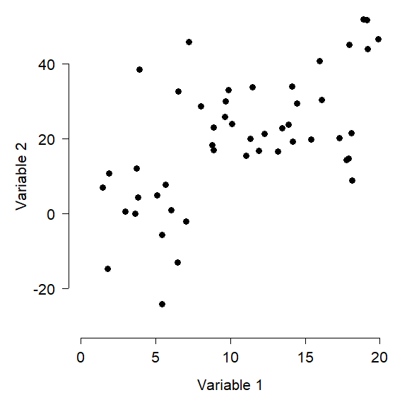<!-- -->

One way to describe the variation in the dataset above is to think about how the samples vary along each axis. The figure below shows how the variation among samples can be broken down into the variation in Variable 1 and the variation in Variable 2. When we say “variation in variable 1”, we mean “deviation between the values of variable 1 and the mean of variable 1”. That is what is shown in the figure below.

- Each point, or sample, has a Variable 1 coordinate and a Variable 2 coordinate.
- Each point’s value for Variable 1 can be thought of as the difference between that value and the mean of Variable 1.
- Likewise, each point’s value for Variable 2 can be thought of as the difference between that value and the mean of Variable 2.
- The position of each point can thus be reframed as its deviation with respect to the Variable 1, and its deviation with respect to Variable 2. This reframing is the same as centering each variable (i.e., subtracting the mean). 
- The total variance among the samples is equal to the variance with respect to Variable 1 plus the variance with respect to Variable 2.

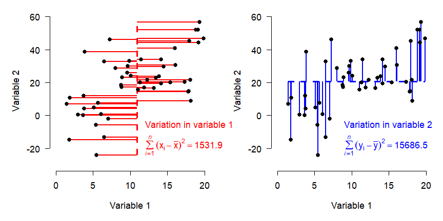<!-- -->

The figure above shows how the total variation in the dataset is split up (“partitioned”) into variation in Variable 1 and variation in Variable 2. 

Describing each observation as its deviation from the mean of each variable has the effect of **centering** the points at the origin. Notice that the variation, expressed as sums of squared deviations, is unchanged.

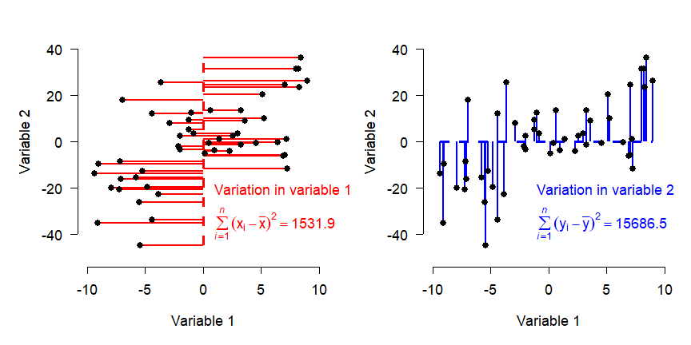<!-- -->

If variables have different ranges, it is a good idea to scale them as well as center them (aka: standardizing or *Z*-scaling). This means that the original values are converted to *Z*-scores by subtracting the mean and dividing by the SD. Trying to use PCA or other eigenvector-based methods without standardizing variables will distort the results. Standardization puts variation along any axis on equal footing.
 
The figure below shows the data as deviations from variable means after standardization. Note that the sums of squares are equal in both directions now.

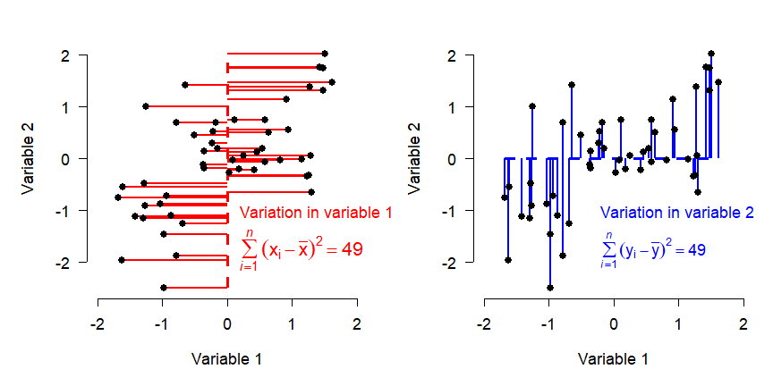<!-- -->
If our goal is to describe variation in the data as succinctly as possible, then using Variable 1 and Variable 2 as axes might not be the best approach. Notice that most of the variation in the points doesn’t line up exactly with either of the variables, but along the red arrow shown below. The rest of the variation is along the direction perpendicular to the red arrow, illustrated by the blue arrow. (Note that the arrows may only appear perpendicular if the plot is precisely square).

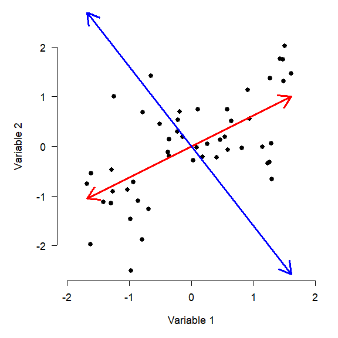<!-- -->

The red arrow is a vector that contains information about both Variable 1 and Variable 2. It is tricky, but not too hard, to calculate each observation’s deviations from the mean of that vector (left panel below). We can also calculate the deviations along a perpendicular vector, because even after describing the variation in the “red” direction, there is still some variation in the “blue” direction (right panel).


```
## [1] 21.44365
```

```
## [1] 76.55635
```

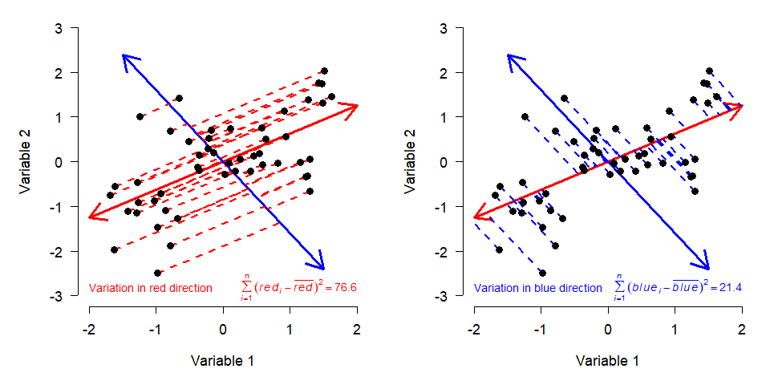<!-- -->

We know that the variation on the red and blue axes is the same as the variation on the *X* and *Y* axes, because the sums of squares are the same. The red and blue axes are just different ways of orienting the data to express the same patterns. All we really did was **rotate** the original coordinate system (defined by Variables 1 and 2) to a new coordinate system (defined by red and blue).

You may have guessed that the red and blue axes have special names: they are the **principal components** of this dataset. Principal components (PCs) are **synthetic** or **composite axes** that capture most of the variation. A PC is a **linear combination** of each of the original variables. This is easy to see in the figure above, because PC1 is defined by its coordinates. The same logic is true with more variables; it’s just harder to visualize. 

## PCA by hand

The procedure above illustrates the geometric interpretation of PCA. The general procedure is:

1. Begin with the samples as a cloud of n points in a p-dimensional space.
2. Center (and usually scale) the axes in the point cloud. This will place the origin of the new coordinate system at the p-dimensional centroid of the cloud.
3. Rotate the axes to maximize the variance along the axes. As the angle of rotation $\theta$ changes, the variance $\sigma^{2}$ will also change.
4. Continue to rotate the axes until the variance along each axis is maximized. Because the data are changed only by rotation, the Euclidean distances between them are preserved.

The other way PCA can be understood is in the language of linear algebra. The procedure is roughly given by:

1.	Calculate the variance-covariance matrix **S** of the data matrix **A**. This is a *p* $\times$ *p* square matrix with the variances of each variable on the diagonal, and covariances between pairs of variables in the upper and lower triangles.
2.	Find the eigenvalues $\lambda$ of **S**. Each eigenvalue represents a portion of the original total variance--the proportion corresponding to a particular principal component.
3.	Find the eigenvectors. For each eigenvalue $\lambda$, there is an eigenvector that contains the coefficients of the linear equation for that principal component. Together the eigenvectors form a *p* $\times$ *p* matrix, **Y**.
4.	Find the scores for the original samples on each principal component as $\textbf{X} = \textbf{AY}$. 
The linear algebra method of PCA in R is illustrated below.


```r
# generate some random data for PCA
set.seed(123)
n <- 50
x <- runif(n, 1, 20)
y <- 1.2 + 1.7*x + rnorm(n, 0, 15)

# produces data with a linear relationship between x and y
# data matrix: n rows * p columns
A <- cbind(x,y)

# standardize each variable
A <- apply(A, 2, scale)

# calculate variance-covariance matrix S
S <- cov(A)
```

The variance-covariance matrix **S** contains the variances of the variables on the diagonal. Both variances are 1 because we scaled the variables (compare to `cov(A)` to see the difference). This matrix **S** is symmetric because the covariance function is reflexive; i.e., Cov(x,y) = Cov(y,x). The variance-covariance matrix is useful because it contains information about both the spread (variance) and orientation (covariance) in the data. For a dataset like ours with 2 variables, the variance-covariance matrix has 2 dimensions (one for each variable).

$$ \textbf{S}= \begin{bmatrix}Var(x) & Cov(x,y) \\ Cov(y,x) & Var(y) \end{bmatrix} $$


```r
# calculate eigenvalues and eigenvectors
eigens <- eigen(S)
evals <- eigens$values
evecs <- eigens$vectors
```

PCA is all about defining a new coordinate system for the data that preserves Euclidean distances, but maximizes the variance captured on the axes of the new system. The axes of the new system are found as linear combinations of the original variables. This means that the new coordinate system will have as many dimensions as the original coordinate system. 

The data in our example can be thought of as a matrix with two columns; each sample is defined by a vector of length two (one for each dimension). That vector simply contains the *x* and *y* coordinates of the sample. If the dataset is matrix **X**, then each point is a vector $v_{i}$ where *i* = 1, 2, …, *n* (*n* = number of samples). For example, the vector [1, 2] corresponds to an observation with *x* = 1 and *y* = 2 (this vector is also a row of **X**). 

To transform the points in the original coordinate system to a new coordinate system, we multiply each vector $v_{i}$ by a *p* $\times$ *p* transformation matrix  **T** (recall that *p* is the number of dimensions) to get the transformed coordinates $b_{i}$.

$$\textbf{T}v_{i}=b_{i}$$

Or written out fully:

$$\begin{bmatrix} \textbf{T}_{1,1} & \textbf{T}_{1,2} \\ \textbf{T}_{2,1} & \textbf{T}_{2,2} \end{bmatrix} \begin{bmatrix} x_{i} \\ y_{i} \end{bmatrix} =\begin{bmatrix}\textbf{T}_{1,1}x_{i} & \textbf{T}_{1,2}y_{i} \\ \textbf{T}_{2,1}x_{i} & \textbf{T}_{2,2}y_{i}\end{bmatrix}$$

It turns out that some vectors $v_{i}$ have a very interesting property: when transformed by **T**, they change length but not direction. These vectors are called **eigenvectors**. The **scalar** (aka: constant) that defines the change in their length (aka: magnitude) is called an **eigenvalue**. This property is expressed compactly as:

$$\textbf{T}v_{i}=\lambda b_{i} $$


The interpretation of this expression is that transforming a coordinate $v_{i}$ into a new coordinate system with matrix **T** is the same as multiplying $v_{i}$ by the eigenvalue $\lambda$. If the eigenvectors are collected into a new matrix **V**, and the eigenvalues are collected into a vector **L**, then

$$\textbf{S}\textbf{V}=\textbf{L}\textbf{V} $$

Put in terms of our 2-d example,

$$\begin{bmatrix}Var(x) & Cov(x,y) \\ Cov(y,x) & Var(y) \end{bmatrix} \begin{bmatrix} v_{1}\\v_{2} \end{bmatrix}=
\begin{bmatrix}\lambda_{1}\\\lambda_{2} \end{bmatrix}
\begin{bmatrix}v_{1}\\v_{2} \end{bmatrix} $$

Once the terms are solved (by the computer!), we can put the eigenvectors in descending order of their eigenvalues to get the principal components. 


```r
# calculate scores by matrix operations
pc <- A %*% evecs

# check that variances = eigenvalues and 
# covariances = 0 (must be, by definition of PCA)
## close enough (<1e-16), probably a numerical limit involved
cov(pc)
```

```
##              [,1]         [,2]
## [1,] 1.625446e+00 9.690887e-17
## [2,] 9.690887e-17 3.745539e-01
```

```r
# variance explained by each PC
round(evals/sum(evals),3)
```

```
## [1] 0.813 0.187
```

The result shows us that about 81% of the variation is explained by PC1 alone, with the remainder explained by PC2. Notice that all of the variation in the dataset is associated with 1 and only 1 PC. This is part of the definition of PCA--the total variation among the samples does not change. All that changes is how we describe the variation (i.e., how we orient the axes used to describe the samples).

Why go through all of this trouble? Besides the benefit of understanding what PCA is doing, we can use the linear algebra to translate between the coordinate system of the original data, and the coordinates system defined by the PCs. The algebra is complicated, but it boils down to multiplying the matrix of PC scores by the transpose of the eigenvector matrix:


```r
backxy <- pc %*% t(evecs)
range(A-backxy)
```

```
## [1] -4.440892e-16  4.440892e-16
```

The “back-calculated” coordinates are off by at most $4.5\times10^{-16}$…the differences should technically be 0, but they are approximated to a very small number by R.

## PCA in R (package `vegan`)

There are two methods for PCA in base R: `prcomp()` and `princomp()`. Both of these methods produce similar outputs, and the only major difference between them is the syntax for extracting results. For this course we are going to use the ordination functions in package `vegan`. Although designed for community ecology, `vegan` is widely used for ordination and multivariate analysis in many fields . Importantly, `vegan` is actively maintained and updated with new techniques as they are developed. Also importantly, `vegan` offers a common interface for many kinds of ordination.

The example below uses the bat brain dataset that we have used before. Load the dataset into R and take a look. @hutcheon2002 reported data on brain morphology and lifestyle from 63 species of bats. Their dataset contains the following variables:

|Variable|Meaning|
|----|----|
|`species`|	Species|
|`family`|Taxonomic family|
|`diet`|Herbivore, gleaner, hawker, or vampire|
|`bow`|Body weight (g)|
|`brw`|Brain weight ($\mu$g)|
|`aud`|Auditory nuclei volume (mm^3^)|
|`mob`|Main olfactory bulb volume (mm^3^)|
|`hip`|Hippcampus volume (mm^3^)|

Import the dataset `bat_data_example.csv`. You can download it [here](https://greenquanteco.github.io/bat_data_example.csv
). The code below requires that you have the file in your R working directory.


```r
library(vegan)
library(rgl)
in.name <- "bat_data_example.csv"
dat <- read.csv(in.name, header=TRUE)
```

We are going to explore how brain morphology, measured as volumes of various brain parts, varies with taxonomy and lifestyle. First, we need to make sure that our data are suitable for PCA. We can inspect distributions of the variables with histograms.


```r
pc.cols <- 4:ncol(dat)
par(mfrow=c(2,3))
for(i in 1:length(pc.cols)){hist(dat[,pc.cols[i]])}
```

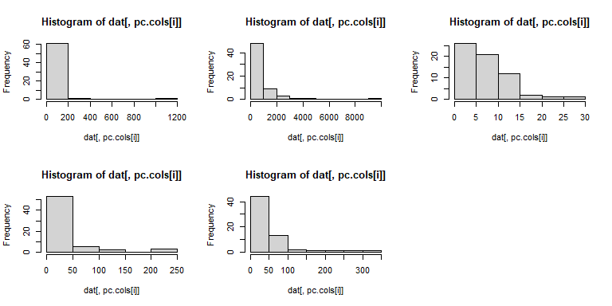<!-- -->

The histograms suggest that a log transform would be appropriate, because PCA requires multivariate normality.


```r
dat2 <- dat
dat2[,pc.cols] <- apply(dat2[,pc.cols], 2, log)
par(mfrow=c(2,3))
for(i in 1:length(pc.cols)){
    hist(dat2[,pc.cols[i]],
        main=names(dat2)[pc.cols[i]])
}
```

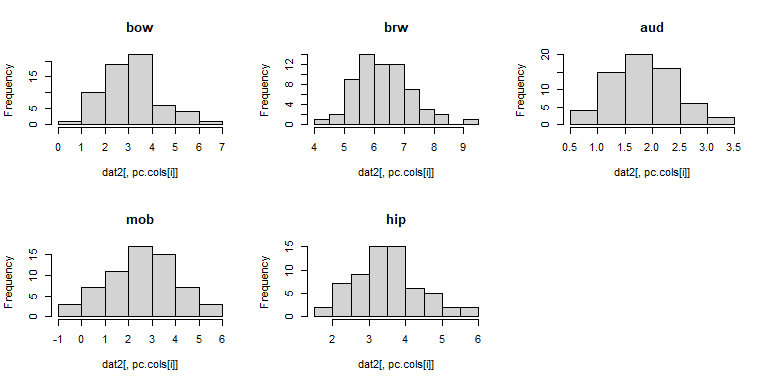<!-- -->

Much better. We should also check to see if any of the variables are related to each other. It’s okay if they are, but such relationships need to be kept in mind when interpreting the PCA (or any ordination, for that matter). To explore relationships between the variables, we will use a `pairs()` plot and a function borrowed from the `pairs()` help page.


```r
# borrowed from ?pairs examples
panel.cor <- function(x, y, digits = 2, prefix = "", cex.cor, ...)
{
    usr <- par("usr"); on.exit(par(usr))
    par(usr = c(0, 1, 0, 1))
    r <- abs(cor(x, y))
    txt <- format(c(r, 0.123456789), digits = digits)[1]
    txt <- paste0(prefix, txt)
    if(missing(cex.cor)) cex.cor <- 0.8/strwidth(txt)
    text(0.5, 0.5, txt, cex = cex.cor * r)
}

# make our plot:
pairs(dat2[,pc.cols],
    lower.panel = panel.smooth,
    upper.panel = panel.cor,
    gap=0)
```

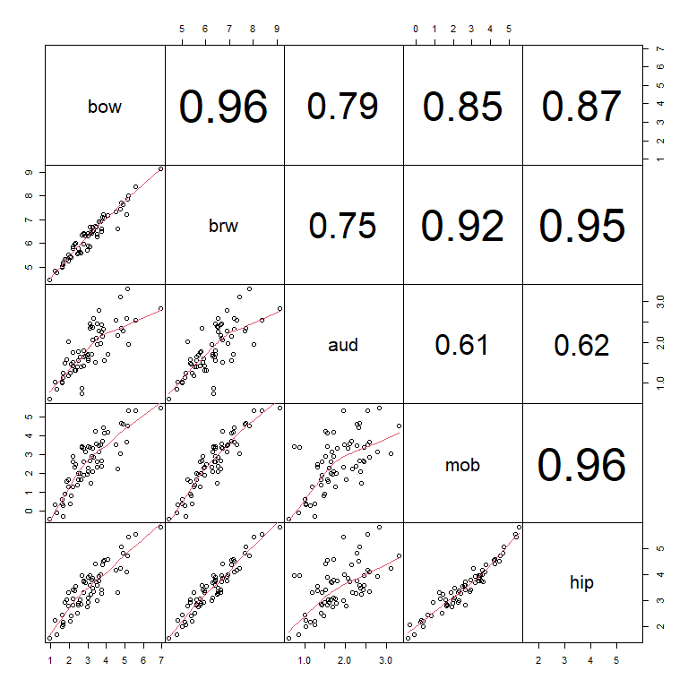<!-- -->

The scatterplot matrix suggests that every variable is closely related to every other variable. This makes sense for morphological data: the sizes of different body parts tend to scale with overall body size. We are interested in brain morphology independent of size, we can factor out size by dividing the volumes of each brain part by the body weight. Because the data are already on the log scale, the division is accomplished by subtracting the log-transformed body weight. The new values of `brw`, `aud`, `mob`, and `hip` are the sizes of those brain components with body size factored out. Neglecting to factor out body size or overall size prior to an ordination will result in an ordination dominated by body size.


```r
dat3 <- dat2
dat3[,pc.cols[-1]] <- apply(dat3[,pc.cols], 1,
    function(x){x[-1]-x[1]})
pairs(dat3[,pc.cols],
    lower.panel = panel.smooth,
    upper.panel = panel.cor,
    gap=0)
```

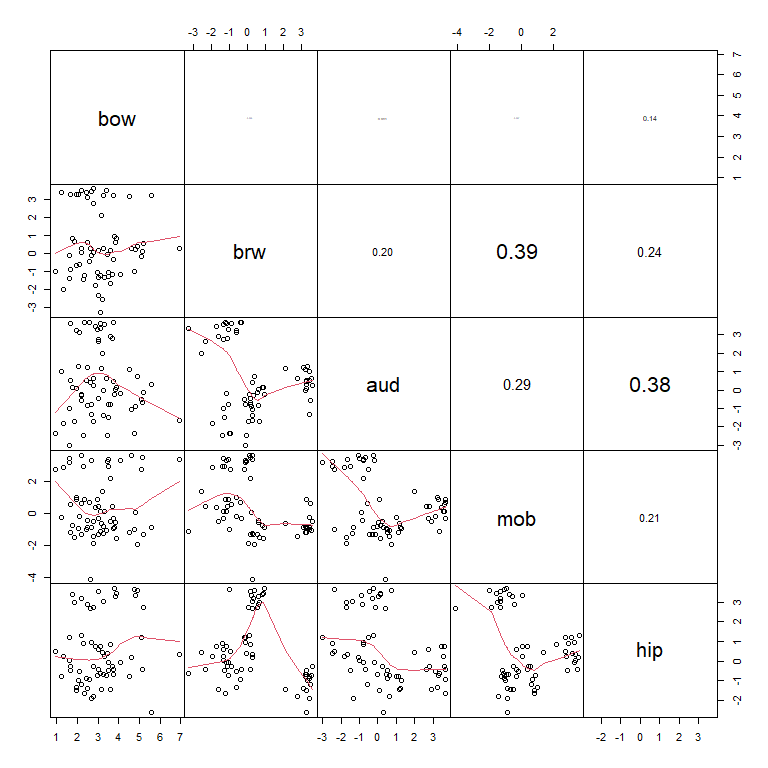<!-- -->

Next, use the function `rda()` from `vegan` to calculate the PCA. In this PCA we scale the variables (aka: standardize) by subtracting the mean and dividing by the SD. This has the effect of making each variable have mean = 0 and SD = 1. Scaling is not required for PCA but is ***highly*** recommended. If values are not scaled, then the PCA will be dominated by the variables with the greatest values or by the observations with extreme values.


```r
p1 <- rda(dat3[,pc.cols], scale=TRUE)
summary(p1)
```

```
## 
## Call:
## rda(X = dat3[, pc.cols], scale = TRUE) 
## 
## Partitioning of correlations:
##               Inertia Proportion
## Total               5          1
## Unconstrained       5          1
## 
## Eigenvalues, and their contribution to the correlations 
## 
## Importance of components:
##                          PC1    PC2    PC3    PC4     PC5
## Eigenvalue            1.4884 1.3471 1.0867 0.9389 0.13888
## Proportion Explained  0.2977 0.2694 0.2173 0.1878 0.02778
## Cumulative Proportion 0.2977 0.5671 0.7844 0.9722 1.00000
## 
## Scaling 2 for species and site scores
## * Species are scaled proportional to eigenvalues
## * Sites are unscaled: weighted dispersion equal on all dimensions
## * General scaling constant of scores:  4.196048 
## 
## 
## Species scores
## 
##         PC1     PC2     PC3     PC4     PC5
## bow  0.6502 -0.3804  0.3746  1.6772 -0.0256
## brw -0.8926 -1.2116 -1.0353  0.2617  0.3410
## aud -1.2718  0.7591  1.0657  0.2616  0.3513
## mob  0.9822  1.2887 -0.8596  0.1665  0.3596
## hip  1.1999 -0.9455  0.8601 -0.5732  0.3456
## 
## 
## Site scores (weighted sums of species scores)
## 
##           PC1      PC2      PC3       PC4       PC5
## sit1  -0.4822 -0.47110 -0.51367  0.032283  0.474975
## sit2  -0.1875  0.46735  0.51711  0.369969 -0.003147
## sit3   0.7140  0.21390 -0.80651 -0.818336 -0.071516
## sit4   0.4038 -0.72892  0.44826 -0.063108  0.690554
## sit5  -0.4484 -0.47079 -0.46877  0.246659 -0.080258
## sit6  -0.1740  0.54116  0.76904 -0.090556  0.443921
## sit7   0.7314  0.13147 -0.08352  0.791550  0.556946
## sit8   0.4378 -0.68647  0.29135 -0.318361 -0.389457
## sit9  -0.6786 -0.40593 -0.49047 -0.055734  0.047201
## sit10 -0.5471  0.46826  0.39227 -0.277305  0.021265
## sit11  0.5047  0.45175 -0.68715 -1.046120 -0.554421
## sit12  0.2737 -0.76045  0.56922 -0.009404  0.423659
## sit13 -0.7074 -0.40835 -0.46360 -0.442119  0.136189
## sit14 -0.4174  0.54986  0.56501  0.390291 -0.996710
## sit15  0.7238  0.23208 -0.69268  0.086960 -0.220235
## sit16  0.4023 -0.71503  0.56602  0.622207 -0.030857
## sit17 -0.5113 -0.39390 -0.48222  1.449440 -0.874003
## sit18 -0.5161  0.65950  0.41766 -0.464633  0.546833
## sit19  0.5582  0.59672 -0.21665  0.456523  0.041643
## sit20  0.7217 -0.57541  0.37694  0.361859  0.367978
## sit21 -0.7814 -0.18490 -0.59536 -0.546239  0.624799
## sit22 -0.5743  0.86534  0.31746 -0.031015 -0.046946
## sit23  0.6501  0.30104 -0.50589  0.704037  0.450911
## sit24  0.1322 -0.48776  0.29655 -0.905271  0.829062
## sit25 -0.6016 -0.09952 -0.25379  0.285644 -0.292755
## sit26  0.1762  0.68850  0.53632  0.011641 -0.162855
## sit27  0.7698  0.39111 -0.48473 -0.523310 -0.586544
## sit28  0.9450 -0.72682  0.51129  0.189683 -0.972058
## sit29 -0.5400 -0.44113 -0.89254  0.077095 -1.008438
## sit30 -0.2476  0.41802  0.76914  0.033110  0.585923
## sit31  0.4579  0.43434 -0.42246 -0.427813  1.254583
## sit32  0.3163 -0.48116  0.14197 -0.583475  0.258704
## sit33 -0.7874 -0.22881 -0.42449  0.020886  0.036846
## sit34 -0.3562  0.67117  0.40279  0.130779  0.254196
## sit35  0.5619  0.57716 -0.36416  0.198927 -0.096652
## sit36  0.3383 -0.69771  0.27202 -0.543479 -0.917745
## sit37 -0.5503 -0.04613 -0.87845 -0.183795  0.366676
## sit38 -0.5610  0.76767  0.14607 -0.233642  0.203234
## sit39  0.5757  0.53175 -0.44112  0.176223 -0.783513
## sit40  0.1957 -0.53875  0.38645 -0.748866  0.152175
## sit41 -0.5793 -0.50413 -0.38612  0.342061  0.134688
## sit42 -0.4700  0.34255  0.60210  0.442490  0.268606
## sit43  0.4381  0.72725 -0.50710 -0.652534 -0.132495
## sit44  0.3847 -0.57265  0.44835 -0.003145  0.642012
## sit45 -0.5225 -0.50720 -0.16657  0.831065  0.048770
## sit46 -0.1615  0.68519  0.58968  0.026128 -0.556304
## sit47  0.9713  0.04069 -0.36804  1.647929  0.094091
## sit48  0.2589 -0.69440  0.08940 -0.926043 -0.419415
## sit49 -0.4445 -0.20883 -0.92458 -0.132031  0.220466
## sit50 -0.5502  0.63824  0.32205  0.014305  0.458476
## sit51  0.5413  0.65064 -0.46422 -0.868767 -0.806164
## sit52  0.3340 -0.79973  0.88265  0.412611  0.351906
## sit53 -0.8137 -0.28059 -0.41296 -0.184942  0.305652
## sit54 -0.2019  0.32853  0.67470 -0.050061 -0.030891
## sit55  0.5214  0.37534 -0.43319 -0.221992  0.717535
## sit56  0.3656 -0.62963  0.49570 -0.443295  0.124316
## sit57 -0.4750 -0.49025 -0.34624  0.481810  0.037603
## sit58 -0.2769  0.47637  0.73519  0.163663  0.314753
## sit59  0.4670  0.13039 -0.27637  0.167998  0.281708
## sit60 -0.1991 -0.86051  0.80864 -0.561143 -0.932744
## sit61 -0.7639 -0.28665 -0.42427  0.151890 -0.689890
## sit62 -0.3285  0.65774  0.99773  0.038309 -1.346359
## sit63  0.5844  0.37256 -0.46123  1.000511  0.233515
```

The summary of the output contains most of what we need. Of greatest interest are the relative contributions of each PC. That is, how much of the overall variation is associated with each PC.

The overall variation is the sum of the variances of the original variables. The PCA was fit using centered and scaled values, so we need to scale the original data to see the variances that were used in the PCA. The scaling meant that each variable ended up with mean = 0 and variance = 1, so the total variance was equal to 5.


```r
apply(scale(dat3[,pc.cols]), 2, var)
```

```
## bow brw aud mob hip 
##   1   1   1   1   1
```
 
That total variance of 5 was partitioned into 5 PCs. In PCA, data are ordinated on one PC for each of the original variables. Each PC is a combination of the original variables. The summary table for the PCA shows how the total variance was split up. 

- The first row, `Eigenvalue`, is the variance associated with each PC. The sum of the eigenvalues equals the total variance, 5. 
- The `Proportion Explained` row shows the proportion of total variance captured on each PC. PC1 captures 29.8%, PC2 captured 26.9%, and so on. For example, the proportion of variance explained by PC1, 0.2977, is equal to the eigenvalue of PC1 divided by the total variance (1.4884 / 5).
- The `Cumulative Proportion` row is the running total of proportion of variance explained, starting with PC1. The rule of thumb for PCA is that you should present and interpret enough PCs to capture ≥80% of the variation. In this example, it takes 3 PCs to get up to about 80% of the variation explained). Two PCs is easier to deal with, but sometimes you need 3. 


```r
summary(p1)$cont$importance
```

```
## Importance of components:
##                          PC1    PC2    PC3    PC4     PC5
## Eigenvalue            1.4884 1.3471 1.0867 0.9389 0.13888
## Proportion Explained  0.2977 0.2694 0.2173 0.1878 0.02778
## Cumulative Proportion 0.2977 0.5671 0.7844 0.9722 1.00000
```

An alternative strategy for deciding how many PCs to interpret is to look at a screeplot, which shows the relative contributions of each PC to the overall variance. The variance is expressed as “Inertia”--the eigenvalues of the PCs. The proportion explained by each axis (seen in the table above), is simply the eigenvalues of the axes divided by the total of all eigenvalues. Some people prefer to present a screeplot that shows proportion of variance explained rather than the eigenvalues.


```r
par(mfrow=c(1,2))
screeplot(p1, main="Eigenvalues")

# alternative version with proportion of variance explained
# instead of eigenvalues (variances)
prx <- 100*summary(p1)$cont$importance[2,]
barplot(prx, ylim=c(0, 30),
    main="%Variance",
    ylab="Proportion of variance explained")
```

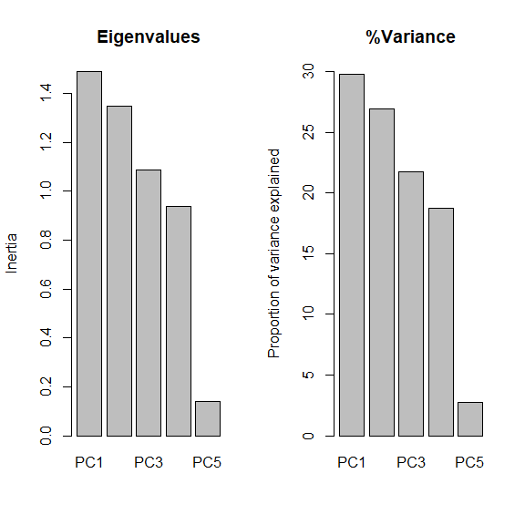<!-- -->

The **loadings** of the variables express how much each variable is associated with each PC. These values have two interpretations:

- First, they are the correlations between the variables and the PCs. 
- Second, they are the coordinates for the biplot vectors (see below), which help us see the relationships between the ordination and the variables. 
  - Note: the biplot vectors implied by these coordinates are sometimes rescaled to more faithfully represent the relationships between variables. See @legendre2012numerical for a thorough explanation.


```r
scores(p1, choices = 1:4, display = "species", scaling = 0)
```

```
##            PC1        PC2        PC3         PC4
## bow  0.2840062 -0.1746469  0.1914720  0.92240824
## brw -0.3898723 -0.5563058 -0.5292561  0.14392406
## aud -0.5555135  0.3485255  0.5448121  0.14388004
## mob  0.4290023  0.5917029 -0.4394228  0.09156649
## hip  0.5241200 -0.4340967  0.4396748 -0.31521900
## attr(,"const")
## [1] 4.196048
```

PC1 is most strongly correlated with `aud` (*r* = -0.55) and `hip` (*r* = 0.52). PC2 is most strongly correlated with `mob` (*r* = 0.59) and `brw` (*r* = -0.55). Ideally, each PC would have a few variables strongly correlated with it (*r* > 0.7), but that isn’t the case here. Interestingly, most of the variables are moderately correlated with first three axes. This suggests that none of the variables is strongly driving any of the PCs. We can check this with a biplot.

An ordination **biplot** is probably the most important tool for interpreting the relationships in the data captured by the ordination. It is called a biplot because it presents two kinds of data: *similarity between the samples* indicated by proximity in the ordination space; and *relationships between some set of quantitative variables and the ordination axes*. The samples are plotted as points; the variables are plotted as vectors radiating from the origin.


```r
par(mfrow=c(1,1))
biplot(p1)
```

<!-- -->

The biplot shows the points (by row name/number) and the five numeric variables that went into the PCA. Each vector shows the projection of a variable into the ordination space. 

- The direction of a vector shows the direction (in ordination space) in which a variable increases. For example, samples in the upper left have increased aud; samples in the upper right have increased mob, and so on. A variable decreases in the direction opposite its vector: samples in the lower right have decreased aud.
  - Compare the variable loadings with the biplot arrows. Do these values make sense?
- Relative angles of vectors reflect the correlation between the underlying variables.
  - Variables whose vectors point in the same direction are positively correlated with each other; the smaller the angle between two vectors, the stronger the correlation (*r* approaching 1).
  - Vectors perpendicular to each other are uncorrelated (*r* close to 0).
  - Vectors pointing in opposite directions are negatively correlated with each other (*r* approaching -1).
  - Correlation coefficients cannot be inferred directly from angles because of how the coordinates on the plot are scaled, but the angles do give a *rough* idea.
- The length of a vector indicates the strength of the correlation with the ordination space. Longer vectors indicate stronger correlations (|*r* |). 
- Each variable vectors represents an axis of the original coordinate system.
  - Shorter vectors have most of their length off the plane of the biplot.
  - Longer vectors have more of their length near the plane of the biplot.
  - The biplot is really a plane within the original data coordinate system defined by the PCs.

Because it took 3 PCs to get up to about 80% of the variation, we should present and interpret the first 3 PCs. We can plot other variables with the `biplot()` command.


```r
par(mfrow=c(2,2))
biplot(p1, choices=c(1,2))
biplot(p1, choices=c(1,3))
biplot(p1, choices=c(2,3))
```

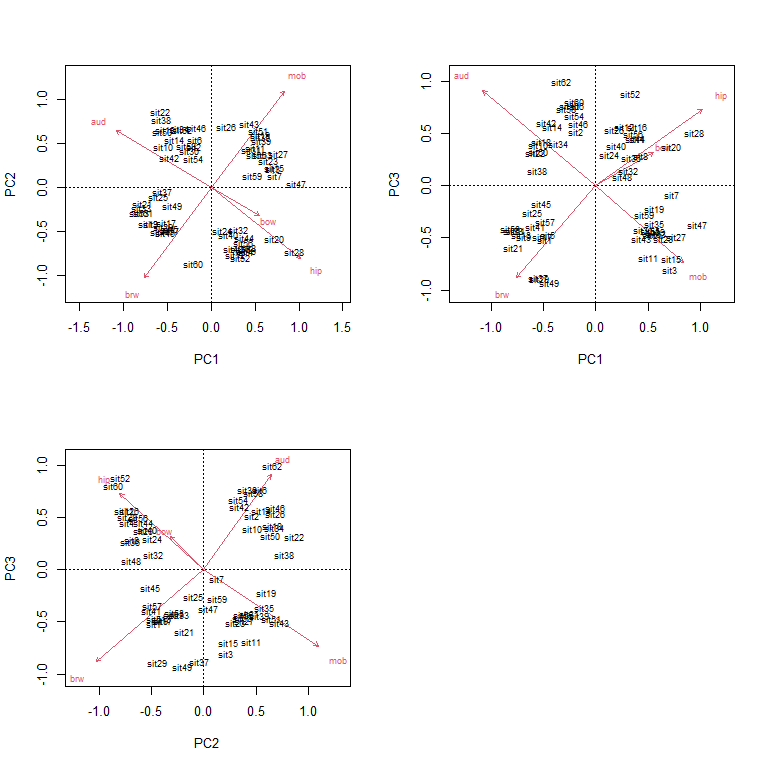<!-- -->

Even better, we can make a 3-d plot using the `rgl` package. Note that the code block below was not run to make this page; try running it on your machine. The plots made by `plot3d()` are cool because you can rotate them with the mouse. Exporting `rgl` figures to static image formats like `.jpg` can be tricky because you must specify the rotation angles, which can pretty much only be done by trial and error.


```r
library(rgl)
par(mfrow=c(1,1))
px <- scores(p1, choices=1:3)$sites
plot3d(px[,1], px[,2], px[,3],
    xlab="PC1", ylab="PC2", zlab="PC3")
```


We can add more information to the biplots to help us make sense of the data. Let’s color-code the diets.


```r
diets <- sort(unique(dat3$diet))
cols <- rainbow(length(diets))
use.cols <- cols[match(dat3$diet, diets)]

par(mfrow=c(1,1))
px <- scores(p1, choices=1:3)$sites
vx <- scores(p1, choices=1:3)$species
plot3d(px[,1], px[,2], px[,3],
    xlab="PC1", ylab="PC2", zlab="PC3",
    col=use.cols, size=50)
for(i in 1:nrow(vx)){
    segments3d(c(0, vx[i,1]), c(0, vx[i,2]), c(0, vx[i,3]), col="red")
    text3d(vx[i,1], vx[i,2], vx[i,3], rownames(vx)[i], col="red")
}
```


The `biplot()` command in `vegan` isn’t very flexible, so we if we want a nicer-looking plot we will need to construct it manually.


```r
px <- scores(p1, choices=1:3)$sites
vx <- scores(p1, choices=1:3)$species

diets <- sort(unique(dat3$diet))
cols <- rainbow(length(diets))
use.cols <- cols[match(dat3$diet, diets)]

par(mfrow=c(2,2))
plot(px[,1], px[,2], pch=16, cex=1.4, col=use.cols,
    xlab="PC1", ylab="PC2", xlim=c(-1.5, 1.5), ylim=c(-1.5, 1.5))
segments(0, 0, vx[,1], vx[,2], col="red")
text(vx[,1], vx[,2], rownames(vx), col="red")
plot(px[,1], px[,3], pch=16, cex=1.4, col=use.cols,
    xlab="PC1", ylab="PC3", xlim=c(-1.5, 1.5), ylim=c(-1.5, 1.5))

segments(0, 0, vx[,1], vx[,3], col="red")
text(vx[,1], vx[,3], rownames(vx), col="red")
plot(px[,2], px[,3], pch=16, cex=1.4, col=use.cols,
    xlab="PC2", ylab="PC3", xlim=c(-1.5, 1.5), ylim=c(-1.5, 1.5))
segments(0, 0, vx[,2], vx[,3], col="red")
text(vx[,2], vx[,3], rownames(vx), col="red")
```

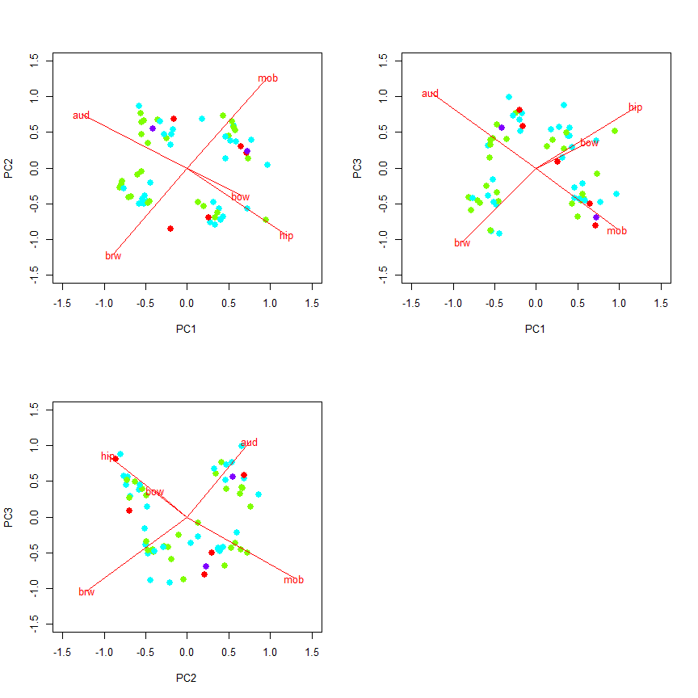<!-- -->

## Application of PCA: PC regression

Because PCs capture information about multiple variables at once, they can be used to represent those variables *in other statistical methods*. For example, a PC that represents many measurements of body parts or tree species composition or gene expression can be used as a predictor variable in a logistic regression or as a response variable. This practice is sometimes called **PC regression**. The example below uses the `iris` dataset to illustrate using principal components of flower morphology to predict species identity.


```r
library(vegan)
# grab numeric variables
dat <- iris[,1:4]
# standardize each variable
dat <- apply(dat, 2, scale)
# fit PCA with vegan::rda()
p1 <- rda(dat)

# examine output
summary(p1)
```

```
## 
## Call:
## rda(X = dat) 
## 
## Partitioning of variance:
##               Inertia Proportion
## Total               4          1
## Unconstrained       4          1
## 
## Eigenvalues, and their contribution to the variance 
## 
## Importance of components:
##                          PC1    PC2     PC3      PC4
## Eigenvalue            2.9185 0.9140 0.14676 0.020715
## Proportion Explained  0.7296 0.2285 0.03669 0.005179
## Cumulative Proportion 0.7296 0.9581 0.99482 1.000000
## 
## Scaling 2 for species and site scores
## * Species are scaled proportional to eigenvalues
## * Sites are unscaled: weighted dispersion equal on all dimensions
## * General scaling constant of scores:  4.940963 
## 
## 
## Species scores
## 
##                 PC1      PC2     PC3      PC4
## Sepal.Length  2.199 -0.89142  0.6810  0.09290
## Sepal.Width  -1.137 -2.18073 -0.2313 -0.04392
## Petal.Length  2.450 -0.05785 -0.1345 -0.28497
## Petal.Width   2.384 -0.15811 -0.6003  0.18617
## 
## 
## Site scores (weighted sums of species scores)
## 
##              PC1       PC2       PC3       PC4
## sit1   -0.534807 -0.202559  0.134486  0.067744
## sit2   -0.491417  0.284467  0.247065  0.288729
## sit3   -0.558311  0.144276 -0.046548  0.079541
## sit4   -0.542997  0.252085 -0.096137 -0.184874
## sit5   -0.564359 -0.272948 -0.016574 -0.100692
## sit6   -0.490158 -0.628394 -0.028400  0.018523
## sit7   -0.577155 -0.020105 -0.353282 -0.103082
## sit8   -0.527285 -0.094163  0.093405 -0.068988
## sit9   -0.551323  0.470639 -0.152779 -0.075287
## sit10  -0.515827  0.197911  0.267239 -0.111838
## sit11  -0.511572 -0.440410  0.282946  0.046898
## sit12  -0.549314 -0.056156 -0.098737 -0.374156
## sit13  -0.523885  0.307482  0.243171  0.006797
## sit14  -0.621804  0.405731 -0.190395 -0.053861
## sit15  -0.519231 -0.784896  0.498009  0.545836
## sit16  -0.534220 -1.133542 -0.032147  0.141647
## sit17  -0.521320 -0.626044  0.005628  0.529258
## sit18  -0.517249 -0.206277  0.046563  0.260934
## sit19  -0.448346 -0.592881  0.394218  0.171253
## sit20  -0.553384 -0.475923 -0.139672 -0.105832
## sit21  -0.452066 -0.172526  0.443660  0.030613
## sit22  -0.521184 -0.389955 -0.168353  0.167052
## sit23  -0.655159 -0.193409 -0.349815  0.055075
## sit24  -0.429477 -0.036103 -0.036320  0.423650
## sit25  -0.525943 -0.057918 -0.124258 -0.757207
## sit26  -0.460927  0.263995  0.321868  0.122104
## sit27  -0.484377 -0.102187 -0.090949  0.189708
## sit28  -0.512107 -0.222443  0.217797  0.028802
## sit29  -0.505256 -0.132170  0.285546  0.236180
## sit30  -0.534939  0.142514 -0.072069 -0.303510
## sit31  -0.505388  0.212903  0.078991 -0.135074
## sit32  -0.432529 -0.178788  0.284827  0.672360
## sit33  -0.617518 -0.756842 -0.049736 -0.642551
## sit34  -0.577663 -0.907551  0.087057 -0.135146
## sit35  -0.498269  0.194193  0.179315  0.081352
## sit36  -0.521372  0.086972  0.237411  0.473451
## sit37  -0.482959 -0.279160  0.510263  0.550396
## sit38  -0.596827 -0.249932 -0.020468 -0.382624
## sit39  -0.573755  0.381540 -0.203515 -0.027297
## sit40  -0.512375 -0.113460  0.185222  0.019754
## sit41  -0.539949 -0.186392 -0.036748  0.299875
## sit42  -0.438794  0.986328  0.215078  0.812492
## sit43  -0.603039  0.202168 -0.322000 -0.186685
## sit44  -0.463903 -0.199310 -0.326039  0.496394
## sit45  -0.504665 -0.481991 -0.261624 -0.423377
## sit46  -0.488768  0.300046  0.067324  0.393177
## sit47  -0.563153 -0.472792 -0.060256 -0.426705
## sit48  -0.565430  0.162986 -0.146873 -0.136884
## sit49  -0.526482 -0.421113  0.191129 -0.041844
## sit50  -0.520433 -0.003889  0.161154  0.138390
## sit51   0.260185 -0.364152  0.720933  0.097640
## sit52   0.172705 -0.250912  0.099119  0.013745
## sit53   0.293056 -0.260062  0.583421  0.026414
## sit54   0.096227  0.740313  0.024328  0.184351
## sit55   0.253972  0.087948  0.419400  0.293579
## sit56   0.091788  0.250350 -0.130785 -0.675053
## sit57   0.176292 -0.326194 -0.156879 -0.216869
## sit58  -0.115081  0.781677 -0.262499 -0.113579
## sit59   0.219123 -0.013599  0.627822 -0.083753
## sit60   0.002698  0.436329 -0.567511 -0.079777
## sit61  -0.026023  1.119949  0.049275  0.038572
## sit62   0.104069  0.026709 -0.215962  0.112474
## sit63   0.132741  0.744668  0.806428  0.128185
## sit64   0.169924  0.078582  0.072304 -0.461957
## sit65  -0.007877  0.185248 -0.205282  0.305664
## sit66   0.206727 -0.214812  0.530244  0.294159
## sit67   0.082712  0.082838 -0.516935 -0.536803
## sit68   0.037503  0.334244  0.318073 -0.575452
## sit69   0.289305  0.684545  0.507911  0.633200
## sit70   0.038945  0.549667  0.182014 -0.144991
## sit71   0.174203 -0.167343 -0.649260 -0.233447
## sit72   0.112475  0.176098  0.279019  0.318333
## sit73   0.291450  0.393839  0.387972 -0.027875
## sit74   0.149449  0.175705  0.307394 -0.768643
## sit75   0.165933  0.026758  0.469708  0.121814
## sit76   0.206459 -0.105828  0.497670  0.285111
## sit77   0.296723  0.032600  0.765762  0.111247
## sit78   0.320786 -0.139805  0.274675  0.187320
## sit79   0.156992  0.095336 -0.090423 -0.102141
## sit80  -0.009507  0.446752  0.336540  0.181602
## sit81   0.030887  0.659238  0.157947 -0.026355
## sit82   0.005538  0.663544  0.254377 -0.091862
## sit83   0.057039  0.327982  0.159240  0.066295
## sit84   0.250577  0.267465 -0.110903 -0.515666
## sit85   0.052892  0.121433 -0.700570 -0.714287
## sit86   0.101341 -0.356814 -0.474560 -0.307421
## sit87   0.247656 -0.220292  0.416800  0.104297
## sit88   0.246665  0.583585  0.724840  0.383552
## sit89   0.016433  0.092625 -0.307060 -0.412448
## sit90   0.066943  0.560940 -0.094157  0.024963
## sit91   0.065904  0.472623 -0.099504 -0.758656
## sit92   0.147492 -0.010517  0.021569 -0.413967
## sit93   0.079471  0.417081  0.209976  0.018305
## sit94  -0.085529  0.852066 -0.111439  0.054857
## sit95   0.068149  0.361096 -0.137839 -0.301050
## sit96   0.021575  0.076458 -0.135826 -0.644580
## sit97   0.053775  0.162426 -0.164507 -0.371696
## sit98   0.136114  0.065353  0.286073 -0.055670
## sit99  -0.105716  0.651440 -0.200510  0.560453
## sit100  0.060627  0.252700 -0.096757 -0.164318
## sit101  0.435593 -0.367295 -1.058781 -0.138048
## sit102  0.273433  0.294905 -0.558308 -0.113580
## sit103  0.520772 -0.237154  0.213687  0.165894
## sit104  0.340090  0.019828 -0.172318 -0.660867
## sit105  0.441082 -0.124501 -0.416633 -0.045684
## sit106  0.649852 -0.337752  0.613226 -0.284182
## sit107  0.086671  0.658913 -1.039290 -0.373148
## sit108  0.543719 -0.177257  0.686307 -0.667233
## sit109  0.473877  0.300209  0.414909 -0.242490
## sit110  0.533644 -0.810616 -0.418659  0.293865
## sit111  0.322149 -0.292325 -0.299723  0.302334
## sit112  0.378471  0.177947 -0.024417  0.163504
## sit113  0.444881 -0.176912 -0.027737  0.410403
## sit114  0.297575  0.490444 -0.611056  0.277939
## sit115  0.346583  0.186627 -1.057168  0.772676
## sit116  0.375495 -0.285358 -0.672325  0.537795
## sit117  0.347477 -0.107866 -0.039419 -0.435393
## sit118  0.572975 -1.078844  0.134671 -0.767485
## sit119  0.781818 -0.007503  0.740646  0.126664
## sit120  0.298437  0.720202  0.281741 -0.182703
## sit121  0.481205 -0.384193 -0.247266  0.470770
## sit122  0.230949  0.241270 -0.872095  0.077799
## sit123  0.684278 -0.174546  0.902945 -0.356926
## sit124  0.314842  0.203312  0.005717  0.392307
## sit125  0.401627 -0.427849 -0.314296 -0.172788
## sit126  0.461512 -0.425256  0.442283 -0.612005
## sit127  0.277500  0.133510 -0.136837  0.351555
## sit128  0.241097 -0.027152 -0.355646 -0.024258
## sit129  0.422317  0.079062 -0.285028  0.087139
## sit130  0.440099 -0.237272  0.753629 -0.583630
## sit131  0.575248 -0.109411  0.766458 -0.050239
## sit132  0.544307 -1.108240  0.519674 -0.593330
## sit133  0.439876  0.075343 -0.372952  0.280329
## sit134  0.263105  0.123606  0.193230 -0.522324
## sit135  0.283963  0.342354  0.173469 -1.372029
## sit136  0.660927 -0.361549  0.571731  0.829359
## sit137  0.372231 -0.450913 -0.996072  0.099803
## sit138  0.317926 -0.178255 -0.190479 -0.603829
## sit139  0.218397 -0.007268 -0.438957  0.014683
## sit140  0.437359 -0.285308  0.013345  0.547135
## sit141  0.475796 -0.259044 -0.451074  0.693853
## sit142  0.449105 -0.290983 -0.136981  1.316566
## sit143  0.273433  0.294905 -0.558308 -0.113580
## sit144  0.481876 -0.366071 -0.356097  0.126660
## sit145  0.471861 -0.442722 -0.665990  0.599972
## sit146  0.441718 -0.163290 -0.269880  1.091092
## sit147  0.369474  0.378378  0.027771  0.617201
## sit148  0.359223 -0.113540 -0.189745  0.334038
## sit149  0.324183 -0.426723 -0.982952  0.073239
## sit150  0.226858  0.010267 -0.556295 -0.457110
```

```r
# make some colors to label species
use.col <- rainbow(3)[match(iris$Species,levels(iris$Species))]

# extract scores of samples (px) and biplot vectors (vx)
px <- scores(p1, display="sites")
vx <- scores(p1,display="species")
 
# make a plot of the flowers in PCA space
plot(px[,1], px[,2], col=use.col, pch=16,
    xlim=c(-3, 3), ylim=c(-3, 3),
    xlab="PC1", ylab="PC2")
segments(0, 0, vx[,1], vx[,2], col="red")
text(vx[,1], vx[,2], rownames(vx), col="red")
legend("topleft", legend=levels(iris$Species),
    pch=16, col=rainbow(3))
```

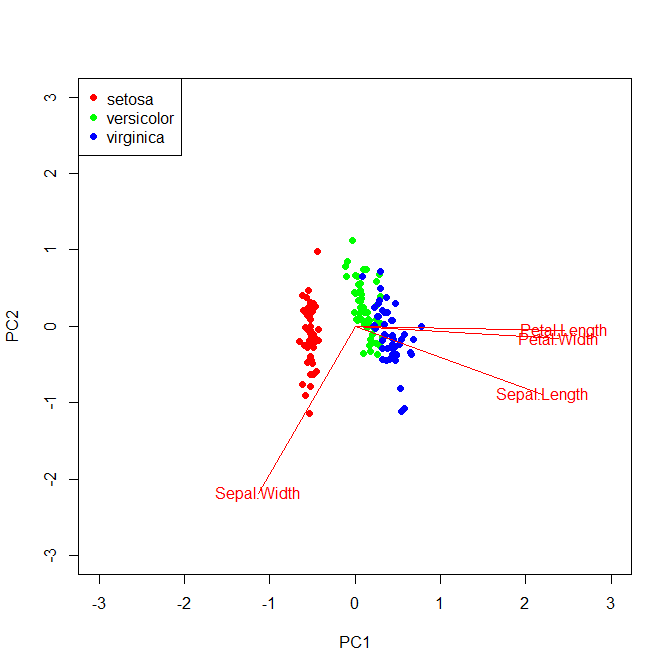<!-- -->

The ordination reveals that 73% of variation is explained by PC1. The figure shows that the species fall out very cleanly along PC1, with is associated with petal morphology. Let’s use PC1 as a predictor for species in a logistic regression. 


```r
dat2 <- data.frame(y=iris$Species, pc1=px[,1])
dat2$z <- ifelse(dat2$y == "virginica", 1, 0)

mod1 <- glm(z~pc1, data=dat2, family=binomial)
summary(mod1)
```

```
## 
## Call:
## glm(formula = z ~ pc1, family = binomial, data = dat2)
## 
## Deviance Residuals: 
##      Min        1Q    Median        3Q       Max  
## -1.83252  -0.10909  -0.00016   0.10887   2.83405  
## 
## Coefficients:
##             Estimate Std. Error z value Pr(>|z|)    
## (Intercept)   -6.023      1.393  -4.323 1.54e-05 ***
## pc1           23.366      5.162   4.526 6.00e-06 ***
## ---
## Signif. codes:  0 '***' 0.001 '**' 0.01 '*' 0.05 '.' 0.1 ' ' 1
## 
## (Dispersion parameter for binomial family taken to be 1)
## 
##     Null deviance: 190.954  on 149  degrees of freedom
## Residual deviance:  50.108  on 148  degrees of freedom
## AIC: 54.108
## 
## Number of Fisher Scoring iterations: 9
```

The logistic regression results suggest that for every unit increase in PC1, the odds ratio of a flower being *Iris virginica* increases by 23. That’s a very strong signal. Just for fun, below are the model predictions of probability of being *I*. *virginica* and the ROC curve. Both confirm visually what the coefficients table above suggested, that PC1 is a very reliable predictor of *Iris* species (at least in this dataset).


```r
n <- 50
prx <- seq(min(dat2$pc1), max(dat2$pc1), length=n)
dx <- data.frame(pc1=prx)
pred <- predict(mod1, newdata=data.frame(dx),
    type="link", se.fit=TRUE)

mn <- plogis(pred$fit)
ll <- plogis(qnorm(0.025, pred$fit, pred$se.fit))
uu <- plogis(qnorm(0.975, pred$fit, pred$se.fit))

par(mfrow=c(1,1), mar=c(5.1, 5.1, 1.1, 1.1),
    lend=1, las=1, cex.axis=1.3, cex.lab=1.3,
    bty="n")
plot(prx, mn, type="n", xlab="PC1",
    ylab=expression(P(italic(virginica))),
    ylim=c(-0.1,1.1))
points(prx, ll, type="l", lty=2)
points(prx, uu, type="l", lty=2)
points(prx, mn, type="l", lwd=2)
points(dat2$pc1, jitter(dat2$z, amount=0.05), xpd=NA)
```

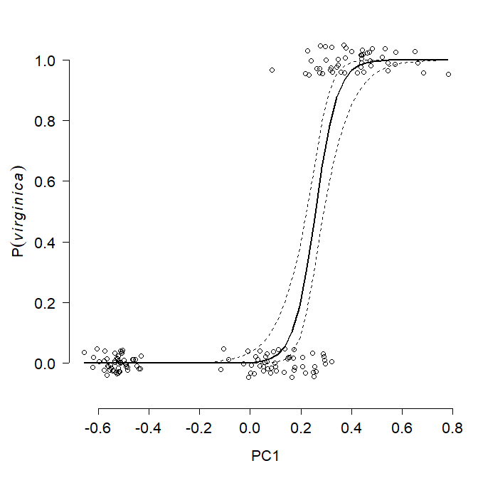<!-- -->

```r
library(pROC)
p1 <- predict(mod1, type="response")
roc1 <- roc(dat2$z ~ p1, plot = TRUE, print.auc = TRUE)
```

```
## Setting levels: control = 0, case = 1
```

```
## Setting direction: controls < cases
```

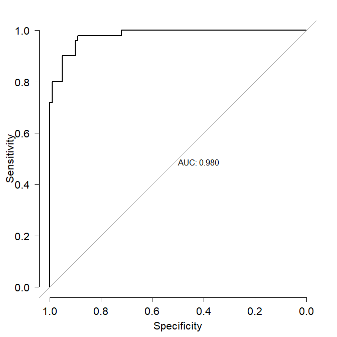<!-- -->

```r
roc1
```

```
## 
## Call:
## roc.formula(formula = dat2$z ~ p1, plot = TRUE, print.auc = TRUE)
## 
## Data: p1 in 100 controls (dat2$z 0) < 50 cases (dat2$z 1).
## Area under the curve: 0.9804
```

Going the other way, modeling PC scores in response to predictor variables, is tricky but it can be done. Usually this is only acceptable when there is a ***clear*** relationship between the modeled PC and several of the original variables that went into the PCA. Treating a PC as a *dependent variable* is an elegant way to get around the problem of having multiple collinear response variables. Conversely, treating a PC as a predictor variable is a way of dealing with multiple collinear predictor variables. Axes from other ordination techniques can be used in this manner, but require ***careful*** biological and statistical justification as well as very cautious interpretation.

[**Go back to main page**](https://greenquanteco.github.io/index.html)

# References

<div id="refs"></div>

# Legal notice

This site is for educational purposes only. This work and its content is released under the [Creative Commons Attribution-ShareAlike 4.0](https://creativecommons.org/licenses/by-sa/4.0/) license. Inclusion of third-party data falls under guidelines of fair use as defined in [section 107 of the US Copyright Act of 1976](https://www.law.cornell.edu/uscode/text/17/107). 
