# Nonmetric multidimensional scaling (NMDS)

PCA and many related techniques are based on linear algebra and eigenvalues. This is fine for datasets where variables are mostly linearly related to each other, or can be transformed to be linearly related. Most of the eigenvalue-based techniques also require data to be (mostly) multivariate normal distributed.
 
If relationships between variables are non-linear, or if the many other assumptions of eigenvalue-based ordination cannot be met, then the next best option is often a non-parametric ordination technique called **nonmetric multidimensional scaling (NMDS or NMS)**. Unlike PCA, which solves linear algebra problems to extract synthetic gradients (“principal components”), NMDS works by trying iteratively to **arrange the samples into a reduced dimensional space** that preserves the **rank order** of the distance matrix**. 

## NMDS simple explanation

Let’s start with a simple example. Download the dataset [state_caps.csv](https://greenquanteco.github.io/state_caps.csv), put it in your R home directory, and load it into R. This dataset contains the latitudes and longitudes of the state capitals of the US. For simplicity, we will use only the lower 48 states.


```r
library(vegan)

in.name <- "state_caps.csv"
dat <- read.csv(in.name, header=TRUE)
dat <- dat[which(!dat$state %in% c("Alaska", "Hawaii")),]

# set rownames so the city names will carry through to the 
# distance matrix
rownames(dat) <- dat$cap
dat <- dat[,c("long", "lat")]
```

Use function `vegdist()` in package `vegan` to calculate Euclidean distances between the cities^[Because position is expressed in latitude and longitude, it is implicit that these are positions on a sphere. Euclidean distance between coordinates is assumes that the coordinates are on a plane, and so will be distorted. The distances are also in nonsensical units that combine degrees latitude and longitude, which are not interchangeable. If you ever need to calculate exact distances between geographic locations, transform the coordinates into a projected coordinate system like UTM (which will be in meters, by definition). Or, use the GIS functions in R which can work in spherical coordinates. Despite being incorrect from a GIS perspective, the distances calculated here are close enough for demonstrating NMDS.]. Then print the object `d1` to the console and take a look (not shown).


```r
d1 <- vegdist(dat[,c("long", "lat")], method="euclidean")
```

The distance matrix gives the distance between each pair of cities, identified by row labels.

If you plot latitude vs. longitude, you will get a reasonable map of the continental US (CONUS).


```r
plot(dat$long, dat$lat)
```

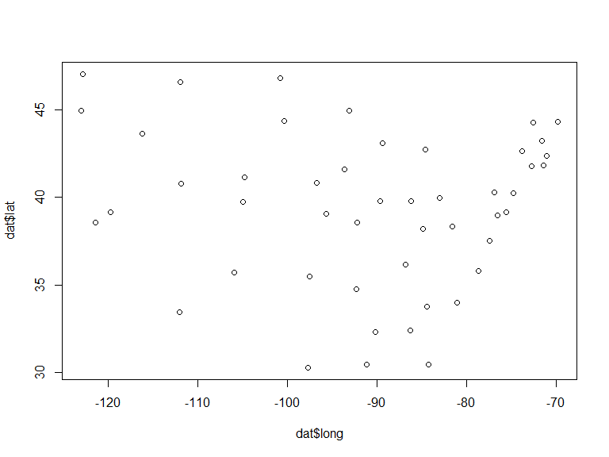<!-- -->

Wouldn’t it be neat if we could recover the actual arrangement of capitals shown above just using their distance matrix? It turns out, we can, with NMDS. The main function for NMDS is `metaMDS()` in package `vegan`. NMDS involves random sampling, so set the random number seed for reproducibility.


```r
set.seed(123)
n1 <- metaMDS(dat, distance="euclidean")
```

```
## 'comm' has negative data: 'autotransform', 'noshare' and 'wascores' set to FALSE
```

```
## Run 0 stress 0 
## Run 1 stress 0.02824041 
## Run 2 stress 9.688201e-05 
## ... Procrustes: rmse 0.0003258308  max resid 0.0008680344 
## ... Similar to previous best
## Run 3 stress 9.741634e-05 
## ... Procrustes: rmse 0.0003391501  max resid 0.0009861631 
## ... Similar to previous best
## Run 4 stress 9.614493e-05 
## ... Procrustes: rmse 0.0003316108  max resid 0.00101616 
## ... Similar to previous best
## Run 5 stress 9.839223e-05 
## ... Procrustes: rmse 0.0003366584  max resid 0.001019179 
## ... Similar to previous best
## Run 6 stress 9.938774e-05 
## ... Procrustes: rmse 0.0003421181  max resid 0.001056077 
## ... Similar to previous best
## Run 7 stress 9.747501e-05 
## ... Procrustes: rmse 0.0003420786  max resid 0.001042044 
## ... Similar to previous best
## Run 8 stress 9.688222e-05 
## ... Procrustes: rmse 0.0003407193  max resid 0.001040716 
## ... Similar to previous best
## Run 9 stress 9.042907e-05 
## ... Procrustes: rmse 0.0003277819  max resid 0.0009954318 
## ... Similar to previous best
## Run 10 stress 9.585724e-05 
## ... Procrustes: rmse 0.0003388215  max resid 0.001045013 
## ... Similar to previous best
## Run 11 stress 9.623688e-05 
## ... Procrustes: rmse 0.0003381601  max resid 0.001029097 
## ... Similar to previous best
## Run 12 stress 0.04810304 
## Run 13 stress 9.271431e-05 
## ... Procrustes: rmse 0.0003274582  max resid 0.000996862 
## ... Similar to previous best
## Run 14 stress 9.821812e-05 
## ... Procrustes: rmse 0.0003434694  max resid 0.001046526 
## ... Similar to previous best
## Run 15 stress 9.886879e-05 
## ... Procrustes: rmse 0.000344009  max resid 0.001069766 
## ... Similar to previous best
## Run 16 stress 9.538052e-05 
## ... Procrustes: rmse 0.0003364742  max resid 0.001031398 
## ... Similar to previous best
## Run 17 stress 0.02824038 
## Run 18 stress 9.633286e-05 
## ... Procrustes: rmse 0.0003317048  max resid 0.000937519 
## ... Similar to previous best
## Run 19 stress 0.02824036 
## Run 20 stress 9.744164e-05 
## ... Procrustes: rmse 0.0003414834  max resid 0.001047844 
## ... Similar to previous best
## *** Solution reached
```

```
## Warning in metaMDS(dat, distance = "euclidean"): stress is (nearly) zero: you
## may have insufficient data
```

```r
plot(scores(n1))
```

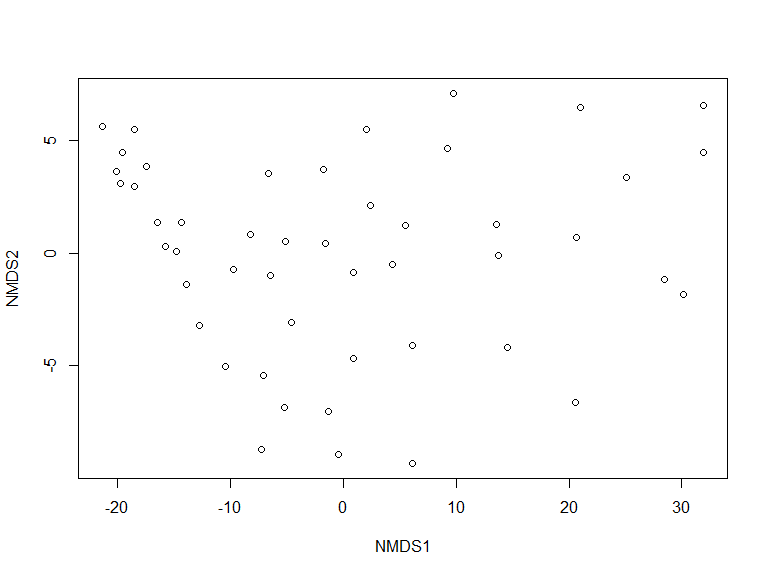<!-- -->

Notice anything odd? The *arrangement* of the cities, or relative positions, are mostly correct. However, the cities are flipped east to west! This is because NMDS only considers relative position, not absolute position. NMDS positions are arbitrary, so we can rotate or flip the axes to make better sense of them. We’ll flip the first axis (NMDS1) by multiplying it by -1.


```r
sn <- scores(n1)
sn[,1] <- -1*sn[,1]
plot(sn)
```

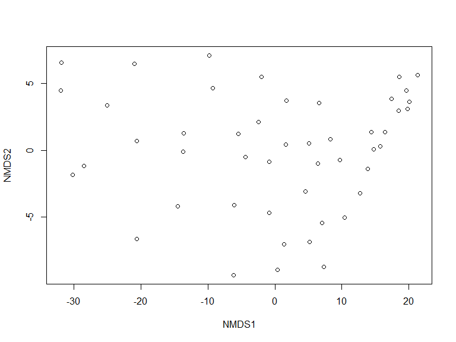<!-- -->

 
Much better. The coordinates aren’t quite the same as the original data, but the relative positions of the cities are correct. We can confirm this with a stress plot.


```r
stressplot(n1)
```

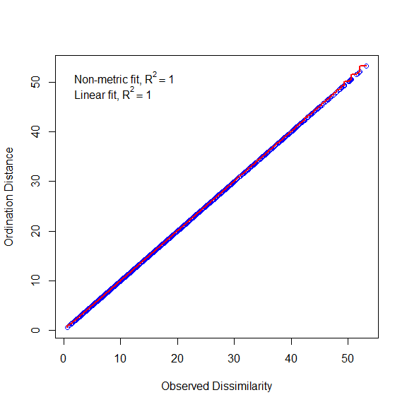<!-- -->

This chart shows that the distances between points in the NMDS space (Ordination Distance) are nearly identical to the distances between points in the original data space (Observed Dissimilarity). A good NMDS fit will have nearly all of the points on the red line of equality.

## NMDS more complicated explanation

Like PCA, NMDS is a technique for reducing the dimensionality of data. The general approach of NMDS is to start with a cloud of *n* samples (points) in *p* dimensions (variables), and try to position the points into <*p* dimensions in a way that preserves the relative distances between the points. Consider the example below, which shows a 3-d dataset with variables *X*, *Y*, and *Z*.


```r
set.seed(123)
n <- 36
x <- runif(n, 1, 10)
y <- runif(n, 1, 3)
z <- runif(n, 1, 10)
```

The code below was not run for this tutorial, but a screenshot of the result is shown below.


```r
library(rgl)
par(mfrow=c(1,1))
plot3d(x, y, z,
    xlab="X", ylab="Y", zlab="Z",
    xlim=c(0,10), ylim=c(0,10), zlim=c(0,10))
```


Or more prosaically:


```r
par(mfrow=c(2,2))
plot(x, y, xlim=c(0, 10), ylim=c(0, 10))
plot(x, z, xlim=c(0, 10), ylim=c(0, 10))
plot(y,z, xlim=c(0, 10), ylim=c(0, 10))
```

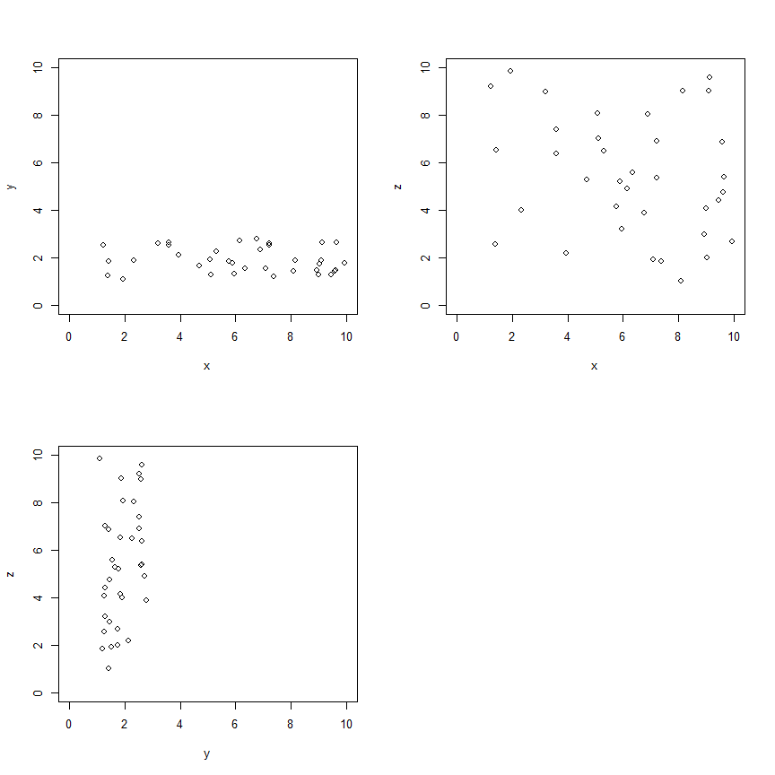<!-- -->

The scatterplots suggest that most of the variation is tied up in *X* and *Z*, with very little in *Y*. If we wanted to present the data in two dimensions, we could use NMDS to arrange the points in a 2-d space that preserves the relative distances. Data can be passed directly to `metaMDS()`, in which case it will calculate the distance matrix for you. Alternatively, you can supply a distance matrix. The function will figure out what to do based on what your input.

As always, set the random number seed for reproducibility.


```r
set.seed(42)
dat <- cbind(x,y,z)
n2 <- metaMDS(dat)
```

```
## Wisconsin double standardization
## Run 0 stress 0.02846602 
## Run 1 stress 0.02846602 
## ... Procrustes: rmse 4.316137e-06  max resid 1.726271e-05 
## ... Similar to previous best
## Run 2 stress 0.02846602 
## ... Procrustes: rmse 1.118155e-05  max resid 4.018889e-05 
## ... Similar to previous best
## Run 3 stress 0.02846602 
## ... New best solution
## ... Procrustes: rmse 6.792159e-06  max resid 2.56478e-05 
## ... Similar to previous best
## Run 4 stress 0.02846602 
## ... Procrustes: rmse 7.699264e-06  max resid 2.638313e-05 
## ... Similar to previous best
## Run 5 stress 0.02846602 
## ... Procrustes: rmse 9.363497e-06  max resid 3.897864e-05 
## ... Similar to previous best
## Run 6 stress 0.02846602 
## ... New best solution
## ... Procrustes: rmse 2.322942e-06  max resid 7.365495e-06 
## ... Similar to previous best
## Run 7 stress 0.02846602 
## ... Procrustes: rmse 3.750166e-06  max resid 1.250864e-05 
## ... Similar to previous best
## Run 8 stress 0.02846602 
## ... Procrustes: rmse 6.108855e-06  max resid 2.128185e-05 
## ... Similar to previous best
## Run 9 stress 0.02846602 
## ... Procrustes: rmse 4.354076e-06  max resid 1.548638e-05 
## ... Similar to previous best
## Run 10 stress 0.02846602 
## ... Procrustes: rmse 1.755597e-06  max resid 5.736735e-06 
## ... Similar to previous best
## Run 11 stress 0.02846602 
## ... Procrustes: rmse 5.436306e-06  max resid 2.010142e-05 
## ... Similar to previous best
## Run 12 stress 0.02846602 
## ... Procrustes: rmse 1.012847e-06  max resid 3.324696e-06 
## ... Similar to previous best
## Run 13 stress 0.02846602 
## ... Procrustes: rmse 4.858257e-06  max resid 1.845511e-05 
## ... Similar to previous best
## Run 14 stress 0.11564 
## Run 15 stress 0.11564 
## Run 16 stress 0.02846602 
## ... Procrustes: rmse 3.74378e-06  max resid 1.643431e-05 
## ... Similar to previous best
## Run 17 stress 0.02846602 
## ... Procrustes: rmse 3.719871e-06  max resid 1.260728e-05 
## ... Similar to previous best
## Run 18 stress 0.02846602 
## ... Procrustes: rmse 5.596345e-06  max resid 2.38461e-05 
## ... Similar to previous best
## Run 19 stress 0.11564 
## Run 20 stress 0.11564 
## *** Solution reached
```

```r
n2
```

```
## 
## Call:
## metaMDS(comm = dat) 
## 
## global Multidimensional Scaling using monoMDS
## 
## Data:     wisconsin(dat) 
## Distance: bray 
## 
## Dimensions: 2 
## Stress:     0.02846602 
## Stress type 1, weak ties
## Two convergent solutions found after 20 tries
## Scaling: centring, PC rotation, halfchange scaling 
## Species: expanded scores based on 'wisconsin(dat)'
```

The output tells us a lot about the fit. We got a 2-d fit (the default), used the Bray-Curtis distance metric (the default), and variables were centered, scaled, and rotated (also default). The rotation referred to here means that the final arrangement of points was rotated so that NMDS axis 1 captured as much variation as possible (aka: “varimax” rotation; @mccune2002analysis). 

The **stress** expresses how well the NMDS represented the **rank order of the distance matrix**. Lower stress indicates a more faithful representation. Stress increases as distances between samples are increased or decreased relative to the same distances in the original, full-dimensional space. If you picture the full-dimensional distances as ropes connecting the samples, and the amount of stretching or coiling of the ropes that happens as the samples are squashed into lower-dimensional space as the stress, then you pretty much have the idea. 

There is no hard and fast rule, but in practice stress values should be >0 and <0.2. Some authors suggest that NMDS fits with stress $\ge$0.2 are suspect and should not be interpreted; other authors use 0.1 as the cutoff. Some authors and software packages scale stress by 100, so the cutoff becomes 20 or 10 instead of 0.2 or 0.1 [@mccune2002analysis]. Like *P*-values, stress values are a heuristic for inference and so you should not get too hung up on them. The stress plot and the screeplot are arguably more meaningful evaluations of your NMDS fit.

The stressplot below shows that the NMDS did a very good job representing the distance matrix in the reduced space, because the points are clustered near the line and the *R*^2^ values very high. 


```r
par(mfrow=c(1,1))
stressplot(n2)
```

<!-- -->

The **screeplot** shows how the stress of the ordination changes as more dimensions are added. An NMDS ordination with the same number of dimensions as the original data would have stress 0. Generally, adding dimensions decreases stress, but there is usually a point of diminishing returns.

For the example below, I added a few more dimensions to the dataset `dat` with no information so that a better screeplot could be constructed. You don’t need to do this to your own data—the only reason it’s being done here is because our dataset only had 3 dimensions to start with. With your data, you should fit NMDS ordinations with more dimensions than you think you need, to see how stress decreases with dimensionality.


```r
# extra dimensions with random numbers (no information)
ext <- matrix(runif(n*1, 0, 0.1), nrow=n, ncol=2)

# combine with original data
dat2 <- cbind(dat, ext)

# fit NMDS ordinations in a loop
# for each element of nlist, k = number of dimensions
nlist <- vector("list", ncol(dat2))
for(i in 1:length(nlist)){
    nlist[[i]] <- metaMDS(dat2, distance="euclidean", k=i)
}

# extract stress values for each NMDS fit
strs <- sapply(nlist, function(x){x$stress})
```


```r
# fancy plot
par(mfrow=c(1,1), cex.lab=1.2, cex.axis=1.2) 
plot(1:length(nlist), strs, type="l", lwd=3,
    xlab="Dimensions in NMDS",
    ylab="Stress")
```

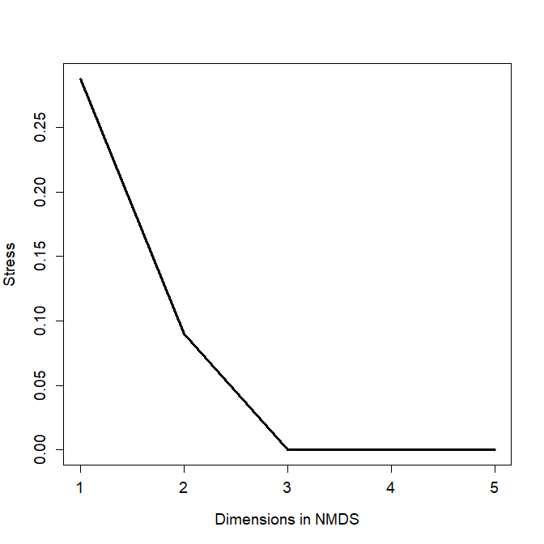<!-- -->

The screeplot shows that the stress decreases much more when going from 1 to 2 dimensions than it does for going from 2 to 3 dimensions. Stress becomes negligible for $\ge$3 dimensions, because the original data had 3 dimensions and the two additional dimensions had almost 0 variance. The bend in the curve at *k* = 2 indicates that 2 is probably the optimal number of dimensions. If you’re not sure how many dimensions to use, examine biplots for both *k* and try to determine which plot is more interpretable biologically.

We can plot the scores of the samples much in the same way as we did the PCA scores in the previous example. We can also produce a biplot that works much the same way as the PCA biplot. We’ll explore those methods in the next section.

## NMDS real data example

Load the `dune` dataset that comes with package `vegan`. This dataset contains cover class values for 30 species of plants on 20 dune meadow sites in the Netherlands. We’ll also load `dune.env`, the environmental data that describe each site. 


```r
library(vegan)
data(dune)
data(dune.env)

dat <- dune
env <- dune.env
```

If we are interested in in plant diversity among the sites, we could use multivariate methods to describe variation in plant cover. First, make some histograms of the cover of each plant species.


```r
par(mfrow=c(5, 6), mar=c(4.1, 4.1, 1.1, 1.1))
for(i in 1:ncol(dat)){hist(dat[,i], main="")}
```

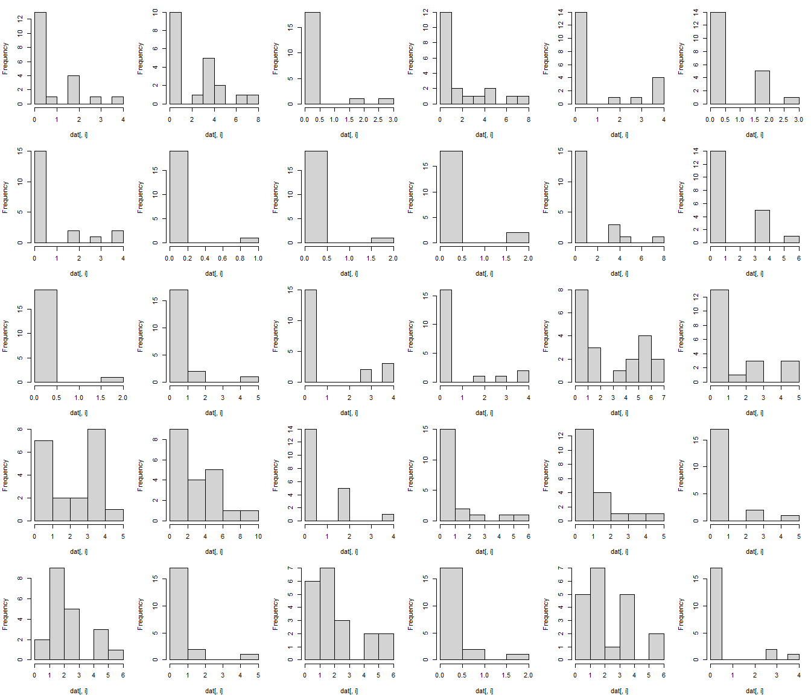<!-- -->

The cover of most species is clearly non-normal. This means that PCA would be difficult to fit. What’s more, the response variable (canopy cover class) isn’t really quantitative. Instead, it is ordinal. For example, category 2 represents greater proportion of plant cover than category 1, but it’s not clear how much more. So, an analysis based on rank order might make more sense than one based on actual values. That suggests using NMDS instead of PCA. Use `vegan::metaMDS()` to fit the NMDS, using the default Bray-Curtis distance metric.


```r
set.seed(456)
p1 <- metaMDS(dat)
```

```
## Run 0 stress 0.1192678 
## Run 1 stress 0.1183186 
## ... New best solution
## ... Procrustes: rmse 0.02027121  max resid 0.06496598 
## Run 2 stress 0.1900911 
## Run 3 stress 0.1192679 
## Run 4 stress 0.19015 
## Run 5 stress 0.1192678 
## Run 6 stress 0.1183186 
## ... New best solution
## ... Procrustes: rmse 9.438674e-06  max resid 3.090521e-05 
## ... Similar to previous best
## Run 7 stress 0.1183186 
## ... Procrustes: rmse 2.811111e-06  max resid 7.842694e-06 
## ... Similar to previous best
## Run 8 stress 0.1192679 
## Run 9 stress 0.1192678 
## Run 10 stress 0.1192678 
## Run 11 stress 0.1812933 
## Run 12 stress 0.1889647 
## Run 13 stress 0.1192679 
## Run 14 stress 0.1192678 
## Run 15 stress 0.1183186 
## ... Procrustes: rmse 1.256982e-05  max resid 3.657271e-05 
## ... Similar to previous best
## Run 16 stress 0.1192679 
## Run 17 stress 0.1192678 
## Run 18 stress 0.1192678 
## Run 19 stress 0.1192678 
## Run 20 stress 0.192224 
## *** Solution reached
```

```r
p1
```

```
## 
## Call:
## metaMDS(comm = dat) 
## 
## global Multidimensional Scaling using monoMDS
## 
## Data:     dat 
## Distance: bray 
## 
## Dimensions: 2 
## Stress:     0.1183186 
## Stress type 1, weak ties
## Two convergent solutions found after 20 tries
## Scaling: centring, PC rotation, halfchange scaling 
## Species: expanded scores based on 'dat'
```

The NMDS fit has stress = 0.118, which is not too bad. Let’s take a look at the ordination.


```r
plot(p1)
```

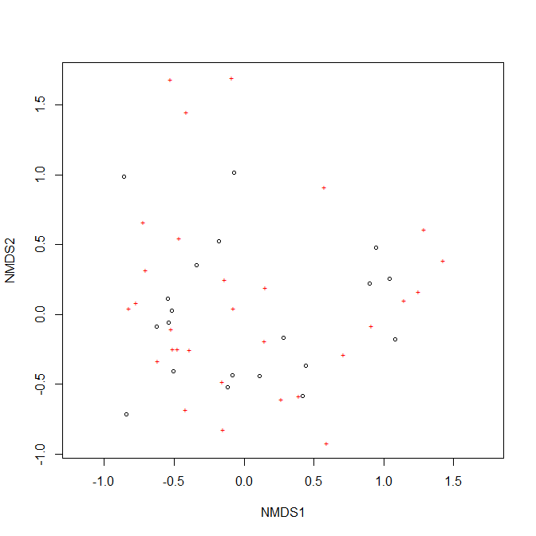<!-- -->

The default NMDS biplot is not very informative, so lets' build the plot manually. While we’re at it, let’s use the environmental dataset to assign some category labels.


```r
# management regimes
mans <- sort(unique(env$Management))
nman <- length(mans)

# land uses
uses <- sort(unique(env$Use))
nuse <- length(uses)

# colors and symbols
cols <- c("blue", "purple", "red")
pchs <- 15:18

env$col <- cols[match(env$Use, uses)]
env$pch <- pchs[match(env$Management, mans)]

# get site and species scores
px <- scores(p1)
vx <- scores(p1, display="species")

# fancy plot
par(mfrow=c(1,1), mar=c(5.1, 5.1, 1.1, 1.1), 
    bty="n", las=1, lend=1,
    cex.axis=1.3, cex.lab=1.3)
plot(px, pch=env$pch, col=env$col, cex=1.3,
    xlim=c(-1.5, 1.5), ylim=c(-1.5, 1.5))
segments(0, 0, vx[,1], vx[,2])
mult <- 1.1
text(mult*vx[,1], mult*vx[,2], rownames(vx))
legend("bottomright", legend=mans, pch=pchs, cex=1.3)
legend("bottomleft", legend=uses, col=cols, pch=16, cex=1.3)
```

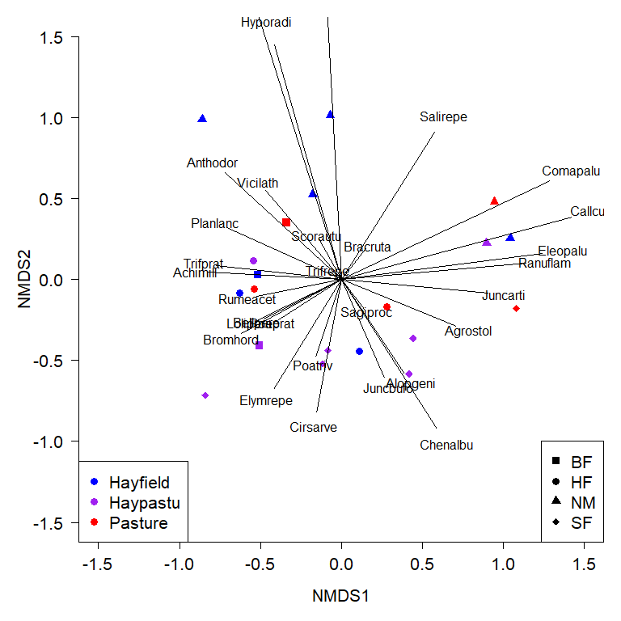<!-- -->

There’s a lot of information in that figure, so let's break it down:

- Points show samples (sites).
- Proximity of two points reflects their dissimilarity in terms of the plant variables (closer = more similar).
- Point color encodes land use (hayfield, pasture, or both).
- Point shape encodes land management: BF (Biological farming), HF (Hobby farming), NM (Nature Conservation Management), and SF (Standard Farming). 
- Vectors show how the species are associated with the ordination space. Species cover increases in the direction of the vector. For example, species “Juncarti” increases to the right and decreases to the left.
- Magnitude of each vector indicates the strength of the association. Vectors that are parallel to one of the NMDS axes are particularly interesting because they describe important gradients among the sites.

The figure is a bit of a mess, so we should try some different representations to help us make sense of it. 
Code one factor at a time:


```r
par(mfrow=c(1,2))
cols1 <- rainbow(nuse)
cols1x <- cols1[match(env$Use, uses)]
plot(px, pch=16, col=cols1x, cex=1.3,
    xlim=c(-1.5, 1.5), ylim=c(-1.5, 1.5))
legend("bottomright", legend=uses,
    pch=16, col=cols1, cex=1.3)

cols2 <- rainbow(nman)
cols2x <- cols2[match(env$Management, mans)]

plot(px, pch=16, col=cols2x, cex=1.3,
    xlim=c(-1.5, 1.5), ylim=c(-1.5, 1.5))
legend("bottomright", legend=mans,
    pch=16, col=cols2, cex=1.3)
```

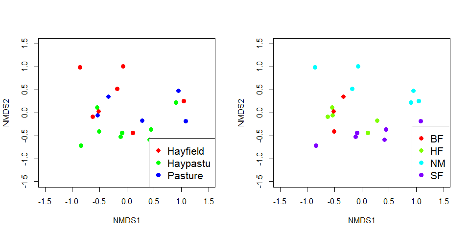<!-- -->

When only one factor is plotted, it’s a little easier to see the potential grouping by management style in the right panel. Styles SF, HF, and NM fall out mostly along NMDS2, but BF does not separate cleanly from the others. Let’s investigate the differences related to management styles.

We can add ellipses to help illustrate group centers (aka: “centroids”, or average positions in NMDS space) and the 95% CI of the centroids. 


```r
# define some colors
cols <- rainbow(nman)
colsx <- cols2[match(env$Management, mans)]

# make plot
par(mfrow=c(1,1))
plot(px, pch=16, col=colsx, cex=1.3,
    xlim=c(-1.5, 1.5), ylim=c(-1.5, 1.5))
# add ellipse
ordiellipse(p1, env$Management, 
            kind="se", conf=0.95,
            draw="polygon", col=cols, border=NA)

# plot group labels with white box behind at centroids
centx <- aggregate(p1$points[,1],
    by=list(env$Management), FUN=mean)$x
centy <- aggregate(p1$points[,2],
    by=list(env$Management), FUN=mean)$x

box.len <- 0.1 # fiddle with this to get boxes right size
rect(centx-box.len, centy-box.len,
    centx+box.len, centy+box.len, 
    col="white", border="black")
text(centx, centy, mans, cex=1.3,
    col=cols, font=2, adj=c(0.5, 0.45))

# add points again to make sure they show up
points(px, pch=21, bg=colsx, fg="black", lwd=2, cex=1.4)
legend("bottomright", legend=mans,
    pch=21, pt.bg=cols, col="black", pt.lwd=2, cex=1.3)
```

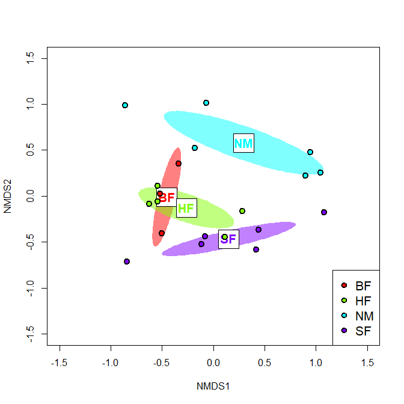<!-- -->

The default colors produced by `rainbow()` can be horrendous, but you get the idea. There are better ways to get color palettes that you can explore. The figure shows that it is quite likely that at least some of the management groups differ from each other in terms of their plant cover. We can test this directly with MRPP.


```r
mrpp(px, env$Management)
```

```
## 
## Call:
## mrpp(dat = px, grouping = env$Management) 
## 
## Dissimilarity index: euclidean 
## Weights for groups:  n 
## 
## Class means and counts:
## 
##       BF     HF     NM    SF    
## delta 0.5279 0.5845 1.055 0.8339
## n     3      5      6     6     
## 
## Chance corrected within-group agreement A: 0.2216 
## Based on observed delta 0.792 and expected delta 1.017 
## 
## Significance of delta: 0.004 
## Permutation: free
## Number of permutations: 999
```

The MRPP shows significant separation between the management groups, but the relatively low *A* indicates that there is still a lot of the positioning left unexplained.

We can also use NMDS to test for relationships between the NMDS coordinates and continuous variables using `envfit()` (from the `vegan` package). Note that only columns 1, 2, and 5 are used in the routine because those are the columns that contain quantitative (or ordinal) potential predictors.


```r
ef <- envfit(p1, env[,c(1,2,5)])
ef
```

```
## 
## ***VECTORS
## 
##      NMDS1   NMDS2     r2 Pr(>r)  
## A1 0.96474 0.26322 0.3649  0.014 *
## ---
## Signif. codes:  0 '***' 0.001 '**' 0.01 '*' 0.05 '.' 0.1 ' ' 1
## Permutation: free
## Number of permutations: 999
## 
## ***FACTORS:
## 
## Centroids:
##             NMDS1   NMDS2
## Moisture1 -0.5101 -0.0403
## Moisture2 -0.3938  0.0139
## Moisture4  0.2765 -0.4033
## Moisture5  0.6561  0.1476
## Manure0    0.2958  0.5790
## Manure1   -0.2482 -0.0215
## Manure2   -0.3079 -0.1866
## Manure3    0.3101 -0.2470
## Manure4   -0.3463 -0.5583
## 
## Goodness of fit:
##              r2 Pr(>r)   
## Moisture 0.5014  0.002 **
## Manure   0.4247  0.018 * 
## ---
## Signif. codes:  0 '***' 0.001 '**' 0.01 '*' 0.05 '.' 0.1 ' ' 1
## Permutation: free
## Number of permutations: 999
```

The output shows that all three of A1 soil horizon thickness (`A1`), moisture category, and manure category were significantly related to the NMDS configuration. The plots below show some ways to illustrate these relationships. First, we can add vectors representing continuous variables to the ordination. These vectors are exactly like biplot arrows for variables that went into the ordination, and are interpreted the same way . If you include both ordinated variables and other variables fitted with `envfit()`, you should make them different colors.


```r
# get coordinates of vectors (matrix)
ef.vec <- ef$vectors$arrows

# plot points
par(mfrow=c(1,1))
plot(px, pch=16, cex=1.3,
    xlim=c(-1.5, 1.5), ylim=c(-1.5, 1.5))

# add envfit vector
segments(0, 0, ef.vec[1,1], ef.vec[1,2], col="red", lwd=2)
# multiplier to move label outwards (should be >1)
mult <- 1.2
text(mult*ef.vec[1,1], mult*ef.vec[1,2],
    rownames(ef.vec)[1], col="red")
```

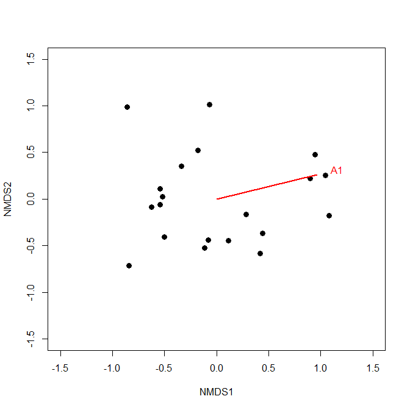<!-- -->

```r
# not run:
# if more than one continuous envfit to plot:
#mult <- 1.2
#for(i in 1:nrow(ef.vec)){
#    segments(0, 0, ef.vec[i,1], ef.vec[i,2],
#        col="red", lwd=2)
#    text(mult*ef.vec[i,1], mult*ef.vec[i,2],
#        rownames(ef.vec)[i], col="red")
#}
```

Factors that define groups, like the farming types above, can be encoded in the points by shape and/or color, and their uncertainty expressed with ellipses. Factors that are ordered, like Moisture and Manure, can be added to the plot as arrows. Adding arrows to connect centroids of the levels of an ordered factor is also a great way to show changes over time or space. For example, you could use season or year as an ordered factor to show changes over time; or, use latitude or elevation intervals as an ordered factor. Even if one of these variables is treated continuously, showing arrows by ordered groups (levels) can help capture nonmonotonic relationships that would be masked by a single `envfit()` vector. The figure below illustrates the difference between treating a continuous predictor, time, as an ordered factor vs. as a continuous variable.


The code below shows how to extract the coordinates for the arrows showing levels of an ordered factor.


```r
# get matrix of level centroids (has all factors)
ef.fac <- ef$factors$centroids

# isolate moisture and manure rows of matrix
ef.moi <- ef.fac[grep("Moist", rownames(ef.fac)),]
ef.man <- ef.fac[grep("Manure", rownames(ef.fac)),]

# number of levels of each factor
nmois <- nrow(ef.moi)
nmanu <- nrow(ef.man)

par(mfrow=c(1,1))
plot(px, pch=16, cex=1.3,
    xlim=c(-1.5, 1.5), ylim=c(-1.5, 1.5))
	
# add arrows
# notice how arrows are specified from the matrix as 
# beginning x, beginning y, ending x, and ending y, and
# how bracket notation is used.
arrows(ef.moi[-nmois,1], ef.moi[-nmois,2],
       ef.moi[-1, 1], ef.moi[-1, 2], col="red",
       lwd=3, length=0.15)
arrows(ef.man[-nmanu ,1], ef.man[-nmanu ,2],
       ef.man[-1, 1], ef.man[-1, 2], col="blue",
       lwd=3, length=0.15)
legend("topright", 
    legend=c("Moisture gradient", "Manure gradient"),
    lwd=3, col=c("red", "blue"), bty="n", cex=1.3)
```

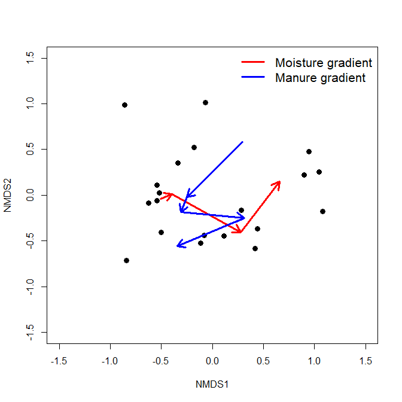<!-- -->


## Hypothesis testing using NMDS
NMDS ordinations can also be used as the basis for hypothesis tests about the magnitude and direction of multivariate trends in experiments. If control and treated samples (or before and after samples) can be matched in pairs or groups, then the paths from the control/before to the treated/after samples can be thought of as the multivariate “response” to whatever the treatment was [@mccune2002analysis]. This is because differences in position in NMDS space represent differences in terms of the original variables. The example below uses simulated data to illustrate the method. 

- **Left panel:** NMDS ordination of samples. Arrows show change from “before” to “after”. Color of arrows signifies control treatment (black) or treated samples (red).
- **Center panel:** "Change vectors" translated so that they emanate from the origin. Magnitude of vector indicates magnitude of change from before to after treatment. Direction of vector indicates direction of change.
- **Right panel:** Change vectors translated to origin and scaled to unit length. Position of end points on unit circle indicate direction of change. In ecology these are also called “composition vectors” because they indicate changes in species composition regardless of magnitude of change.


The positions of the vector endpoints in the center panel can be used to test hypotheses about the overall change in the response variable matrix in response to treatment. An MRPP or other multivariate test such as PERMANOVA can be used to compare the locations of treatment groups in NMDS space. Differences in location in the center plot reflect both *magnitude* and *direction* of change.

Similarly, the positions of the composition vectors in the right panel can be used to test hypotheses about changes in the response variable matrix in response to treatment. Unlike the center panel, the differences in position in the right panel reflect *direction of change* only.

# Other ordination techniques

PCA and NMDS were explored in detail because they are two of the most commonly used and applicable ordination techniques for biologists. There are other techniques out there that you may find useful but are beyond the scope of the course.

**Principal coordinates analysis (PCoA)** is a variation of PCA that can use any kind of distance metric. In one sense PCA uses the Euclidean distance metric because of its reliance on least squares. PCoA can use any distance metric, which may be desirable for data that do not meet the linearity and normality assumptions of PCA. PCoA works by converting distances into the elements of the crossproducts matrix **S**, which basically “pretends” that non-Euclidean distances are Euclidean.

**Canonical ordination** techniques simultaneously analyze two data matrices. Canonical ordination methods can be symmetric or asymmetric. In **asymmetric** methods, there is a response dataset and a predictor dataset. Reversing the roles of the matrices will change the outcome of the analysis. In contrast, **symmetric** methods treat both matrices the same. That is, in a symmetric ordination analysis, neither matrix is considered the “response” or “predictor” dataset. Reversing the roles of the matrices will not change the outputs.

## Canonical asymmetric methods

Canonical asymmetric methods produce ordinations of a response matrix **Y** that are constrained to be linearly related to a second set of variables, the predictor matrix **X**.

**Redundancy analysis (RDA)** is an extension of multiple regression that models multivariate rather than univariate response values. Each ordination axis in RDA is called a “canonical axis” and is similar to a principal component. Each canonical axis in the response matrix **Y** is maximally related to a linear combination of variables in the predictor matrix **X**. RDA preserves the Euclidean distances among samples; this is a consequence of the relationship between RDA and multiple linear regression.

**Canonical correspondence analysis (CCorA)** is similar to RDA, but preserves a different distance metric ($\chi^{2}$ or “chi-squared”) among the samples. CCorA may thus be more appropriate than RDA when data are nonnormal or when relationships are nonlinear.

**Linear discriminant analysis (LDA)** identifies linear combinations of variables in a predictor matrix X that classify observations in a response matrix Y. LDA can be thought of loosely as a multivariate analogue to multiple logistic or multinomial regression. Classification trees may present a more robust alternative to LDA in many situations.

## Canonical symmetric methods

**Canonical correlation analysis (CCA)** is a constrained ordination technique where the ordination of one matrix is informed by multiple regression on another matrix. Given two data matrices **A** and **B**, with correlations among variables in **A** and **B**, CCA fits an ordination for both **A** and **B** where the canonical axes of each ordination are correlated with variables in the other matrix. In other words, CCA finds gradients in one matrix and tries to explain them in terms of information from another matrix. CCA is a powerful tool for exploratory analysis but can be confusing to fit and interpret.

**Co-inertia analysis (CoIA)** and **Procrustes analysis (Proc)** both seek ordinations of two data matrices **A** and **B** that represent relationships in both **A** and **B** simultaneously. CoIA and Proc work very differently but answer a similar question: how can samples be arranged in a reduced dimension space that preserves distances in terms of two sets of variables?

These techniques are described by @legendre2012numerical and @mccune2002analysis. The former reference has a more thorough mathematical treatment; the latter is more introductory. Both are excellent. Several newer references [@borcard2018; @legendre2012numerical] include R code for implementing the methods. 

[Go back](https://greenquanteco.github.io/index.html)

# References

<div id="refs"></div>

# Legal notice

This site is for educational purposes only. This work and its content is released under the [Creative Commons Attribution-ShareAlike 4.0](https://creativecommons.org/licenses/by-sa/4.0/) license. Inclusion of third-party data falls under guidelines of fair use as defined in [section 107 of the US Copyright Act of 1976](https://www.law.cornell.edu/uscode/text/17/107). 
