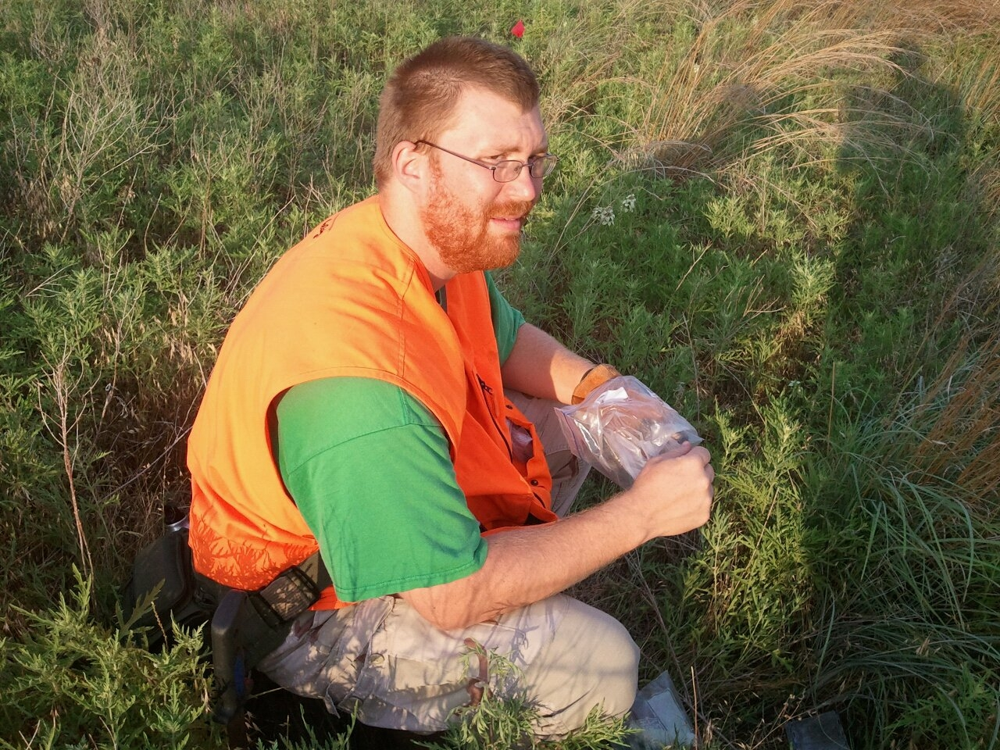
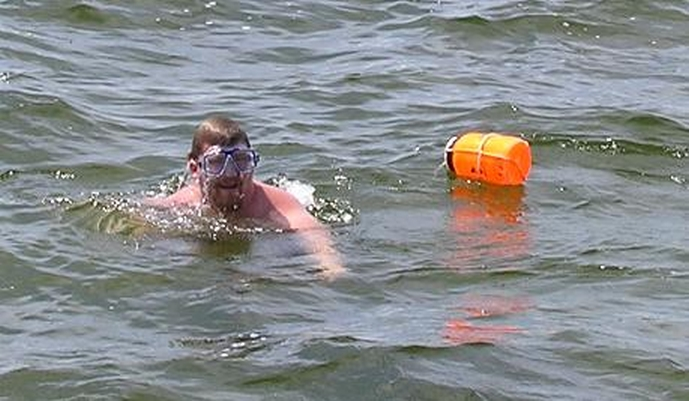
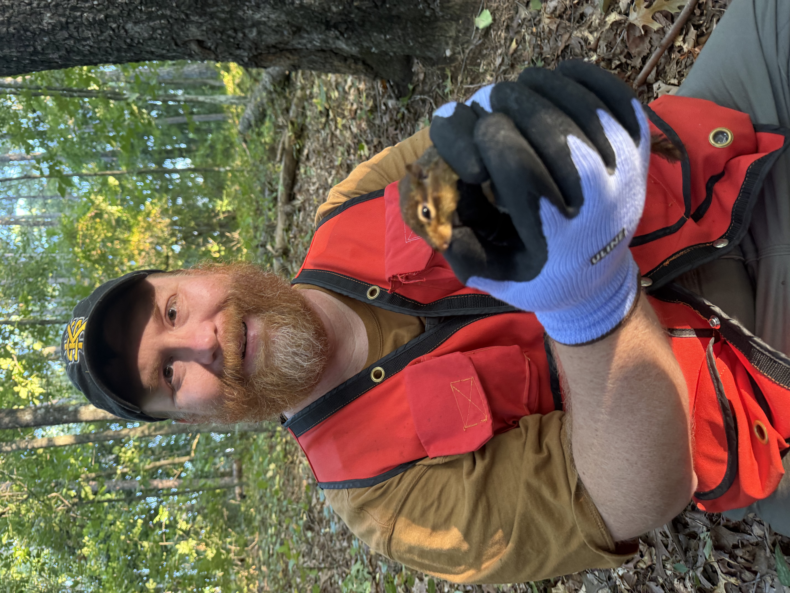
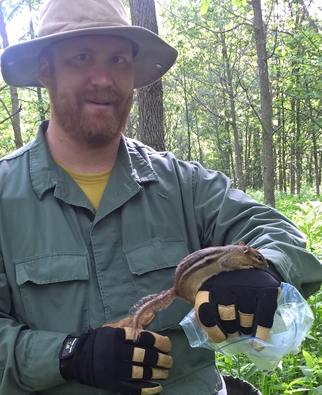

# Background

My path to Kennesaw State has been somewhat non-traditional. Since completing my Ph.D. in 2012, I have been fortunate to work in government, industry, and academia. Those experiences have shaped both my research program and my philosophy of teaching. In my courses and advising I encourage students to appreciate the wide variety of careers available in biology and the unique perspectives that different sectors bring to scientific research.

## Education

::: {.career}

::: {.career-image}

:::

::: {.career-text}

### Baylor University

**Ph.D. Biology** (2012)

**Advisor:** Kenneth T. Wilkins

**Dissertation**

*Effects of habitat affinities and resource needs on edge responses by small mammals.*

:::

:::

::: {.career}

::: {.career-image}

{fig-alt="Nick swimming in a lake with an orange buoy."}

:::

::: {.career-text}

### University of Louisville

**B.S. Biology** (2006)

My undergraduate experience introduced me to ecological research and ultimately inspired me to pursue graduate school and a career in quantitative ecology.

:::

:::

## Professional Experience

::: {.career}

::: {.career-image}

{fig-alt="Official faculty portrait"}

:::

::: {.career-text}

### Associate Professor of Biology
**Kennesaw State University**  
**2025–Present**

Research in quantitative ecology of animal populations.

- Advising undergraduate and graduate students.
- Statistical consulting and collaboration.
- Teaching Comparative Vertebrate Anatomy, Vertebrate Zoology, and Applied Biological Data Analysis.

:::

:::

::: {.career}

::: {.career-image}

:::

::: {.career-text}

### Assistant Professor of Biology
**Kennesaw State University**  
**2020–2025**

Established the Green Quantitative Ecology Laboratory and developed an externally funded research program in ecology and conservation.

Courses included Principles of Biology II Laboratory, Invertebrate Zoology, Comparative Vertebrate Anatomy, and Applied Biological Data Analysis.

:::

:::

::: {.career}

::: {.career-text}

### Project Scientist
**Waterborne Environmental, Inc.**  
**2018–2020**

Conducted ecological risk assessments for agricultural chemicals using population models, individual-based simulations, and toxicokinetic–toxicodynamic (TKTD) models.

Developed simulation software, analyzed large ecological datasets, and contributed to successful research proposals.

:::

:::

::: {.career}

::: {.career-text}

### Applied Statistician (Senior)
**The Climate Corporation**  
**2017–2018**

Developed statistical models supporting precision agriculture and collaborated with software engineers, statisticians, and agronomists to improve data-driven recommendations for growers.

:::

:::

::: {.career}

::: {.career-image}

:::

::: {.career-text}

### Ecologist
**U.S. Geological Survey**  
**2013–2017**

Developed statistical models for wildlife populations using Bayesian and frequentist methods, mark–recapture analyses, distance sampling, and stochastic simulation.

Designed and taught training courses in statistics and R, supervised field crews, and collaborated on research proposals and publications.

:::

:::