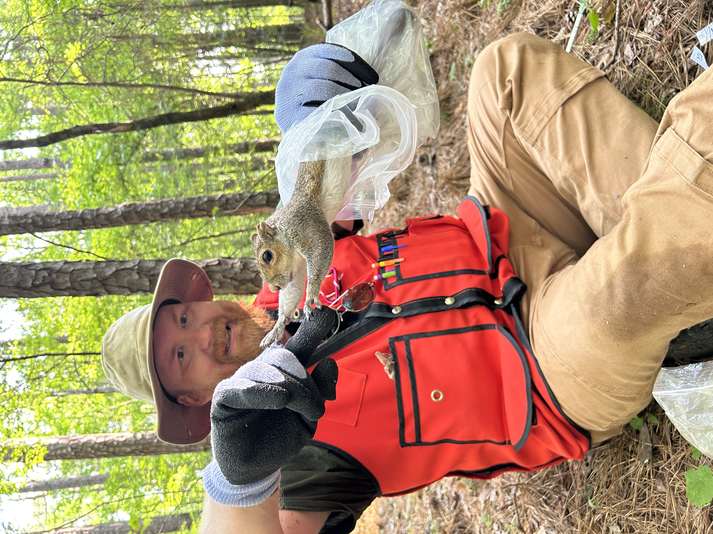

::: {.hero-section}

::: {.grid}

::: {.g-col-12 .g-col-md-7}

# Quantitative ecology, wildlife biology, and biological data analysis

Associate Professor of Biology at [Kennesaw State University](https://www.kennesaw.edu).

My research examines how environmental change affects animals, populations, and ecological communities using field studies, spatial analysis, genetics, and statistical modeling.

[Research](research.qmd){.btn .btn-primary .btn-lg}
[Teaching](teaching.qmd){.btn .btn-outline-primary .btn-lg}
[Contact](about.qmd){.btn .btn-outline-secondary .btn-lg}

:::

::: {.g-col-12 .g-col-md-5}

{.hero-image fig-alt="Portrait or field photograph of Nick Green holding a squirrel."}

:::

:::

:::

## Research themes

::: {.grid .research-grid}

::: {.g-col-12 .g-col-md-4}

::: {.research-card}

### Urban wildlife ecology

How urbanization affects animal morphology, physiology, abundance, population structure, and community composition.

[Explore this research](research.qmd#urban-wildlife-ecology)

:::

:::

::: {.g-col-12 .g-col-md-4}

::: {.research-card}

### Landscape genetics

How habitat configuration, impervious surface, and natural land cover influence movement and genetic connectivity.

[Explore this research](research.qmd#landscape-genetics)

:::

:::

::: {.g-col-12 .g-col-md-4}

::: {.research-card}

### Ecological modeling

Bayesian models, mark–recapture, population dynamics, and climate-linked models of biological systems.

[Explore this research](research.qmd#ecological-modeling)

:::

:::

:::

## Open course books

::: {.grid .course-grid}

::: {.g-col-12 .g-col-md-6}

::: {.course-card}

### Applied Biological Data Analysis

Graduate-level materials covering data organization, visualization, statistical modeling, and reproducible analysis in R. These notes were developed for my course, BIOL 7410.

Topics include:

- data management and visualization;
- linear and generalized linear models;
- mixed models;
- multivariate analysis;
- reproducible scientific workflows.

[Open the course book](https://greenquanteco.github.io/appl-biol-data-analysis/){.btn .btn-primary}

:::

:::

::: {.g-col-12 .g-col-md-6}

::: {.course-card}

### Bayesian Inference for Biologists

An introduction to Bayesian inference and biological model fitting using R and JAGS. Taught as an occasional directed methods (BIOL 7950).

Topics include:

- prior, likelihood, and posterior distributions;
- Markov chain Monte Carlo;
- Bayesian linear and generalized linear models;
- hierarchical models;
- ecological applications.

[Open the course book](https://greenquanteco.github.io/bayesian-inference-biologists/){.btn .btn-primary}

:::

:::

:::

## Current work

::: {.grid}

::: {.g-col-12 .g-col-md-8}

### Research projects

Current projects include urban small-mammal ecology, landscape genetics, mark–recapture studies, climate-linked krill population modeling, and applied quantitative methods in biology.

[View research projects](research.qmd)

:::

::: {.g-col-12 .g-col-md-4}

### Quick links

- [Publications](publications.qmd)
- [Lab members and students](people.qmd)
- [News and updates](news.qmd)
- [GitHub](https://github.com/greenquanteco)
- [ORCID](https://orcid.org/0000-0002-8538-4191)

:::

:::