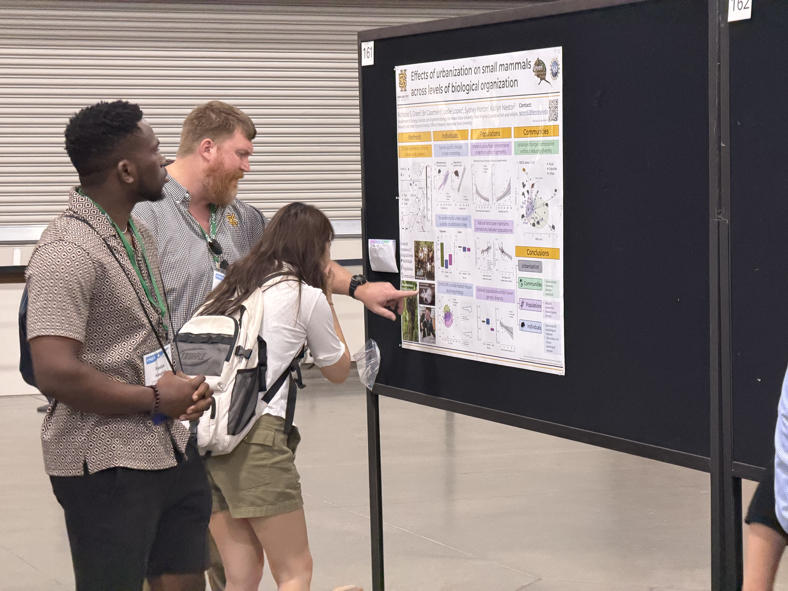

News from the Green Quantitative Ecology Laboratory, including student accomplishments, publications, conference presentations, fieldwork, grants, and new teaching resources. The most recent updates appear first.

## 2026

### Green Lab website launches {#website-launch}

*August 1, 2026*

The [Green Quantitative Ecology Laboratory](https://greenquanteco.github.io) website is now online. The site includes information about our research, teaching, current and former lab members, publications, and conference presentations. It will also provide permanent access to selected course materials, posters, slides, and other resources.

{fig-alt="Logo of the Green Quantitative Ecology Laboratory." width="40%"}

---

### Lab research presented at ESA 2026 {#esa-2026}

*July 27, 2026*

Work from the lab was presented at the 2026 Ecological Society of America Annual Meeting in Salt Lake City, Utah. Presentations included work on the effects of urbanization across multiple levels of biological organization in small mammals (co-authored by lab alumni Bri Casement, Leslie Lopez, and Sydney Morton) and edge-mediated microclimatic refuge in royal catchfly at its southern range limit (with KSU colleague Mario Bretfeld).

{fig-alt="Green Lab research displayed at the 2026 Ecological Society of America Annual Meeting." width="75%"}

