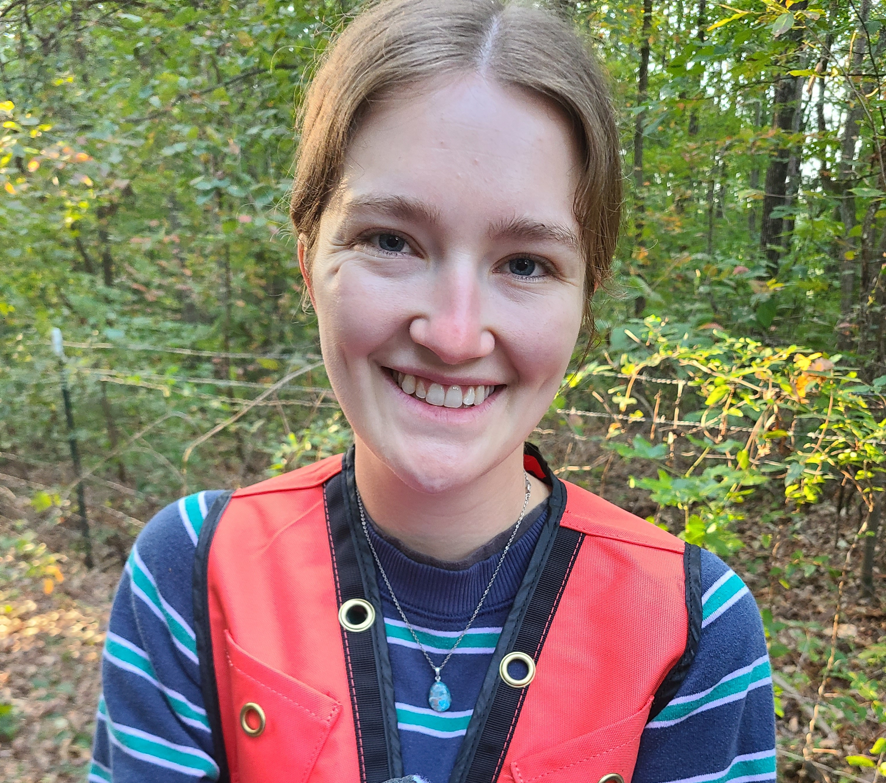
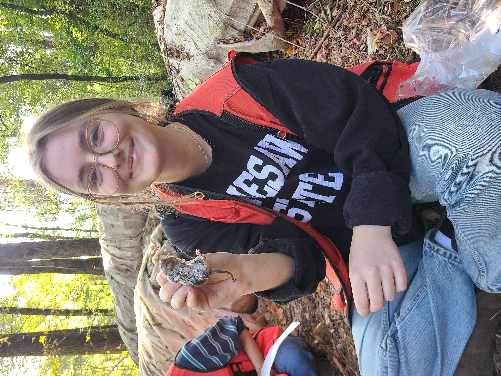
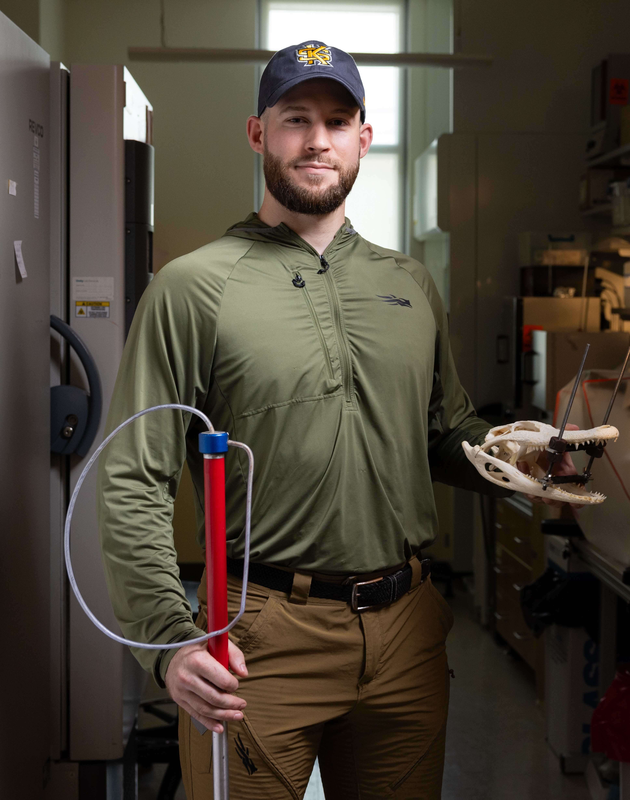
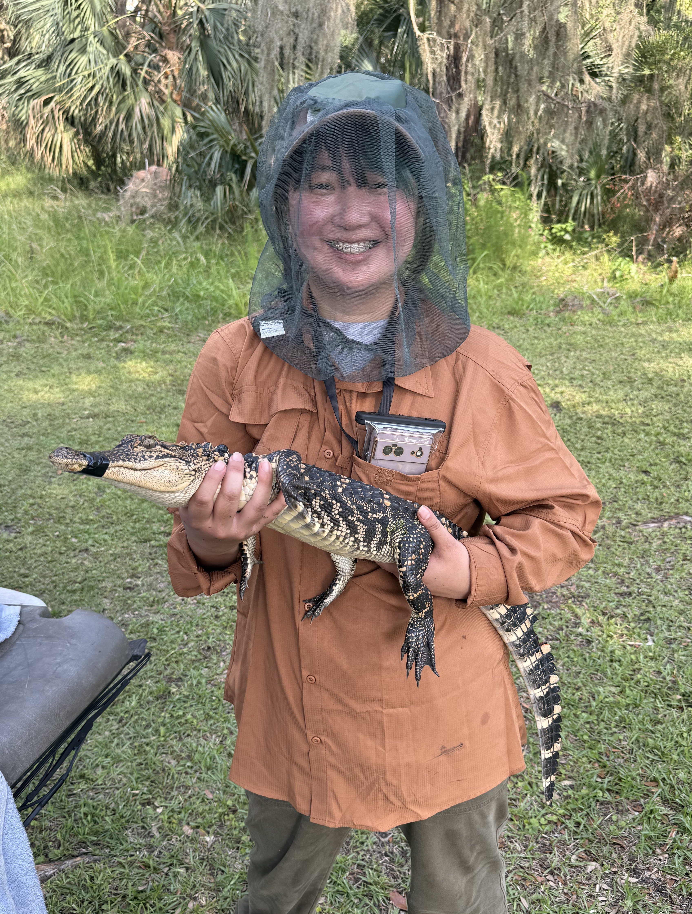
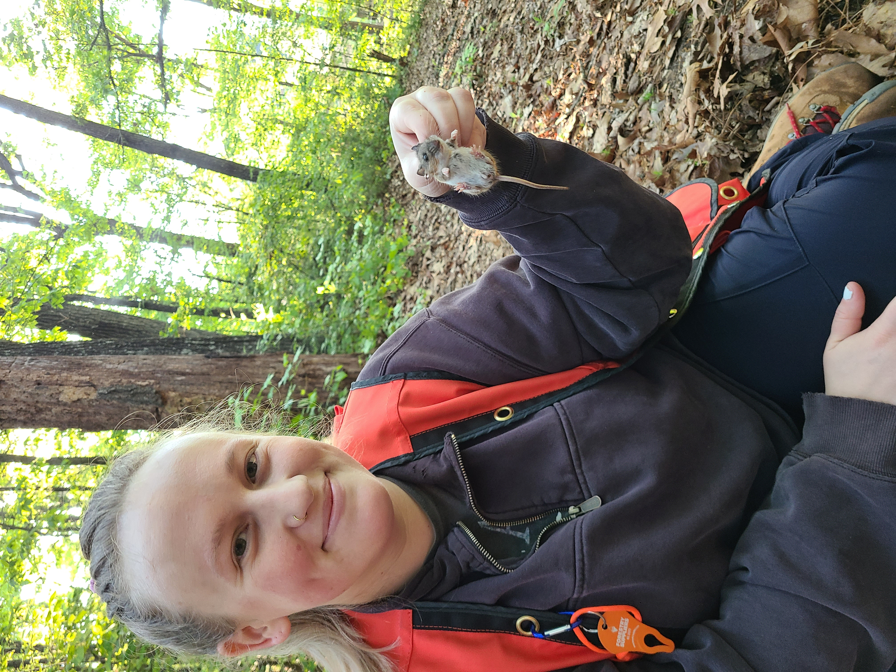
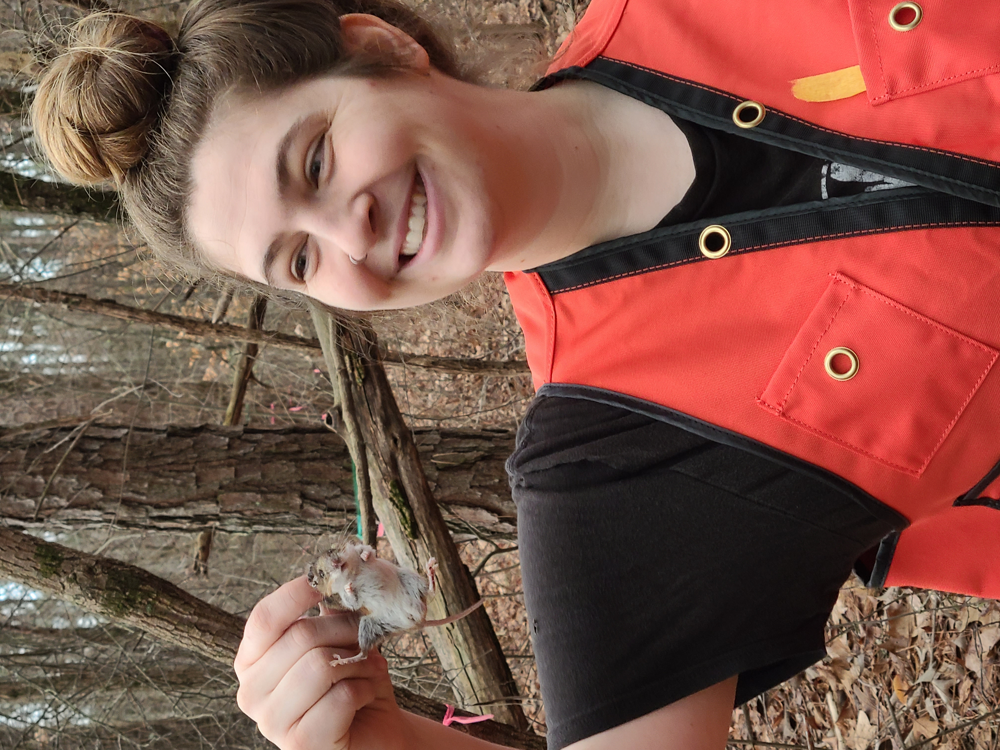
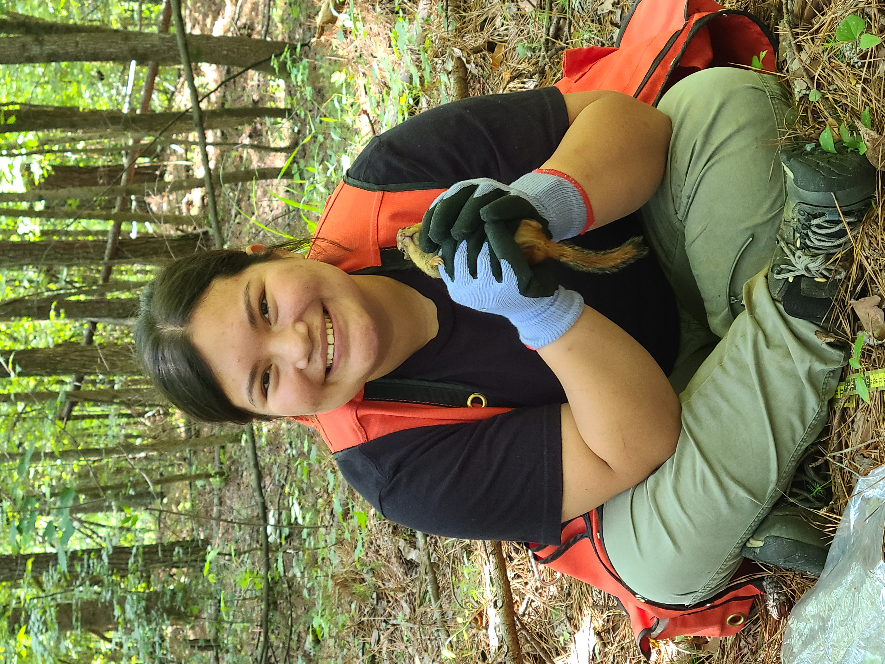

## Current students

::: {.person-card}

::: {.person-photo}

:::

::: {.person-text}

### Sarah Paschal

**M.S. student**

Sarah Paschal joined the lab in 2025 with a B.S. in Biology from Georgia Tech and several years of experience working at Zoo Atlanta, the AWARE Wildlife Center, and a veterinary clinic. Her research focuses on how urbanization and human activities affect small mammal population dynamics. You can reach Sarah by [email](mailto:spasch@students.kennesaw.edu).

**Research interests:** Urban ecology, population biology, spatial analysis

**Project:** Effects of urbanization on small mammal population dynamics

:::

:::

::: {.person-card}

::: {.person-photo}

:::

::: {.person-text}

### Piercy Gierlak

**M.S. student**

Piercy Gierlak joined the lab as an undergraduate in 2024, assisting with various projects and conducting her own research on modeling the possible effects of ocean acidification on oyster growth. In 2025, she earned her B.S. in Environmental Science from Kennesaw State and re-joined the lab, this time as a masters student. Piercy's thesis research is focused on modeling potential effects of climate change on the euphausiid krill of the Gulf of Mexico. You can connect with Piercy by [email](mailto:pgierlak@students.kennesaw.edu).

**Research interests:** Marine biology, climate change, marine invertebrates, ocean acidification, ecological simulation

**Project:** Modeling potential effects of climate change on the Euphausiid krill and pelagic food web of the Gulf of Mexico

:::

:::

## Lab alumni

::: {.person-card}

::: {.person-photo}

:::

::: {.person-text}

### Benjamin Angalet

**M.S. Integrative Biology, 2026**

**Thesis:** *Morphological Variation of Lingual Glands in Wild American Alligator (*Alligator mississippiensis*) Populations*

Benjamin Angalet earned his MSIB in 2026 with his thesis [Morphological Variation of Lingual Glands in Wild American Alligator (*Alligator mississippiensis*) Populations](https://digitalcommons.kennesaw.edu/masterstheses/96/). He joined the lab as a master’s student in 2024. He graduated from the College of Coastal Georgia with a B.S. in Biology – Coastal Ecology in 2022 and has since held several positions within the science field, including a Jekyll Island Park Ranger, Environmental Scientist, and his current position as Field Research Coordinator here at KSU. His thesis investigated the osmoregulatory capabilities of American alligator populations experiencing varying levels of saltwater exposure at locations throughout southeastern Georgia. You can connect with Ben via [email](mailto:bangalet@kennesaw.edu) and visit his [KSU webpage](https://facultyweb.kennesaw.edu/bangalet/index.php).
:::

:::

::: {.person-card}

::: {.person-photo}

:::

::: {.person-text}

### Mayu Mizutani

**M.S. Integrative Biology, 2026**

**Thesis:** *Morphological Variation of Lingual Glands in Wild American Alligator (*Alligator mississippiensis*) Populations*

Mayu Mizutani earned their MSIB in 2026 with their thesis **Spatial and hydrologic effects of climate change and urbanization on 
freshwater fish communities in north Georgia watersheds**. Mayu joined the lab in 2024. Before that, Mayu earned their B.S. in Environmental Engineering at the University of Florida and has worked as a hydrologist and civil engineer. Mayu's thesis research utilized two decades of ecological data to examine how urbanization and climate change may affect fish biodiversity in metropolitan Atlanta watersheds through 2100. This project integrated fish biology, hydrological modeling, and geospatial data analysis. Mayu currently works as a civil engineer on floodplain and stream modeling and plans to someday pursue a PhD in biology.
:::

:::

::: {.person-card}

::: {.person-photo}

:::

::: {.person-text}

### Sydney Morton

**M.S. Integrative Biology, 2025**

**Thesis:** *Effects of urbanization on the population genetics an morphology of the white-footed mouse (*Peromyscus leucopus*) across an urban–rural gradient*

Sydney Morton earned her MSIB in 2025 with her thesis [Effects of urbanization on the population genetics an morphology of the white-footed mouse (*Peromyscus leucopus*) across an urban–rural gradient](https://digitalcommons.kennesaw.edu/masterstheses/89/). Sydney joined the lab in 2023 after earning her B.S. in biology from the University of Central Florida. Her past experience includes laboratory and field studies supporting sea turtle conservation and wetland preservation. Her research at KSU leveraged her lab and field experiences to investigate the effects of urbanization on small mammal population genetics. Sydney is now a Lecturer of Biology at KSU in the [Department of Ecology, Evolution, and Organismal Biology](https://campus.kennesaw.edu/colleges-departments/csm/academics/eeob/). You can connect with Sydney by [email](mailto:smorto21@kennesaw.edu).  
:::

:::

::: {.person-card}

::: {.person-photo}

:::

::: {.person-text}

### Bri Casement

**M.S. Integrative Biology, 2024**

**Thesis:** *Spatial and abiotic effects of urbanization on small mammal communities*

Bri Casement earned her MSIB in 2024 with her thesis, [Spatial and abiotic effects of urbanization on small mammal communities](https://digitalcommons.kennesaw.edu/masterstheses/31/).  Before coming to KSU, she earned her B.S. in both Biology and Environmental Science (cum laude) from Heidelberg University in Ohio. Before graduate school, Bri conducted research on streams in Ohio, lizards in Panama, and even worked as an elementary school teacher. Her thesis research focused on the effects of urbanization, land use change, and human socioeconomic factors on small mammal populations and communities in Georgia. After graduating, Bri went on to pursue a Ph.D. at West Virginia University.

You can find Bri's research on Google Scholar and [ORCID](https://orcid.org/0000-0003-4172-3822).  
:::

:::

::: {.person-card}

::: {.person-photo}

:::

::: {.person-text}

### Leslie Lopez

**M.S. Integrative Biology, 2024**

**Thesis:** *Patterns and Potential Mechanisms of Phenotypic Changes in Urban Small Mammals*

Leslie Lopez earned her MSIB in the lab in 2024 with her thesis [Patterns and Potential Mechanisms of Phenotypic Changes in Urban Small Mammals](https://digitalcommons.kennesaw.edu/masterstheses/17/). Her research focused on the effects of urban living on the health and growth of forest rodents, including morphology and blood chemistry. Leslie joined the lab in 2022 after earning her B.S. in Biology (*cum laude*) from the University of West Georgia. Leslie's lifelong interest in animals and health drive her research and professional activities. In addition to her master's research, Leslie has worked in the KSU Vivarium and veterinary clinics. Leslie now works for the Georgia Department of Public Health.
:::

:::