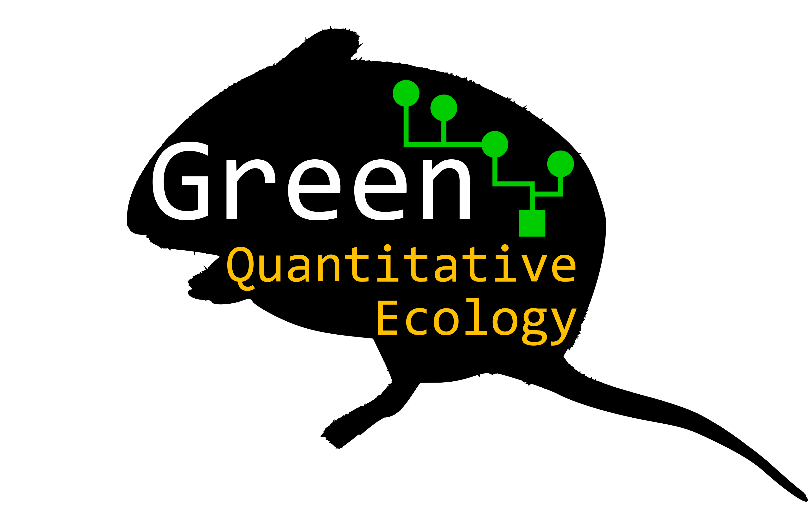
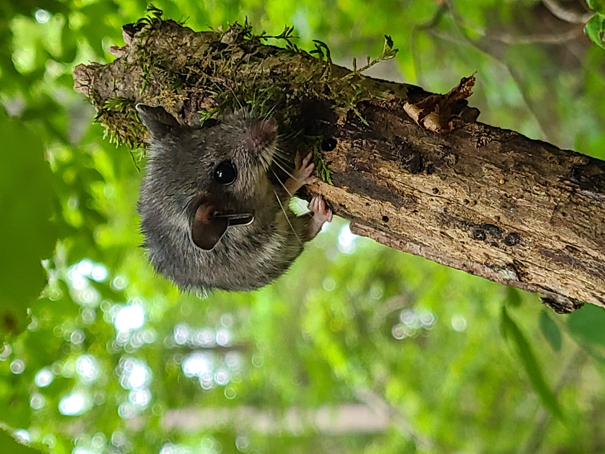
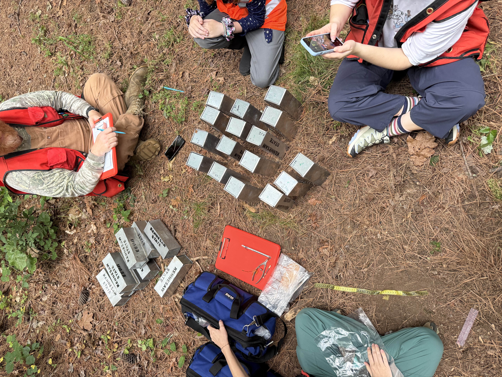
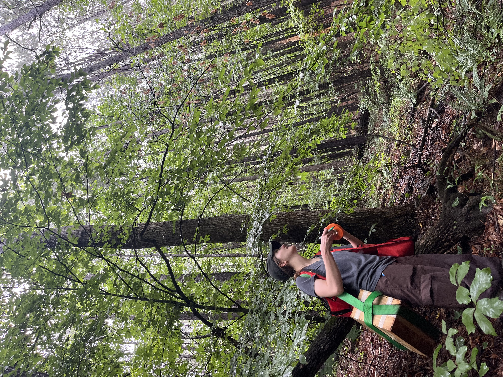
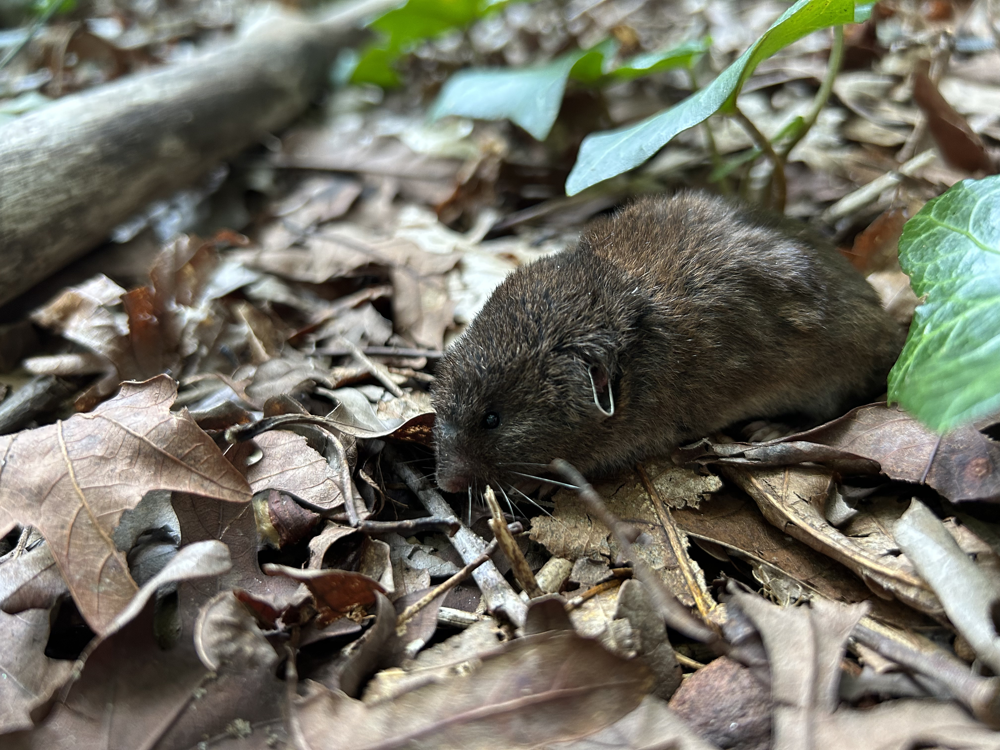
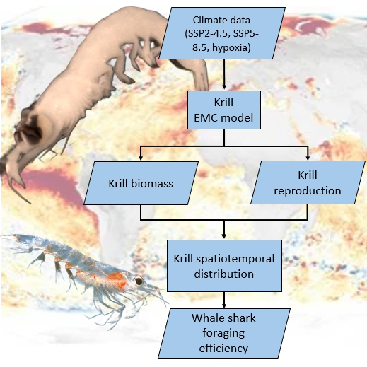
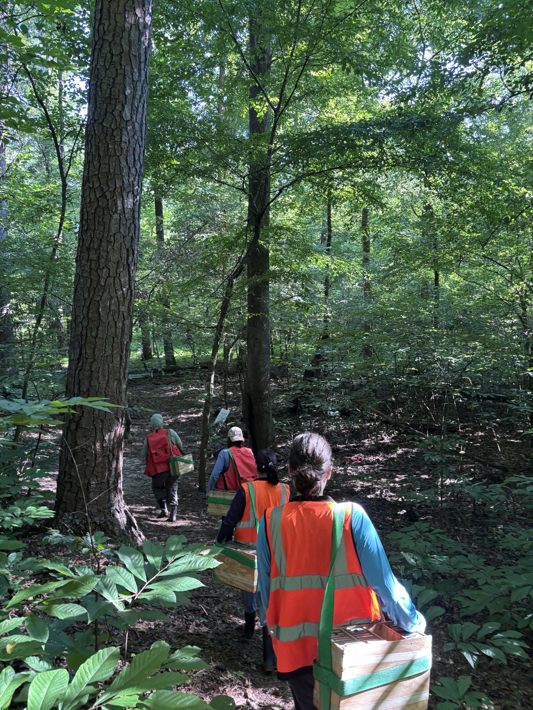
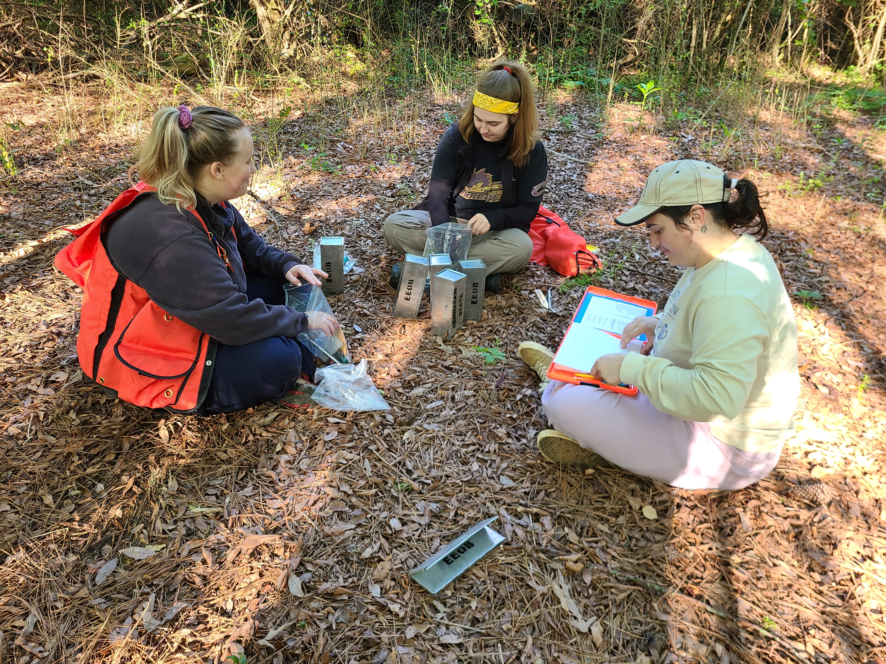
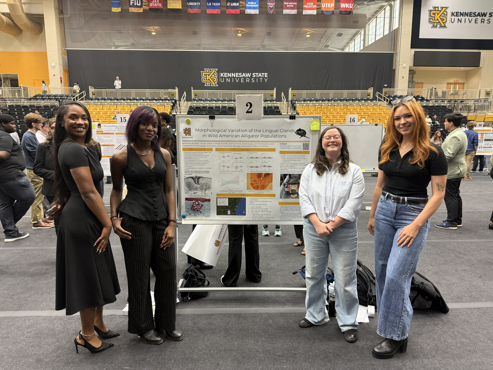
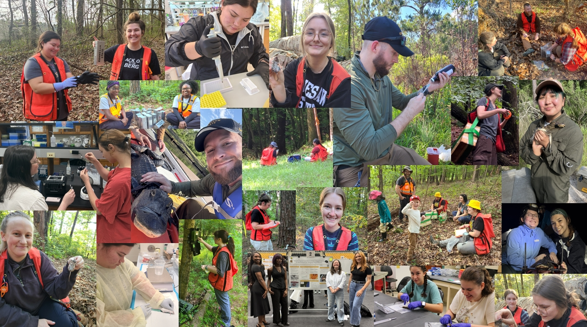

My research integrates field ecology, quantitative analysis, genetics, and ecological modeling to understand how organisms respond to environmental change. I am broadly interested in how processes operating at the level of individuals, populations, and communities influence biodiversity and conservation. Although my study systems range from terrestrial mammals to marine ecosystems, they share a common emphasis on applying quantitative methods to answer ecological questions.

::: {.lab-logo}

{fig-alt="Logo of the Green Quantitative Ecology Laboratory."}

:::
<!-- end lab-logo -->

## Urban ecology of small mammals

::: {.research-project}

::: {.research-project-image}

{fig-alt="White-footed mouse climbing on a tree branch."}

:::
<!-- end research-project-image -->

::: {.research-project-text}

Urbanization is one of the most pervasive forms of environmental change, and many wildlife species persist within metropolitan landscapes. Small mammals such as mice, rats, and voles are an important component of terrestrial ecosystems. As consumers of seeds and vegetation they exert enormous influence over plant communities; they are also an important prey item for numerous predators. Some species are also vectors of important human and animal diseases.

Understanding how small mammals are affected by changes in their environment is critical to understanding changes in natural communities and emerging risks to human health. This project uses field sampling, physiological measurements, and sophisticated statistical modeling approaches to investigate how small mammals are impacted by their changing environment. Since 2023, my lab has been investigating how urban development influences mammals across multiple levels of biological organization, including morphology, physiology, population dynamics, genetic connectivity, and community composition. This has resulted in a series of MSIB theses and manuscripts focused on community structure, individual physiology, and population genetics.

Current MSIB student Sarah Paschal is leading the latest phase of the project, an intensive mark–recapture study of rural and suburban populations to understand how anthropogenic influences affect rodent population dynamics. For more information, or if you are a KSU undergraduate interested in working on this project, please reach out to [Sarah](mailto:spasch10@students.kennesaw.edu) or [Dr. Green](mailto:ngreen62@kennesaw.edu).

*Current funding: National Science Foundation*

:::
<!-- end research-project-text -->

:::
<!-- end research-project -->

::: {.research-project}

::: {.research-project-image}

{fig-alt="Three people sitting on the ground with Sherman traps handling small mammals."}

:::
<!-- end standalone research-project-image -->

::: {.research-project-image}

{fig-alt="Sarah Paschal standing in the forest holding a box of traps."}

:::
<!-- end standalone research-project-image -->

:::
<!-- end research-project -->

{fig-alt="A pine vole sitting on leaf litter in a forest."}

## Climate change and marine ecology

::: {.research-project}

::: {.research-project-image}

{fig-alt="Collection of elements associated the project, including two krill, a whale shark, a triglyceride molecule, and a flowchart of a bioenergetics model."}

:::
<!-- end research-project-image -->

::: {.research-project-text}

Marine ecosystems are undergoing rapid environmental change driven by warming temperatures, altered productivity, and ocean acidification. Our research investigates how these changes influence marine organisms and the ecological processes that connect them.

We are developing mechanistic bioenergetic and population models to predict how rising ocean temperatures will affect the growth, reproduction, and distribution of krill throughout the Gulf of Mexico. The project integrates laboratory calorimetry to improve estimates of krill energetic content with spatially explicit simulations of climate-driven changes in productivity. Because krill form a key trophic link between plankton and higher predators, these models will help predict how changing prey availability may influence species such as whale sharks and improve our understanding of ecosystem responses to climate change.

This research is being led by current MSIB student Piercy Gierlak. For more information, or if you are a KSU undergraduate interested in working on this project, please reach out to [Piercy](mailto:pgierlak@students.kennesaw.edu) or [Dr. Green](mailto:ngreen62@kennesaw.edu).

:::
<!-- end research-project-text -->

:::
<!-- end research-project -->

## Student research opportunities

Students in my laboratory participate in every stage of the research process, including study design, field sampling, laboratory analyses, statistical modeling, scientific writing, and conference presentations. Research opportunities range from field-based ecological studies to computational projects involving spatial analysis, Bayesian statistics, and ecological modeling.

{fig-alt="Three students in orange vests walking down a trail in the forest."}

{fig-alt="Three students in orange vests sitting in a forest."}

### KSU undergraduates

If you are interested in doing research in the lab, please send me an email at [ngreen62@kennesaw.edu](mailto:ngreen62@kennesaw.edu) so we can have a conversation about your interests and how they might fit into current projects. There are many ways you can get involved, so please reach out! There are also opportunities for research credit in the form of **BIOL 3110L: Directed Methods** and **BIOL 4400: Directed Study**.

{fig-alt="Four students standing with a research poster."}

### Potential graduate students

The next opening for a new graduate student in my lab will be for Fall 2027. An advertisement may go out via ECOLOG-L and other listservs sometime in November or December 2026. If you are interested in future opportunities, feel free to reach out by [email](mailto:ngreen62@kennesaw.edu). You can also follow me and the lab on [Bluesky (@greenquanteco.bsky.social)](https://bsky.app/profile/greenquanteco.bsky.social) for updates on lab events and activities.

{fig-alt="Collage of students in the lab and field over the period 2023 through 2026."}
