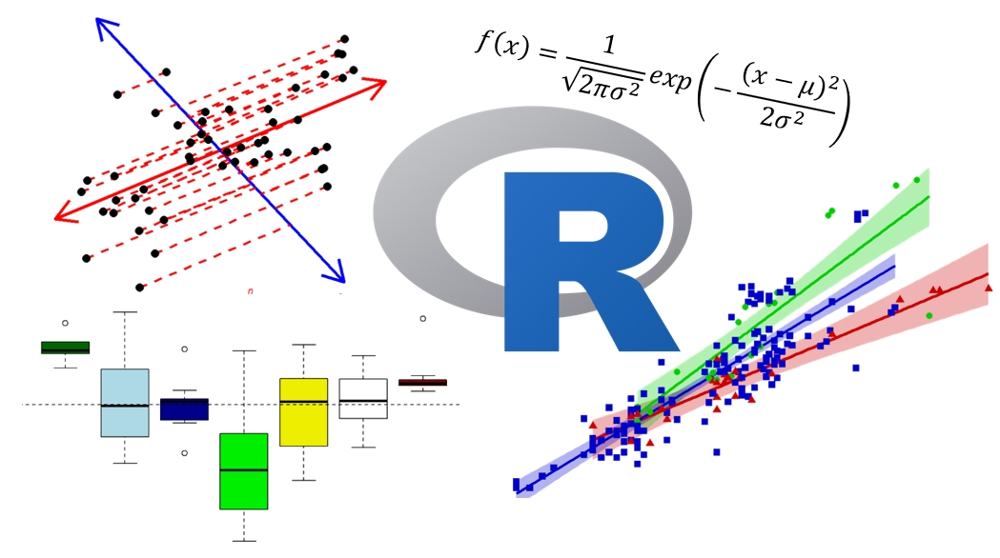
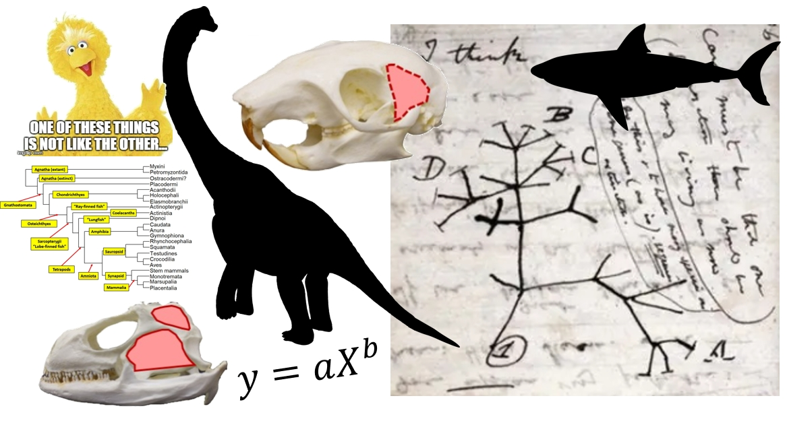

::: {.teaching-notice}

For up-to-date course information, please see the [KSU Dynamic Schedule](https://campus.kennesaw.edu/current-students/registrar/registration/index.php).

**Current students:** Please refer to [D2L Brightspace](https://campus.kennesaw.edu/current-students/d2l/index.php) for current course content.

:::

## Graduate courses

::: {.course-card}

::: {.course-image}

:::

::: {.course-content}

### BIOL 7410: Applied Biological Data Analysis

A graduate-level course in biological data management, visualization, statistical modeling, and reproducible analysis using R. Topics include linear and generalized linear models, mixed models, multivariate methods, and effective communication of quantitative results.

[Open course book](https://greenquanteco.github.io/appl-biol-data-analysis/){.btn .btn-primary}
[View syllabus](files/syllabi/biol-7410-syllabus.pdf){.btn .btn-outline-secondary}

:::

:::

::: {.course-card}

::: {.course-content}

### Bayesian Inference for Biologists

A directed methods seminar introducing Bayesian reasoning and model fitting in R and JAGS. Topics include priors, likelihoods, posterior distributions, MCMC, hierarchical models, and biological applications.

[Open course book](https://greenquanteco.github.io/bayesian-inference-biologists/){.btn .btn-primary}
[View syllabus](files/syllabi/bayesian-inference-syllabus.pdf){.btn .btn-outline-secondary}

:::

:::

## Undergraduate courses

::: {.course-card}

::: {.course-image}

:::

::: {.course-content}

### Comparative Vertebrate Anatomy

An upper-level laboratory and lecture course examining vertebrate structure, function, development, and evolution. Students compare anatomical systems across major vertebrate groups through dissection, specimen study, quantitative analysis, and independent research projects.

[View syllabus](files/syllabi/comparative-vertebrate-anatomy-syllabus.pdf){.btn .btn-outline-secondary}

:::

:::

::: {.course-card}

::: {.course-image}

:::

::: {.course-content}

### Vertebrate Zoology

A survey of vertebrate diversity, evolution, ecology, and natural history. The course emphasizes major evolutionary transitions, comparative biology, classification, and identification of regional vertebrates. The lab component of the course is a semester-long course-based undergraduate research experience (CURE).

[View syllabus](files/syllabi/vertebrate-zoology-syllabus.pdf){.btn .btn-outline-secondary}

:::

:::

## Additional teaching

::: {.course-card .course-card-no-image}

::: {.course-content}

### Graduate research and directed methods

I regularly supervise graduate research, thesis projects, independent studies, and directed methods courses in quantitative ecology, population biology, spatial analysis, and reproducible scientific computing.

:::

:::