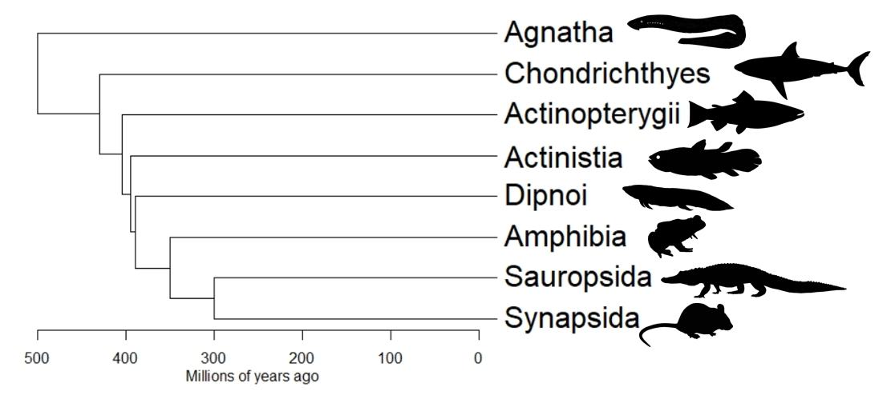

::: {.teaching-notice}

For up-to-date course information, please see the [KSU Dynamic Schedule](https://campus.kennesaw.edu/current-students/registrar/registration/index.php).

**Current students:** Please refer to [D2L Brightspace](https://campus.kennesaw.edu/current-students/d2l/index.php) for current course content.

:::

## Graduate courses

::: {.course-card}

### BIOL 7410: Applied Biological Data Analysis

::: {.course-layout}

::: {.course-image}

:::

::: {.course-content}

A graduate-level course in biological data management, visualization, statistical modeling, and reproducible analysis using R. Topics include linear and generalized linear models, mixed models, multivariate methods, and effective communication of quantitative results.

[Open course book](https://greenquanteco.github.io/appl-biol-data-analysis/){.btn .btn-primary}
[View syllabus](files/biol-7410-syllabus-fall-2026.pdf){.btn .btn-outline-secondary}

:::

:::

:::

::: {.course-card}

### BIOL 7950: Bayesian Inference for Biologists

::: {.course-content}

A directed methods seminar introducing Bayesian reasoning and model fitting in R and JAGS. Topics include priors, likelihoods, posterior distributions, MCMC, hierarchical models, and biological applications.

[Open course book](https://greenquanteco.github.io/bayesian-inference-biologists/){.btn .btn-primary}
[View syllabus](files/syllabi/bayesian-inference-syllabus.pdf){.btn .btn-outline-secondary}

:::

:::

::: {.course-card}

### BIOL 6490: Special Topics

::: {.course-content}

**Special Topics** courses are seminars developed *ad hoc* to meet student needs. Sometimes a new course, like BIOL 7410, will be trial run as a Special Topics several times before making it into the catalog. Other times, I can organize a seminar on subjects students are interested. At some point I'd like to try and develop a seminar on **Multivariate analysis for biology**, **Simulation modeling in biology**, or other quantitative topics. I'd also love to try something like a "**Foundations of ecology**" seminar where we read and dissect classic papers to better understand the history discipline. If you are an MSIB student and have an idea for a seminar, please [reach out](mailto:ngreen62@kennesaw.edu?subject=Special%20Topics) so we can discuss and see if there is enough interest. This works best if we start the process in early Fall semester because of how the curriculum process works.

:::

:::

## Undergraduate courses

::: {.course-card}

### BIOL 3315K: Vertebrate Zoology

::: {.course-layout}

::: {.course-image}

:::

::: {.course-content}

A survey of vertebrate diversity, evolution, ecology, and natural history. The course emphasizes major evolutionary transitions, comparative biology, classification, and identification of regional vertebrates. The lab component of the course is a semester-long course-based undergraduate research experience (CURE).

[View syllabus](files/biol-3315k-syllabus-fall-2026.pdf){.btn .btn-outline-secondary}

:::

:::

:::

::: {.course-card}

### BIOL 4350K: Comparative Vertebrate Anatomy

::: {.course-layout}

::: {.course-image}

:::

::: {.course-content}

An upper-level laboratory and lecture course examining vertebrate structure, function, development, and evolution. Students compare anatomical systems across major vertebrate groups through dissection, specimen study, quantitative analysis, and independent research projects.

[View syllabus](files/syllabi/comparative-vertebrate-anatomy-syllabus.pdf){.btn .btn-outline-secondary}

:::

:::

:::

## Additional teaching

I regularly supervise graduate research, thesis projects, independent studies, and directed methods courses in quantitative ecology, population biology, spatial analysis, and reproducible scientific computing.

::: {.course-card}

### BIOL 3110L: Directed Methods

::: {.course-content}

Many undergraduates who work in the lab also enroll in **BIOL 3110L: Directed Methods**. This is a variable credit hour course where students gain in-depth skills with a specific set of research methodologies through direct involvement in faculty-led research or scholarship. Reach out by [email](mailto:ngreen62@kennesaw.edu?subject=Directed%20Methods%20interest) to discuss taking directed methods.

:::

:::

::: {.course-card}

### BIOL 4400: Directed Study

::: {.course-content}

Undergraduate students who want to conduct an independent research project within my lab, usually over the course of an entire academic year (Fall and Spring), can enroll in **BIOL 4400: Directed Study**. Reach out to me by [email](mailto:ngreen62@kennesaw.edu?subject=Directed%20Study%20interest) prior to the Fall semester if you are interested in exploring this possibility. Please note that I require potential Directed Study students to have previously taken at least 1 hour of **BIOL 3110L** or have similar demonstrated research experience.

:::

:::

